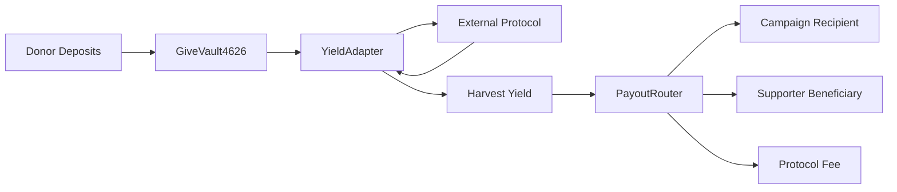

# GIVE Protocol v0.5 – AI Agent Instructions

## Overview
GIVE Protocol enables **no-loss giving**: donors deposit principal into ERC-4626 vaults, yield adapters generate returns, and harvested profits stream to social impact campaigns without touching principal. This is a **modular, UUPS-upgradeable architecture** in active refactor (v0.5) from an MVP foundation.

**⚠️ Migration in Progress**: `OVERHAUL_PLAN.md` is the authoritative roadmap. Check phase completion status before making changes.

## Architecture Principles

### 1. Shared Storage Pattern
- **Single Source of Truth**: All contracts read/write through `StorageLib` accessing `GiveStorage.Store` at a dedicated slot
- **Type Definitions**: `GiveTypes.sol` defines canonical structs (`VaultConfig`, `CampaignConfig`, `AdapterConfig`, etc.)
- **Module Libraries**: `VaultModule`, `AdapterModule`, `DonationModule`, `SyntheticModule`, `RiskModule`, `EmergencyModule` operate on shared storage—they're libraries, not contracts
- **Never bypass**: Direct storage access bypasses the shared state model and will cause inconsistencies

```solidity
// ✅ Correct: Use StorageLib
GiveTypes.VaultConfig storage vault = StorageLib.vault(vaultId);

// ❌ Wrong: Direct storage mapping access
// mapping(bytes32 => VaultConfig) vaults; // Don't do this
```

### 2. UUPS Proxy Governance
- **ACLManager** (`governance/ACLManager.sol`) issues dynamic roles and owns the `ROLE_UPGRADER`
- **Every** upgradeable contract implements `_authorizeUpgrade` checking `ROLE_UPGRADER` via ACL
- **GiveProtocolCore** is the orchestrator proxy—thin delegation layer to module libraries
- No ad-hoc `Ownable`—all permissions flow through ACL roles

```solidity
function _authorizeUpgrade(address) internal view override {
    if (!aclManager.hasRole(ROLE_UPGRADER, msg.sender)) {
        revert Unauthorized();
    }
}
```

### 3. Campaign-Centric Payout Model (Phase 13+)
- **CampaignRegistry**: Manages campaign lifecycle (submission → approval → active → completed/paused)
- **StrategyRegistry**: Maps adapters to strategies with risk tiers and TVL caps
- **PayoutRouter**: Replaces old `DonationRouter`—supporters set per-vault preferences (campaignId, beneficiary, allocation %)
- **CampaignVault4626**: Factory-deployed vaults with immutable campaign metadata and lock profiles
- Payouts halt when campaigns fail checkpoint votes (Phase 14)

### 4. Yield Adapter Surface
- Adapters implement `IYieldAdapter`: `deposit`, `withdraw`, `totalAssets`, `harvest`
- Variants: `CompoundingValue`, `ClaimableYield`, `BalanceGrowth`, `PerpetualYieldToken` (enum in `GiveTypes.AdapterKind`)
- Examples: `MockYieldAdapter` (test), `AaveAdapter` (real integration)
- Register via `AdapterModule.configure`, validate via `StrategyRegistry`

### 5. Strategy Manager (Phase 15)
- **StrategyManager** (`manager/StrategyManager.sol`) centralizes vault adapter configuration with campaign/strategy validation
- **Campaign-Adapter Binding**: `_assertAdapterMatchesCampaign()` ensures vaults only use adapters registered to their campaign's strategy
- **Role Requirements**: StrategyManager needs `STRATEGY_MANAGER_ROLE`, `EMERGENCY_ROLE` created in ACL (not pre-defined like campaign roles)
- **Test Pattern**: Tests must create custom roles via `acl.createRole()` before granting them

```solidity
// ✅ Correct: Create role before granting
acl.createRole(manager.STRATEGY_MANAGER_ROLE(), admin);
acl.grantRole(manager.STRATEGY_MANAGER_ROLE(), admin);

// ❌ Wrong: Role doesn't exist yet
acl.grantRole(manager.STRATEGY_MANAGER_ROLE(), admin); // RoleDoesNotExist error
```

## Development Workflows

### Build & Test (Foundry)
```bash
cd backend
forge build           # Compiles contracts with via-ir optimizer
forge test -vv        # Runs test suite (~19 test files)
make test             # Makefile wrapper with color output
```

**Test Harness**: `BaseProtocolTest` (`backend/test/utils/BaseProtocolTest.sol`) deploys full stack via `Bootstrap.s.sol`. Inherit this for integration tests.

```solidity
contract MyTest is BaseProtocolTest {
    function setUp() public override {
        super.setUp(); // Deploys ACL, Core, Vault, Router, Registries, etc.
    }
}
```

### Deployment (Bootstrap Script)
**Single entry point**: `script/Bootstrap.s.sol` replaces all legacy deployment scripts.

```bash
# Local Anvil
forge script script/Bootstrap.s.sol --rpc-url http://localhost:8545 --private-key $PRIVATE_KEY --broadcast

# Testnet (Sepolia, Base Sepolia, Scroll Sepolia)
make deploy-sepolia    # Uses .env for keys/RPC
```

**Determinism**: Bootstrap deploys proxies, initializes storage, assigns ACL roles, and logs addresses. Config in `HelperConfig.s.sol`.

### Frontend (Two Implementations)
1. **Legacy** (`frontend/`): Vite + React + Wagmi—kept for reference, not actively maintained
2. **Active** (`apps/web/`): Next.js 14 App Router + RainbowKit + Wagmi
   - `pnpm dev` (port 3000)
   - Config: `src/config/addresses.ts` (per-chain contract addresses)
   - ABIs: Auto-sync with `pnpm sync-abis` (pulls from `forge inspect`)

## Critical Conventions

### Storage Slot Safety
- `GiveStorage.sol` uses `keccak256("give.storage.v1")` for the root slot
- **Never** declare storage variables in UUPS implementation contracts—use storage lib or diamond storage patterns
- Module libraries access storage via `StorageLib.root()` returning the shared `Store` struct

### Role Naming
- Format: `ROLE_*` (e.g., `ROLE_VAULT_MANAGER`, `ROLE_CAMPAIGN_CREATOR`)
- Defined in `ACLManager.sol` (canonical roles) or module libraries (`VaultModule.MANAGER_ROLE`)
- Check via `aclManager.hasRole(roleId, account)`

### Event-Driven Observability
- Emit events for **all** state transitions: campaign approval, checkpoint votes, payout execution, strategy updates
- Schema: `{Action}{Entity}` (e.g., `CampaignApproved`, `CheckpointScheduled`, `YieldHarvested`)
- Indexers depend on these—don't omit events

### Testing Best Practices
- **Parity checks**: Compare behavior against legacy MVP (`backend/test/*.t.sol` references)
- **Fork tests**: `Fork_AaveSepolia.t.sol` validates real protocol integrations
- **Gas snapshots**: Phases 10+ require `.gas-snapshot` updates (`forge snapshot`)

## Key Files Reference

| Path | Purpose |
|------|---------|
| `OVERHAUL_PLAN.md` | Authoritative phase-by-phase migration checklist |
| `backend/src/types/GiveTypes.sol` | Canonical struct definitions |
| `backend/src/storage/StorageLib.sol` | Shared storage accessors |
| `backend/src/core/GiveProtocolCore.sol` | Module orchestrator proxy |
| `backend/src/governance/ACLManager.sol` | Role-based access control |
| `backend/src/manager/StrategyManager.sol` | Vault adapter configuration & campaign-strategy binding |
| `backend/src/payout/PayoutRouter.sol` | Campaign payout distribution logic |
| `backend/src/registry/CampaignRegistry.sol` | Campaign lifecycle management |
| `backend/src/registry/StrategyRegistry.sol` | Strategy metadata & adapter registration |
| `backend/script/Bootstrap.s.sol` | Deterministic deployment script |
| `backend/test/utils/BaseProtocolTest.sol` | Foundry test harness |

## Gotchas & Anti-Patterns

### ❌ Don't
- Add storage variables to UUPS implementation contracts (use shared storage)
- Bypass `StorageLib`—direct mapping access breaks consistency
- Use `Ownable` or ad-hoc admin checks—everything goes through ACL
- Modify `OVERHAUL_PLAN.md` phases without team coordination
- Deploy contracts individually—use `Bootstrap.s.sol`

### ✅ Do
- Update `OVERHAUL_PLAN.md` checkboxes when completing tasks
- Run `forge test` after edits to catch storage layout shifts
- Use `vm.prank(admin)` in tests, not unlabeled addresses
- Emit events for indexer compatibility
- Check phase completion in plan before adding features

## External Dependencies
- **OpenZeppelin Contracts**: `@openzeppelin/contracts` (UUPS, ERC20, ERC4626)
- **Chainlink**: `@chainlink/contracts` (oracles, price feeds)
- **Forge-std**: Testing utilities (`Test.sol`, `console.sol`)
- **Aave v3**: External yield source for adapters

## Cross-Component Data Flows



1. **Deposit**: Vault calls adapter's `deposit(assets)`, updates `StorageLib.vault().totalProfit`
2. **Harvest**: Vault invokes adapter's `harvest()`, transfers profits to `PayoutRouter`
3. **Distribution**: Router reads `CampaignRegistry` for recipient, splits per supporter preferences
4. **Checkpoint**: `CampaignRegistry.finalizeCheckpoint()` halts payouts if vote fails

## Migration Status (Phases 0-15 Complete)
- ✅ Shared storage, governance, core modules, vault stack, adapters
- ✅ Campaign/strategy registries, vault factory, payout router, checkpoint voting
- ✅ **Phase 15**: Strategy manager, adapter validation, keeper flows complete
- 📋 **Phase 16**: Final docs, cleanup, CI coverage gates (next)

**Before implementing features**: Verify phase completion in `OVERHAUL_PLAN.md`. New work should align with the plan or propose plan amendments.
