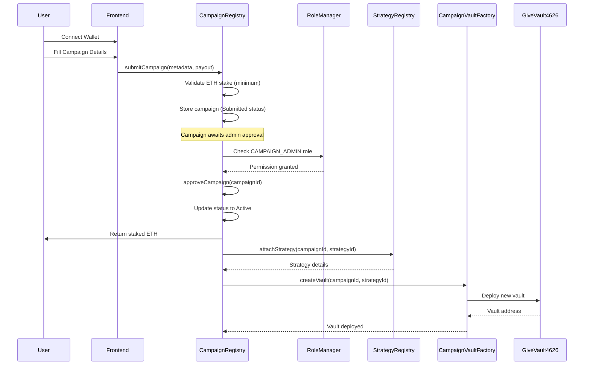
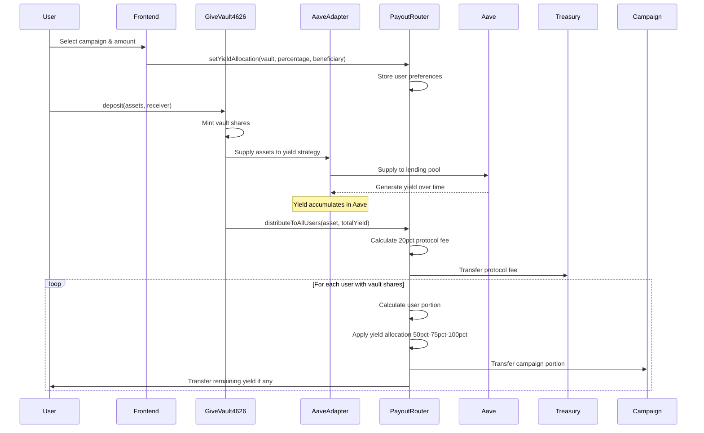
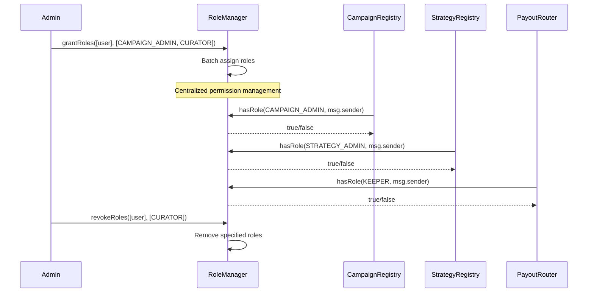
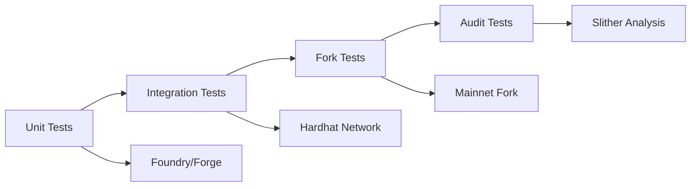
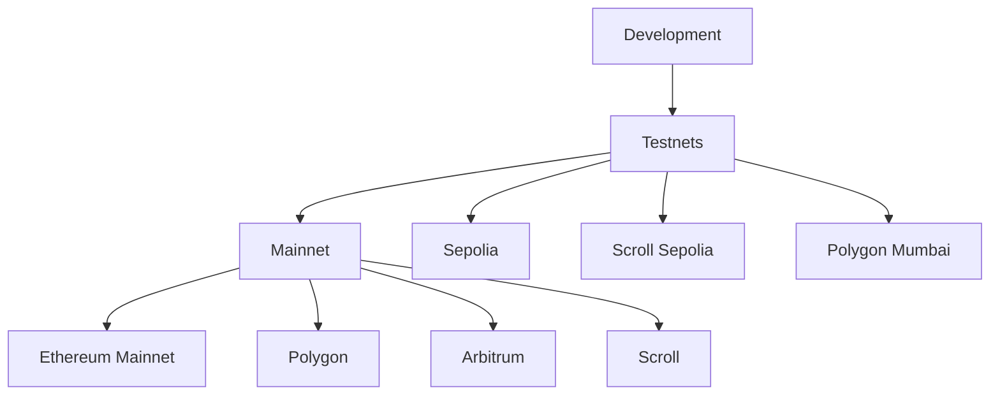
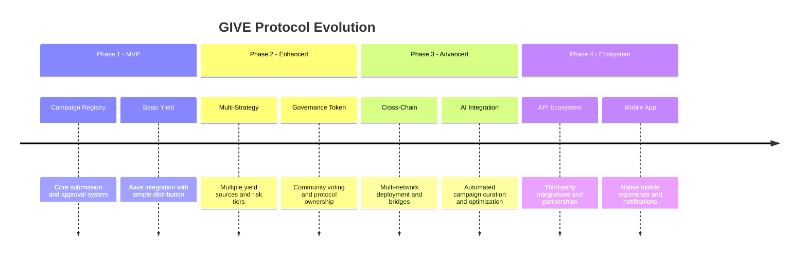

# GIVE Protocol - System Architecture Flow Diagram

## Complete System Flow Architecture

```mermaid
graph TB
    %% User Interfaces
    UI[Frontend dApp Interface]
    
    %% Core Access Control
    RM[RoleManager Contract]
    
    %% Campaign Management Layer
    CR[CampaignRegistry Contract]
    SR[StrategyRegistry Contract]
    CVF[CampaignVaultFactory Contract]
    
    %% Vault & Strategy Layer  
    GV[GiveVault4626 Contract]
    AA[AaveAdapter Contract]
    MYA[MockYieldAdapter Contract]
    
    %% Payout & Distribution
    PR[PayoutRouter Contract]
    ES[EpochScheduler Contract]
    
    %% External Protocols
    AAVE[Aave Protocol]
    USDC[USDC Token]
    WETH[WETH Token]
    
    %% Treasury & Governance
    TREAS[Protocol Treasury]
    CAMP_PAYOUT[Campaign Payout Address]
    
    %% User Actions Flow
    UI -->|1. Connect Wallet| UI
    UI -->|2. Submit Campaign| CR
    UI -->|3. Stake ETH| CR
    UI -->|4. Deposit Assets| GV
    UI -->|5. Set Yield Preferences| PR
    
    %% Access Control Integration
    CR -.->|Check Permissions| RM
    SR -.->|Check Permissions| RM  
    PR -.->|Check Permissions| RM
    CVF -.->|Check Permissions| RM
    
    %% Campaign Lifecycle
    CR -->|Campaign Submitted| CR
    CR -->|Admin Approval| CR
    CR -->|Attach Strategy| SR
    CR -->|Create Vault| CVF
    CVF -->|Deploy| GV
    
    %% Strategy Management
    SR -->|Register Strategy| SR
    SR -->|Link Adapter| AA
    SR -->|Link Adapter| MYA
    
    %% Vault Operations
    GV -->|Deposit Assets| USDC
    GV -->|Deposit Assets| WETH
    GV -->|Supply to Protocol| AA
    AA -->|Interact with| AAVE
    
    %% Yield Generation & Distribution
    AA -->|Generate Yield| AA
    GV -->|Harvest Yield| PR
    PR -->|20pct Protocol Fee| TREAS
    PR -->|User Allocation 50pct-75pct-100pct| CAMP_PAYOUT
    PR -->|Remaining to User| UI
    
    %% Epoch Management
    ES -->|Trigger Distribution| PR
    PR -->|Process Payouts| PR
    
    %% Role Definitions
    subgraph "Access Control Roles"
        CADMIN[CAMPAIGN_ADMIN]
        SADMIN[STRATEGY_ADMIN] 
        KEEPER[KEEPER]
        CURATOR[CURATOR]
        VOPS[VAULT_OPS]
        TREASURY[TREASURY]
        GUARDIAN[GUARDIAN]
        RECORDER[DONATION_RECORDER]
    end
    
    RM -->|Manages| CADMIN
    RM -->|Manages| SADMIN
    RM -->|Manages| KEEPER
    RM -->|Manages| CURATOR
    RM -->|Manages| VOPS
    RM -->|Manages| TREASURY
    RM -->|Manages| GUARDIAN
    RM -->|Manages| RECORDER

    %% Styling
    classDef userInterface fill:#e1f5fe,stroke:#01579b,stroke-width:3px
    classDef coreContract fill:#f3e5f5,stroke:#4a148c,stroke-width:2px
    classDef yieldContract fill:#e8f5e8,stroke:#1b5e20,stroke-width:2px
    classDef externalProtocol fill:#fff3e0,stroke:#e65100,stroke-width:2px
    classDef treasury fill:#fce4ec,stroke:#880e4f,stroke-width:2px
    
    class UI userInterface
    class RM,CR,SR,CVF,PR,ES coreContract
    class GV,AA,MYA yieldContract
    class AAVE,USDC,WETH externalProtocol
    class TREAS,CAMP_PAYOUT treasury
```



## Detailed Flow Sequences

### 1. Campaign Creation & Approval Flow



### 2. User Deposit & Yield Generation Flow



### 3. Access Control & Role Management Flow



## System Architecture Layers

### Layer 1: User Interface & Experience
- **Frontend dApp**: React/Next.js with Web3 integration
- **Wallet Connection**: RainbowKit + wagmi hooks
- **Transaction Management**: ethers.js with user feedback
- **Real-time Updates**: Event listening and state synchronization

### Layer 2: Access Control & Governance
- **RoleManager**: Centralized permission system (8 roles)
- **Role Hierarchy**: Admin → Curator → Keeper → User
- **Batch Operations**: Efficient role management
- **Security**: OpenZeppelin AccessControlEnumerable

### Layer 3: Campaign & Strategy Management
- **CampaignRegistry**: Permissionless submissions with approval workflow
- **StrategyRegistry**: Yield strategy catalog with risk tiers
- **Campaign Lifecycle**: Submitted → Active/Rejected
- **Strategy Attachment**: Link campaigns to yield strategies

### Layer 4: Vault & Asset Management  
- **GiveVault4626**: ERC-4626 compliant yield-bearing vaults
- **Asset Deposits**: Multi-token support (USDC, WETH, etc.)
- **Share Tracking**: Proportional ownership and yield rights
- **Vault Factory**: Dynamic vault deployment per campaign

### Layer 5: Yield Generation & Adapters
- **AaveAdapter**: Integration with Aave lending protocol
- **MockYieldAdapter**: Testing and development adapter
- **Strategy Execution**: Automated yield generation
- **Risk Management**: Adapter-specific safety mechanisms

### Layer 6: Distribution & Payouts
- **PayoutRouter**: Epoch-based yield distribution
- **User Preferences**: 50%, 75%, or 100% allocation to campaigns
- **Protocol Economics**: 20% fee capture to treasury
- **Beneficiary System**: Yield redirection capabilities

### Layer 7: External Protocol Integration
- **Aave Protocol**: Primary yield generation source
- **Token Standards**: ERC-20 compliance across assets
- **Oracle Integration**: Price feeds and data sources
- **Cross-Chain**: Future multi-network expansion

## Key Design Principles

### 1. **Modularity & Separation of Concerns**
- Each contract has a single, well-defined responsibility
- Clean interfaces between layers enable future upgrades
- Plugin architecture for yield strategies and adapters

### 2. **Security-First Architecture**  
- Centralized access control with role-based permissions
- Reentrancy protection on all external calls
- Comprehensive input validation and error handling
- Pausable contracts for emergency scenarios

### 3. **User Experience Optimization**
- Intuitive campaign discovery and participation
- Flexible yield allocation preferences (50%, 75%, or 100%)
- Gas-optimized operations and batch transactions
- Clear transaction feedback and error messages

### 4. **Economic Sustainability**
- 20% protocol fee ensures sustainable operations
- ETH staking mechanism prevents spam campaigns
- Yield-generating strategies provide ongoing value
- Treasury management for protocol development

### 5. **Governance & Decentralization**
- Role-based administration with clear hierarchies  
- Permissionless campaign submissions
- Community curation through approval processes
- Transparent on-chain operations and events

## Integration Points & APIs

### Smart Contract Interfaces
```solidity
// Core interfaces for external integration
interface ICampaignRegistry {
    function submitCampaign(string metadata, address payout) external payable;
    function getCampaign(uint256 id) external view returns (Campaign memory);
}

interface IGiveVault4626 {
    function deposit(uint256 assets, address receiver) external returns (uint256 shares);
    function withdraw(uint256 assets, address receiver, address owner) external returns (uint256 shares);
}

interface IPayoutRouter {
    function setYieldAllocation(address vault, uint8 percentage, address beneficiary) external;
    function distributeToAllUsers(address asset, uint256 totalYield) external;
}
```

### Frontend Integration Points
- Campaign browsing and filtering APIs
- Wallet connection and transaction handling
- Real-time yield tracking and distribution history  
- User preference management interfaces

## Testing Architecture

### Contract Testing Strategy


### Test Coverage Areas
- **Unit Tests**: Individual contract functionality (>95% coverage)
- **Integration Tests**: Multi-contract interactions and workflows
- **Fork Tests**: Real protocol integrations (Aave, Uniswap)
- **Security Tests**: Reentrancy, overflow, access control vulnerabilities
- **Gas Optimization Tests**: Transaction cost analysis and optimization

## Deployment Architecture

### Multi-Network Strategy


### Deployment Sequence
1. **Development Environment**: Local Anvil/Hardhat network
2. **Testnet Deployment**: Sepolia → Scroll Sepolia → Polygon Mumbai
3. **Security Audits**: Professional audit and community review
4. **Mainnet Deployment**: Phased rollout with monitoring
5. **Multi-Chain Expansion**: Cross-chain bridge and governance setup

## Monitoring & Analytics

### Real-Time Metrics
- **Campaign Performance**: Submission rate, approval rate, funding levels
- **Yield Generation**: Total value locked (TVL), yield rates, distribution efficiency
- **User Engagement**: Active users, retention rates, transaction volume
- **Protocol Health**: Gas usage, error rates, security incidents

### Dashboard Components
- Protocol treasury balance and fee collection
- Campaign success rates and impact metrics  
- Yield strategy performance comparisons
- User yield allocation preference trends
- Network activity and transaction costs

## Security Considerations

### Threat Model
- **Smart Contract Risks**: Reentrancy, overflow, access control bypass
- **Economic Attacks**: Flash loan attacks, governance manipulation
- **Operational Risks**: Key management, upgrade procedures
- **External Dependencies**: Oracle failures, protocol upgrades

### Mitigation Strategies
- Multi-signature wallets for admin functions
- Timelock controllers for critical changes
- Circuit breakers and pause mechanisms
- Regular security audits and bug bounties
- Comprehensive monitoring and alerting systems

## Future Enhancements

### Roadmap Architecture


### Planned Features
- **Advanced Yield Strategies**: Compound, Yearn, Convex integrations
- **Governance System**: Token-based voting for protocol parameters
- **Cross-Chain Bridges**: Unified experience across multiple networks
- **Mobile Applications**: Native iOS/Android apps with push notifications
- **API Ecosystem**: Developer tools and third-party integrations
- **Impact Tracking**: On-chain verification of charitable outcomes

## Technical Specifications

### Performance Targets
- **Transaction Throughput**: Support 1000+ concurrent users
- **Gas Efficiency**: <150k gas for standard operations
- **Uptime**: 99.9% availability across all networks
- **Response Time**: <2s for all user interactions

### Scalability Solutions
- Layer 2 deployment for reduced costs
- State channels for high-frequency operations  
- IPFS integration for metadata storage
- Subgraph indexing for efficient querying

This comprehensive architecture provides a robust, secure, and scalable foundation for the GIVE Protocol's charitable giving and yield generation ecosystem, with clear paths for future growth and enhancement.