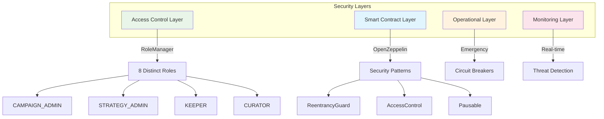
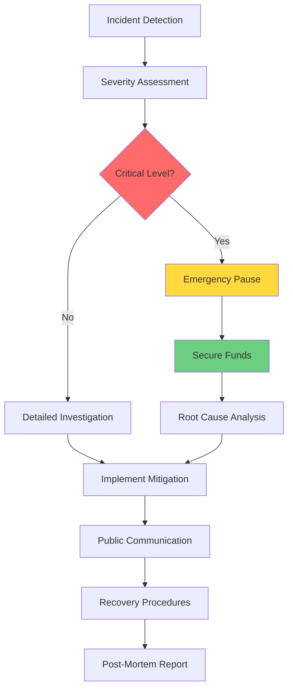

# 08 — Security & Operations

## Security Architecture Overview

The GIVE Protocol implements a defense-in-depth security model with multiple layers of protection:



## Design Principles

### 1. **Defense in Depth**
- **Multi-layer security**: Access control + contract-level + operational + monitoring
- **Fail-safe defaults**: Operations fail securely when conditions are not met
- **Principle of least privilege**: Minimal permissions for each role and function
- **Separation of concerns**: Isolated contract responsibilities with clear boundaries

### 2. **Campaign-First Security Model**
- **Campaign isolation**: Each campaign has dedicated vault with isolated risk exposure
- **Permissionless submissions**: ETH staking mechanism prevents spam and ensures commitment
- **Curator approval**: Human review process for campaign validation and quality control
- **Yield protection**: User funds generate yield safely while maintaining campaign allocation flexibility

### 3. **Economic Security**
- **Protocol fee sustainability**: 20% fee ensures ongoing security operations and development
- **Stake-based commitment**: Campaign creators must stake ETH, creating skin-in-the-game incentives
- **Yield allocation flexibility**: Users control 50%, 75%, or 100% allocation to campaigns
- **Treasury management**: Protocol fees fund security audits, bug bounties, and infrastructure

## Role-Based Access Control (RBAC)

### Core Security Roles

| Role | Permissions | Security Considerations |
|------|-------------|------------------------|
| `CAMPAIGN_ADMIN` | Approve/reject campaigns, manage campaign lifecycle | **High Risk** - Multi-sig required, time delays on critical operations |
| `STRATEGY_ADMIN` | Create yield strategies, manage adapters | **High Risk** - Controls yield generation, requires technical expertise |
| `KEEPER` | Execute automated tasks, trigger distributions | **Medium Risk** - Automated operations, rate limiting recommended |
| `CURATOR` | Review campaign submissions, quality control | **Medium Risk** - Subjective decisions, transparent processes needed |
| `VAULT_OPS` | Vault management, emergency operations | **High Risk** - Direct fund access, strict monitoring required |
| `TREASURY` | Protocol fee management, treasury operations | **Critical Risk** - Treasury access, hardware wallet mandatory |
| `GUARDIAN` | Emergency pause, security incident response | **Critical Risk** - System-wide control, incident response team only |
| `DONATION_RECORDER` | Record and track donations | **Low Risk** - Read-only operations, audit trail maintenance |

### Access Control Implementation

```solidity
// Centralized role management through RoleManager
contract SecurityPatterns {
    // Multi-role validation for critical operations
    modifier onlyAuthorizedRoles(bytes32[] memory roles) {
        bool authorized = false;
        for (uint256 i = 0; i < roles.length; i++) {
            if (roleManager.hasRole(roles[i], msg.sender)) {
                authorized = true;
                break;
            }
        }
        require(authorized, "Unauthorized: insufficient role permissions");
        _;
    }
    
    // Time-delayed critical operations
    modifier withTimeDelay(bytes32 operationId, uint256 delay) {
        require(timeDelays[operationId] != 0, "Operation not scheduled");
        require(block.timestamp >= timeDelays[operationId] + delay, "Time delay not met");
        _;
        delete timeDelays[operationId];
    }
}
```

## Smart Contract Security

### Critical Vulnerabilities & Mitigations

#### 1. **Reentrancy Protection**
```solidity
// All external calls protected with ReentrancyGuard
function distributeToAllUsers(address asset, uint256 totalYield) 
    external 
    nonReentrant 
    whenNotPaused 
    returns (uint256) 
{
    // Implementation with external calls protected
}
```

**Mitigation Strategies:**
- OpenZeppelin `ReentrancyGuard` on all vault operations
- Checks-Effects-Interactions pattern throughout
- State updates before external calls
- Reentrancy testing in all test suites

#### 2. **Access Control Bypass**
```solidity
// Centralized permission checking
function _checkAuthorization(bytes32 role, address account) internal view {
    if (!roleManager.hasRole(role, account)) {
        revert Errors.UnauthorizedCaller(account);
    }
}
```

**Mitigation Strategies:**
- Centralized `RoleManager` contract for all permissions
- Custom error types for clear failure modes
- Role hierarchy validation and inheritance
- Regular access control audits

#### 3. **Integer Overflow/Underflow**
```solidity
// Solidity 0.8.20+ built-in overflow protection
// Additional validation for critical calculations
function calculateYieldDistribution(uint256 totalYield) internal pure returns (uint256, uint256) {
    require(totalYield > 0, "Invalid yield amount");
    uint256 protocolFee = (totalYield * PROTOCOL_FEE_BPS) / BASIS_POINTS;
    require(protocolFee <= totalYield, "Fee calculation overflow");
    return (protocolFee, totalYield - protocolFee);
}
```

#### 4. **External Protocol Risk**
```solidity
// Adapter isolation and safety checks
contract AaveAdapter {
    function supply(uint256 amount) external override {
        require(amount > 0, "Invalid amount");
        require(amount <= maxSupplyAmount, "Exceeds supply limit");
        
        // Safety check before external call
        uint256 balanceBefore = asset.balanceOf(address(this));
        
        try aavePool.supply(address(asset), amount, address(this), 0) {
            uint256 balanceAfter = asset.balanceOf(address(this));
            require(balanceBefore - balanceAfter == amount, "Supply amount mismatch");
        } catch {
            revert Errors.ExternalProtocolError();
        }
    }
}
```

### Circuit Breakers & Emergency Controls

#### Pausable Operations
```solidity
// Granular pause controls
contract EmergencyControls is Pausable {
    bool public investingPaused;
    bool public harvestingPaused;
    bool public distributionsPaused;
    
    modifier whenInvestingNotPaused() {
        require(!investingPaused, "Investing paused");
        _;
    }
    
    function emergencyPauseAll() external onlyRole(GUARDIAN_ROLE) {
        _pause();
        investingPaused = true;
        harvestingPaused = true;
        distributionsPaused = true;
        emit EmergencyPauseActivated(msg.sender, block.timestamp);
    }
}
```

## Pre-Deployment Security Checklist

### Code Quality & Testing
- [ ] **Test Coverage**: Achieve >95% line coverage across all contracts
- [ ] **Foundry Tests**: All 72+ tests passing with zero skipped assertions
- [ ] **Integration Tests**: Multi-contract workflows tested end-to-end
- [ ] **Fork Tests**: Real protocol interactions validated on mainnet forks
- [ ] **Gas Optimization**: Operations under 150k gas limit where possible
- [ ] **Code Formatting**: `forge fmt` applied consistently

### Static Analysis & Security Scanning
- [ ] **Slither Analysis**: No high/medium severity findings unaddressed  
- [ ] **MythX Scanning**: Comprehensive vulnerability analysis completed
- [ ] **Manual Review**: Line-by-line security review of critical functions
- [ ] **Dependency Audit**: OpenZeppelin and external library versions verified
- [ ] **Access Control Audit**: Role assignments and permissions validated
- [ ] **Economic Model Review**: Fee calculations and incentive alignment verified

### Deployment Security
- [ ] **Multi-sig Setup**: Critical roles assigned to multi-signature wallets
- [ ] **Hardware Wallets**: Production deployments from hardware-secured accounts
- [ ] **Address Verification**: All external protocol addresses double-checked
- [ ] **Configuration Validation**: Fee rates, limits, and parameters within safe ranges
- [ ] **Emergency Procedures**: Pause and recovery mechanisms tested
- [ ] **Backup Plans**: Contingency procedures documented and validated

### Documentation & Transparency  
- [ ] **Technical Documentation**: Architecture and security model documented
- [ ] **Audit Reports**: External security audits completed and published
- [ ] **Deployment Guide**: Step-by-step deployment procedures documented
- [ ] **Incident Response Plan**: Security incident procedures prepared
- [ ] **Bug Bounty Program**: Community security testing incentivized

## Post-Deployment Monitoring

### Real-Time Security Monitoring

#### Critical Event Tracking
```solidity
// Security-relevant events for monitoring
event EmergencyPauseActivated(address indexed guardian, uint256 timestamp);
event UnauthorizedAccess(address indexed caller, bytes4 selector);
event LargeFundMovement(address indexed vault, uint256 amount);
event YieldDistributionAnomaly(address indexed vault, uint256 expectedYield, uint256 actualYield);
event ExternalProtocolError(address indexed adapter, string errorCode);
```

#### Automated Alerting System
- **Fund Movement Alerts**: Transactions above threshold amounts
- **Access Control Violations**: Failed permission checks and unauthorized attempts  
- **Yield Anomalies**: Unexpected changes in yield generation rates
- **External Protocol Issues**: Failed interactions with Aave and other protocols
- **Gas Price Spikes**: Transaction cost anomalies affecting user experience

#### Performance Monitoring
- **Transaction Success Rates**: Monitor for increasing failure rates
- **Gas Usage Patterns**: Track optimization opportunities and cost trends
- **User Activity**: Campaign submission and participation metrics
- **Protocol Health**: TVL, yield rates, and distribution efficiency

### Security Dashboards

#### Operations Dashboard
- Real-time protocol TVL and yield generation
- Active campaigns and approval pipeline
- Role assignment and permission audit trails
- Recent transaction history and patterns

#### Security Dashboard  
- Failed transaction analysis and error categorization
- Access control events and authorization failures
- External protocol integration health status
- Emergency pause status and recovery procedures

## Incident Response Procedures

### Security Incident Classification

#### **Level 1: Critical (Immediate Response)**
- Active exploit or fund drainage
- Smart contract vulnerability exploitation  
- Unauthorized admin access or privilege escalation
- External protocol compromise affecting user funds

**Response Timeline:** <15 minutes
**Actions:** Emergency pause, fund protection, team notification

#### **Level 2: High (Rapid Response)**
- Yield generation anomalies or adapter malfunctions
- Governance token or voting mechanism issues
- Significant user experience degradation
- Suspicious transaction patterns

**Response Timeline:** <1 hour  
**Actions:** Investigation, targeted pause if needed, user communication

#### **Level 3: Medium (Standard Response)**
- Minor smart contract bugs without fund risk
- Frontend security issues or UI vulnerabilities
- Third-party service outages affecting operations
- Performance degradation or scaling issues

**Response Timeline:** <4 hours
**Actions:** Standard investigation, fix deployment, status updates

### Incident Response Workflow



#### Immediate Response (0-30 minutes)
1. **Threat Assessment**: Classify incident severity and potential impact
2. **Emergency Actions**: Execute pause mechanisms if funds at risk  
3. **Team Assembly**: Activate incident response team and establish communication
4. **Stakeholder Notice**: Alert key stakeholders and community if public impact

#### Investigation Phase (30 minutes - 4 hours)
1. **Root Cause Analysis**: Deep technical investigation of incident cause
2. **Impact Assessment**: Quantify affected users, funds, and operations
3. **Containment Strategy**: Prevent incident escalation and further damage
4. **Recovery Planning**: Develop step-by-step recovery and restoration plan

#### Recovery Phase (4 hours - 48 hours)
1. **Fix Implementation**: Deploy patches, updates, or emergency procedures
2. **System Restoration**: Gradually restore normal operations with monitoring
3. **User Communication**: Provide transparent updates and next steps
4. **Verification**: Confirm all systems operating normally before full restoration

#### Post-Incident (48+ hours)
1. **Post-Mortem Report**: Detailed public report on incident and response
2. **Process Improvement**: Update procedures based on lessons learned
3. **Prevention Measures**: Implement additional safeguards to prevent recurrence
4. **Community Engagement**: Address concerns and rebuild trust through transparency

## Key Risk Categories & Mitigations

### 1. Smart Contract Risks

#### **Reentrancy Attacks**
- **Risk**: External calls allowing recursive state manipulation
- **Mitigation**: OpenZeppelin ReentrancyGuard, checks-effects-interactions pattern
- **Testing**: Comprehensive reentrancy attack simulations in test suite

#### **Access Control Bypass**  
- **Risk**: Unauthorized access to privileged functions
- **Mitigation**: Centralized RoleManager, multi-sig for critical roles, time delays
- **Testing**: Permission testing across all role combinations

#### **Integer Overflow/Underflow**
- **Risk**: Arithmetic errors in financial calculations  
- **Mitigation**: Solidity 0.8.20+ built-in protection, SafeMath patterns
- **Testing**: Boundary value testing and edge case validation

### 2. Economic & Governance Risks

#### **Campaign Spam & Low Quality**
- **Risk**: Flood of low-quality or fraudulent campaign submissions
- **Mitigation**: ETH staking requirement, curator review process, reputation system
- **Monitoring**: Submission patterns, approval rates, community feedback

#### **Yield Strategy Failures**
- **Risk**: External protocol failures affecting yield generation
- **Mitigation**: Adapter isolation, emergency withdrawal capabilities, diversification
- **Monitoring**: Yield rates, protocol health, adapter performance metrics

#### **Protocol Fee Manipulation**
- **Risk**: Fee rates set too high or treasury mismanagement
- **Mitigation**: Fee caps (20% maximum), multi-sig treasury control, transparency
- **Monitoring**: Fee collection rates, treasury balance changes, community sentiment

### 3. Operational Risks

#### **Key Management**
- **Risk**: Private key compromise or loss
- **Mitigation**: Hardware wallets, multi-sig wallets, key rotation procedures
- **Monitoring**: Transaction patterns, unauthorized access attempts

#### **Upgrade Procedures**
- **Risk**: Failed upgrades or malicious proxy implementations
- **Mitigation**: Timelock controllers, thorough testing, staged rollouts
- **Monitoring**: Contract code changes, proxy implementations, upgrade events

#### **External Dependencies**
- **Risk**: Third-party service failures (Aave, oracles, infrastructure)
- **Mitigation**: Multiple provider relationships, fallback mechanisms
- **Monitoring**: Service availability, response times, error rates

### 4. Frontend & User Experience Risks

#### **Wallet Security**
- **Risk**: User wallet compromise or phishing attacks
- **Mitigation**: Security education, transaction verification, secure defaults
- **Monitoring**: Suspicious transaction patterns, user reports

#### **Metadata Integrity** 
- **Risk**: Malicious or corrupted campaign metadata
- **Mitigation**: Content validation, IPFS pinning, moderation systems
- **Monitoring**: Metadata changes, content reports, validation failures

## Secure Development Practices

### Development Environment Security
- **Private Key Management**: Never commit private keys; use `.env` files with `.gitignore`
- **Hardware Wallets**: Use hardware wallets for all production deployments
- **Secure Networks**: Deploy from secure, monitored network environments
- **Version Control**: Sign commits, use protected branches, require reviews

### Code Security Standards
- **OpenZeppelin Integration**: Use battle-tested security primitives
- **Custom Error Types**: Implement descriptive error handling for debugging
- **Event Logging**: Emit events for all state changes and critical operations
- **Gas Optimization**: Balance security with efficiency; avoid premature optimization

### Testing & Validation
- **Property-Based Testing**: Use Echidna for invariant validation
- **Fuzzing**: Automated testing with random inputs and edge cases
- **Integration Testing**: Multi-contract interaction validation
- **Security Test Cases**: Specific tests for known vulnerability patterns

### External Library Management  
- **Dependency Auditing**: Regular security audits of external dependencies
- **Version Pinning**: Lock specific versions to prevent supply chain attacks
- **Update Procedures**: Systematic review and testing of library updates
- **Security Advisories**: Monitor and respond to published security issues

## External Security Reviews

### Audit Preparation
- **Documentation Package**: Architecture, specifications, invariants, known issues
- **Test Suite**: Comprehensive test coverage with security-focused scenarios
- **Deployment Scripts**: Production deployment procedures and configurations  
- **Risk Assessment**: Detailed analysis of potential vulnerabilities and mitigations

### Audit Scope & Focus Areas
- **Smart Contract Logic**: Core business logic and state management
- **Access Control**: Role-based permissions and authorization mechanisms
- **Economic Models**: Fee calculations, yield distribution, incentive alignment
- **Integration Security**: External protocol interactions and adapter logic
- **Upgrade Mechanisms**: Proxy patterns, timelock controls, governance procedures

### Post-Audit Procedures
- **Finding Resolution**: Address all high and medium severity findings
- **Mitigation Verification**: Validate fixes through additional testing
- **Documentation Updates**: Update security documentation with audit insights
- **Public Disclosure**: Publish audit reports for community transparency
- **Continuous Monitoring**: Ongoing security assessment and improvement

## Bug Bounty Program

### Scope & Rewards
- **In-Scope**: Smart contracts, frontend applications, infrastructure components
- **Out-of-Scope**: Third-party dependencies, known issues, social engineering
- **Reward Tiers**: $1,000 - $50,000 based on severity and impact
- **Responsible Disclosure**: 90-day disclosure timeline with coordinated release

### Submission Requirements
- **Technical Details**: Proof of concept, reproduction steps, impact assessment
- **Responsible Testing**: No mainnet exploitation or user fund risks
- **Clear Communication**: English language, technical accuracy, actionable recommendations
- **Unique Findings**: No duplicate submissions or previously reported issues

This comprehensive security framework ensures the GIVE Protocol maintains the highest standards of security while enabling innovative charitable giving and yield generation capabilities.
