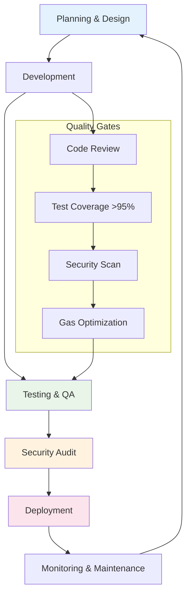

# 04 — Development Workflow & Quality Assurance

## Development Lifecycle Overview

The GIVE Protocol follows a structured development lifecycle ensuring security, quality, and maintainability at every stage.



## Development Environment Setup

### Prerequisites

```bash
# Core Tools
curl -L https://foundry.paradigm.xyz | bash
foundryup

# Node.js (>=18)
nvm install 18
nvm use 18

# Package Manager
npm install -g pnpm

# VS Code Extensions (recommended)
code --install-extension ms-vscode.vscode-json
code --install-extension bradlc.vscode-tailwindcss
code --install-extension esbenp.prettier-vscode
```

### Repository Setup

```bash
# Clone and setup
git clone https://github.com/GIVE-Labs/give-protocol-v0.git
cd give-protocol-v0

# Backend setup
cd backend
forge install
forge build

# Frontend setup  
cd ../frontend
pnpm install
pnpm dev

# Environment configuration
cp .env.example .env.local
# Configure RPC URLs and contract addresses
```

### Development Tools Configuration

#### Foundry Configuration (`foundry.toml`)
```toml
[profile.default]
src = "src"
out = "out"
libs = ["lib"]
gas_reports = ["*"]
optimizer = true
optimizer_runs = 1000000
via_ir = true

[profile.ci]
fuzz = { runs = 10000 }
invariant = { runs = 1000, depth = 20 }

[fmt]
line_length = 120
tab_width = 4
bracket_spacing = true
```

#### ESLint Configuration (`.eslintrc.json`)
```json
{
  "extends": [
    "next/core-web-vitals",
    "@typescript-eslint/recommended",
    "plugin:security/recommended"
  ],
  "rules": {
    "@typescript-eslint/no-unused-vars": "error",
    "@typescript-eslint/explicit-function-return-type": "warn",
    "security/detect-object-injection": "error"
  }
}
```

## Smart Contract Development Workflow

### 1. Architecture Design Phase

#### Interface Definition
```solidity
// Start with interfaces to define contract boundaries
interface ICampaignRegistry {
    function submitCampaign(string calldata metadataURI, address payoutAddress) 
        external payable returns (uint256 campaignId);
    
    function approveCampaign(uint256 campaignId) external;
    
    function getCampaign(uint256 campaignId) 
        external view returns (Campaign memory);
}
```

#### Data Structure Planning
```solidity
// Define comprehensive data structures
struct Campaign {
    uint256 id;
    address creator;
    address curator;
    address payoutAddress;
    uint96 stakeAmount;
    CampaignStatus status;
    string metadataURI;
    uint64[] attachedStrategies;
    uint256 createdAt;
    uint256 updatedAt;
}

enum CampaignStatus { Submitted, Active, Paused, Completed, Rejected }
```

### 2. Implementation Phase

#### Contract Structure Pattern
```solidity
// SPDX-License-Identifier: MIT
pragma solidity ^0.8.20;

import {AccessControlEnumerable} from "@openzeppelin/contracts/access/AccessControlEnumerable.sol";
import {ReentrancyGuard} from "@openzeppelin/contracts/utils/ReentrancyGuard.sol";
import {Pausable} from "@openzeppelin/contracts/utils/Pausable.sol";

import {RoleAware} from "./access/RoleAware.sol";
import {Errors} from "./utils/Errors.sol";

/// @title CampaignRegistry
/// @notice Manages campaign lifecycle from submission to completion
/// @dev Implements permissionless submission with approval workflow
contract CampaignRegistry is RoleAware, ReentrancyGuard, Pausable {
    
    /*//////////////////////////////////////////////////////////////
                                EVENTS
    //////////////////////////////////////////////////////////////*/
    
    event CampaignSubmitted(uint256 indexed campaignId, address indexed creator, address indexed curator);
    event CampaignApproved(uint256 indexed campaignId, address indexed approver);
    
    /*//////////////////////////////////////////////////////////////
                                STORAGE
    //////////////////////////////////////////////////////////////*/
    
    mapping(uint256 => Campaign) public campaigns;
    uint256 public campaignCounter;
    uint256 public minimumStake;
    
    /*//////////////////////////////////////////////////////////////
                                CONSTRUCTOR
    //////////////////////////////////////////////////////////////*/
    
    constructor(address roleManager, address treasury, uint256 _minimumStake) 
        RoleAware(roleManager) {
        treasury = _treasury;
        minimumStake = _minimumStake;
    }
    
    /*//////////////////////////////////////////////////////////////
                            EXTERNAL FUNCTIONS
    //////////////////////////////////////////////////////////////*/
    
    // Implementation follows...
}
```

#### Development Best Practices

**Gas Optimization Checklist**:
- [ ] Use `uint256` for loop counters and mappings
- [ ] Pack structs efficiently (consider storage slots)
- [ ] Use `immutable` for constants set at construction
- [ ] Implement `unchecked` blocks for safe arithmetic
- [ ] Minimize storage reads/writes in loops

**Security Checklist**:
- [ ] Input validation on all external functions
- [ ] Reentrancy protection on state-changing functions
- [ ] Access control on privileged operations
- [ ] Safe arithmetic (Solidity 0.8.20+ built-in)
- [ ] Event emission for all state changes

### 3. Testing Strategy

#### Test Organization Structure
```
test/
├── unit/                    # Individual contract testing
│   ├── CampaignRegistry.t.sol
│   ├── StrategyRegistry.t.sol
│   └── PayoutRouter.t.sol
├── integration/             # Multi-contract workflows  
│   ├── CampaignLifecycle.t.sol
│   └── YieldDistribution.t.sol
├── security/                # Security-focused tests
│   ├── ReentrancyTests.t.sol
│   └── AccessControlTests.t.sol
├── fork/                    # Mainnet fork testing
│   └── Fork_AaveSepolia.t.sol
└── invariant/               # Property-based testing
    └── CampaignInvariants.t.sol
```

#### Test Development Pattern
```solidity
contract CampaignRegistryTest is Test {
    CampaignRegistry public campaignRegistry;
    RoleManager public roleManager;
    
    address public admin = makeAddr("admin");
    address public curator = makeAddr("curator");
    address public treasury = makeAddr("treasury");
    
    uint256 public constant MINIMUM_STAKE = 0.0001 ether;
    
    function setUp() public {
        // Deploy dependencies
        roleManager = new RoleManager(address(this));
        roleManager.grantRole(roleManager.CAMPAIGN_ADMIN_ROLE(), admin);
        
        // Deploy contract under test
        campaignRegistry = new CampaignRegistry(
            address(roleManager),
            treasury,
            MINIMUM_STAKE
        );
    }
    
    function testSubmitCampaign() public {
        vm.deal(curator, 1 ether);
        
        vm.prank(curator);
        uint256 campaignId = campaignRegistry.submitCampaign{value: MINIMUM_STAKE}(
            "ipfs://metadata-hash",
            makeAddr("payout")
        );
        
        assertEq(campaignId, 1);
        
        CampaignRegistry.Campaign memory campaign = campaignRegistry.getCampaign(campaignId);
        assertEq(campaign.creator, curator);
        assertEq(uint8(campaign.status), uint8(CampaignRegistry.CampaignStatus.Submitted));
    }
    
    function testCannotSubmitCampaignWithInsufficientStake() public {
        vm.deal(curator, 1 ether);
        
        vm.prank(curator);
        vm.expectRevert(Errors.InsufficientStake.selector);
        campaignRegistry.submitCampaign{value: MINIMUM_STAKE - 1}(
            "ipfs://metadata-hash",
            makeAddr("payout")
        );
    }
}
```

### 4. Code Quality Gates

#### Pre-Commit Hooks
```bash
#!/bin/sh
# .git/hooks/pre-commit

# Format code
forge fmt

# Run tests
forge test

# Static analysis
slither . --config-file slither.config.json

# Gas report
forge test --gas-report

exit $?
```

#### Continuous Integration
```yaml
# .github/workflows/ci.yml
name: CI

on: [push, pull_request]

jobs:
  test:
    runs-on: ubuntu-latest
    steps:
      - uses: actions/checkout@v3
        with:
          submodules: recursive
      
      - name: Install Foundry
        uses: foundry-rs/foundry-toolchain@v1
        
      - name: Build contracts
        run: |
          cd backend
          forge build
          
      - name: Run tests
        run: |
          cd backend  
          forge test -vvv
          
      - name: Generate coverage
        run: |
          cd backend
          forge coverage --report lcov
          
      - name: Upload coverage
        uses: codecov/codecov-action@v3
        with:
          file: ./backend/lcov.info
```

## Frontend Development Workflow

### Component Development Pattern

#### Atomic Design Structure
```
src/components/
├── ui/                      # Basic UI elements
│   ├── Button.tsx
│   ├── Input.tsx
│   └── Modal.tsx
├── campaign/                # Campaign-specific components
│   ├── CampaignCard.tsx
│   ├── CampaignForm.tsx
│   └── CampaignStats.tsx
├── layout/                  # Layout components
│   ├── Header.tsx
│   ├── Footer.tsx
│   └── Sidebar.tsx
└── pages/                   # Page-level components
    ├── CampaignStaking.tsx
    └── CreateCampaign.tsx
```

#### Component Template
```tsx
import React, { useState, useEffect } from 'react';
import { useAccount, useReadContract, useWriteContract } from 'wagmi';
import { Address, formatUnits } from 'viem';

import Button from '../ui/Button';
import { CampaignRegistryABI } from '../../abis';
import { CONTRACT_ADDRESSES } from '../../config/contracts';

interface CampaignCardProps {
  campaignId: bigint;
  onUpdate?: () => void;
}

export default function CampaignCard({ campaignId, onUpdate }: CampaignCardProps): JSX.Element {
  const { address } = useAccount();
  const [isLoading, setIsLoading] = useState(false);
  
  // Read campaign data
  const { data: campaign, isError, refetch } = useReadContract({
    address: CONTRACT_ADDRESSES.CampaignRegistry,
    abi: CampaignRegistryABI,
    functionName: 'getCampaign',
    args: [campaignId],
  });
  
  // Write contract setup
  const { writeContract, isPending } = useWriteContract();
  
  const handleSupport = async (): Promise<void> => {
    if (!campaign) return;
    
    try {
      setIsLoading(true);
      writeContract({
        address: CONTRACT_ADDRESSES.CampaignRegistry,
        abi: CampaignRegistryABI,
        functionName: 'supportCampaign',
        args: [campaignId],
      });
    } catch (error) {
      console.error('Support failed:', error);
    } finally {
      setIsLoading(false);
    }
  };
  
  if (isError || !campaign) {
    return <div className="text-red-500">Failed to load campaign</div>;
  }
  
  return (
    <div className="campaign-card p-6 border rounded-lg shadow-sm">
      <h3 className="text-xl font-semibold mb-2">{campaign.title}</h3>
      <p className="text-gray-600 mb-4">{campaign.description}</p>
      
      <div className="flex justify-between items-center">
        <span className="text-sm text-gray-500">
          Raised: {formatUnits(campaign.totalRaised, 18)} ETH
        </span>
        
        <Button 
          onClick={handleSupport}
          disabled={isLoading || isPending}
          variant="primary"
        >
          {isLoading || isPending ? 'Supporting...' : 'Support Campaign'}
        </Button>
      </div>
    </div>
  );
}
```

### Web3 Integration Patterns

#### Contract Hook Pattern
```tsx
// hooks/useCampaignRegistry.ts
import { useReadContract, useWriteContract } from 'wagmi';
import { CampaignRegistryABI } from '../abis';
import { CONTRACT_ADDRESSES } from '../config/contracts';

export function useCampaignRegistry() {
  const { writeContract, isPending, isError } = useWriteContract();
  
  const submitCampaign = async (metadataURI: string, payoutAddress: string, stakeAmount: bigint) => {
    return writeContract({
      address: CONTRACT_ADDRESSES.CampaignRegistry,
      abi: CampaignRegistryABI,
      functionName: 'submitCampaign',
      args: [metadataURI, payoutAddress],
      value: stakeAmount,
    });
  };
  
  const getCampaign = (campaignId: bigint) => {
    return useReadContract({
      address: CONTRACT_ADDRESSES.CampaignRegistry,
      abi: CampaignRegistryABI,
      functionName: 'getCampaign',
      args: [campaignId],
    });
  };
  
  return {
    submitCampaign,
    getCampaign,
    isPending,
    isError,
  };
}
```

## Deployment Workflow

### Environment Management

#### Network Configuration
```typescript
// config/networks.ts
export const networks = {
  localhost: {
    chainId: 31337,
    name: 'Localhost',
    rpcUrl: 'http://127.0.0.1:8545',
    blockExplorer: 'N/A',
  },
  sepolia: {
    chainId: 11155111,
    name: 'Sepolia',
    rpcUrl: process.env.SEPOLIA_RPC_URL,
    blockExplorer: 'https://sepolia.etherscan.io',
  },
  scrollSepolia: {
    chainId: 534351,
    name: 'Scroll Sepolia',
    rpcUrl: process.env.SCROLL_SEPOLIA_RPC_URL,
    blockExplorer: 'https://sepolia.scrollscan.dev',
  },
};
```

#### Deployment Script Template
```solidity
// script/Deploy.s.sol
pragma solidity ^0.8.20;

import "forge-std/Script.sol";
import "../src/access/RoleManager.sol";
import "../src/campaign/CampaignRegistry.sol";
import "../src/manager/StrategyRegistry.sol";

contract DeployScript is Script {
    struct DeploymentConfig {
        address admin;
        address treasury;
        uint256 minimumStake;
        string environment;
    }
    
    function run() external {
        DeploymentConfig memory config = getConfig();
        
        vm.startBroadcast();
        
        // Deploy core contracts
        RoleManager roleManager = new RoleManager(config.admin);
        
        StrategyRegistry strategyRegistry = new StrategyRegistry(address(roleManager));
        
        CampaignRegistry campaignRegistry = new CampaignRegistry(
            address(roleManager),
            config.treasury,
            config.minimumStake
        );
        
        // Configure roles
        roleManager.grantRole(roleManager.CAMPAIGN_ADMIN_ROLE(), config.admin);
        roleManager.grantRole(roleManager.STRATEGY_ADMIN_ROLE(), config.admin);
        
        vm.stopBroadcast();
        
        // Log deployment addresses
        console.log("Deployment completed successfully");
        console.log("RoleManager:", address(roleManager));
        console.log("StrategyRegistry:", address(strategyRegistry));
        console.log("CampaignRegistry:", address(campaignRegistry));
        
        // Save addresses for frontend
        saveDeploymentAddresses(
            address(roleManager),
            address(strategyRegistry), 
            address(campaignRegistry)
        );
    }
    
    function getConfig() internal view returns (DeploymentConfig memory) {
        string memory environment = vm.envString("DEPLOYMENT_ENV");
        
        if (keccak256(bytes(environment)) == keccak256(bytes("production"))) {
            return DeploymentConfig({
                admin: vm.envAddress("PROD_ADMIN_ADDRESS"),
                treasury: vm.envAddress("PROD_TREASURY_ADDRESS"),
                minimumStake: 0.001 ether,
                environment: "production"
            });
        } else {
            return DeploymentConfig({
                admin: vm.envAddress("DEV_ADMIN_ADDRESS"),
                treasury: vm.envAddress("DEV_TREASURY_ADDRESS"),
                minimumStake: 0.0001 ether,
                environment: "development"
            });
        }
    }
    
    function saveDeploymentAddresses(
        address roleManager,
        address strategyRegistry,
        address campaignRegistry
    ) internal {
        string memory json = "deployment";
        vm.serializeAddress(json, "RoleManager", roleManager);
        vm.serializeAddress(json, "StrategyRegistry", strategyRegistry);
        string memory output = vm.serializeAddress(json, "CampaignRegistry", campaignRegistry);
        
        string memory filename = string.concat("deployments/", vm.envString("DEPLOYMENT_ENV"), ".json");
        vm.writeJson(output, filename);
    }
}
```

### Deployment Pipeline

#### Automated Deployment
```bash
#!/bin/bash
# scripts/deploy.sh

set -e

ENVIRONMENT=${1:-development}
NETWORK=${2:-sepolia}

echo "Deploying to $ENVIRONMENT environment on $NETWORK network"

# Load environment variables
source .env.$ENVIRONMENT

# Compile contracts
forge build

# Run deployment
forge script script/Deploy.s.sol:DeployScript \
    --rpc-url ${RPC_URL} \
    --private-key ${PRIVATE_KEY} \
    --broadcast \
    --verify \
    --etherscan-api-key ${ETHERSCAN_API_KEY}

# Update frontend configuration
node scripts/update-contracts.js $ENVIRONMENT

echo "Deployment completed successfully"
```

## Quality Assurance Framework

### Code Review Checklist

#### Smart Contract Review
- [ ] **Security**: Access control, reentrancy, overflow protection
- [ ] **Gas Optimization**: Efficient storage patterns, minimal external calls
- [ ] **Upgradeability**: Proxy patterns, storage layout compatibility
- [ ] **Events**: Comprehensive event emission for indexing
- [ ] **Documentation**: NatSpec comments, clear function purposes
- [ ] **Testing**: Adequate test coverage, edge cases handled

#### Frontend Review  
- [ ] **Web3 Integration**: Proper error handling, transaction feedback
- [ ] **User Experience**: Intuitive flows, loading states, error messages
- [ ] **Performance**: Optimized renders, efficient state management
- [ ] **Accessibility**: WCAG compliance, keyboard navigation
- [ ] **Security**: Input validation, XSS prevention
- [ ] **Responsive Design**: Mobile compatibility, cross-browser testing

### Automated Quality Checks

#### Static Analysis
```bash
# Smart contract analysis
slither . --config-file slither.config.json
mythx analyze contracts/

# Frontend analysis
npm run lint
npm run type-check
npm audit
```

#### Performance Monitoring
```typescript
// Performance monitoring setup
import { Web3ReactProvider } from '@web3-react/core';
import { Analytics } from '@analytics/core';

const analytics = Analytics({
  app: 'give-protocol',
  plugins: [
    performancePlugin(),
    errorTrackingPlugin(),
  ]
});

export function App() {
  return (
    <Web3ReactProvider getLibrary={getLibrary}>
      <ErrorBoundary fallback={ErrorFallback}>
        <Router>
          <Routes>
            {/* Application routes */}
          </Routes>
        </Router>
      </ErrorBoundary>
    </Web3ReactProvider>
  );
}
```

## Documentation Standards

### Code Documentation

#### Smart Contract Documentation
```solidity
/// @title CampaignRegistry
/// @author GIVE Protocol Team
/// @notice Manages campaign lifecycle from submission to completion
/// @dev Implements permissionless submission with curator approval workflow
/// @custom:security-contact security@giveprotocol.xyz
contract CampaignRegistry {
    
    /// @notice Submits a new campaign for approval
    /// @dev Requires ETH stake equal to minimumStake
    /// @param metadataURI IPFS hash containing campaign metadata
    /// @param payoutAddress Address to receive campaign funds
    /// @return campaignId Unique identifier for the created campaign
    /// @custom:throws InsufficientStake if msg.value < minimumStake
    /// @custom:throws InvalidPayoutAddress if payoutAddress is zero address
    function submitCampaign(
        string calldata metadataURI,
        address payoutAddress
    ) external payable returns (uint256 campaignId) {
        // Implementation...
    }
}
```

#### API Documentation
```typescript
/**
 * Campaign Registry Hook
 * 
 * Provides functionality to interact with the CampaignRegistry contract
 * 
 * @example
 * ```tsx
 * const { submitCampaign, isPending } = useCampaignRegistry();
 * 
 * const handleSubmit = async () => {
 *   await submitCampaign("ipfs://hash", "0x...", parseEther("0.001"));
 * };
 * ```
 */
export function useCampaignRegistry() {
  // Implementation...
}
```

### Architecture Decision Records (ADRs)

```markdown
# ADR-001: Centralized Role Management

## Status
Accepted

## Context
Multiple contracts had scattered AccessControl implementations creating security gaps.

## Decision
Implement centralized RoleManager contract for all permission management.

## Consequences
- ✅ Unified security model
- ✅ Simplified role administration  
- ✅ Better audit trail
- ❌ Single point of failure (mitigated by upgradeability)

## Implementation
- Deploy RoleManager as upgradeable proxy
- Migrate all contracts to use RoleManager reference
- Implement comprehensive role hierarchy
```

This development workflow ensures consistent quality, security, and maintainability across the entire GIVE Protocol codebase while supporting rapid iteration and deployment.