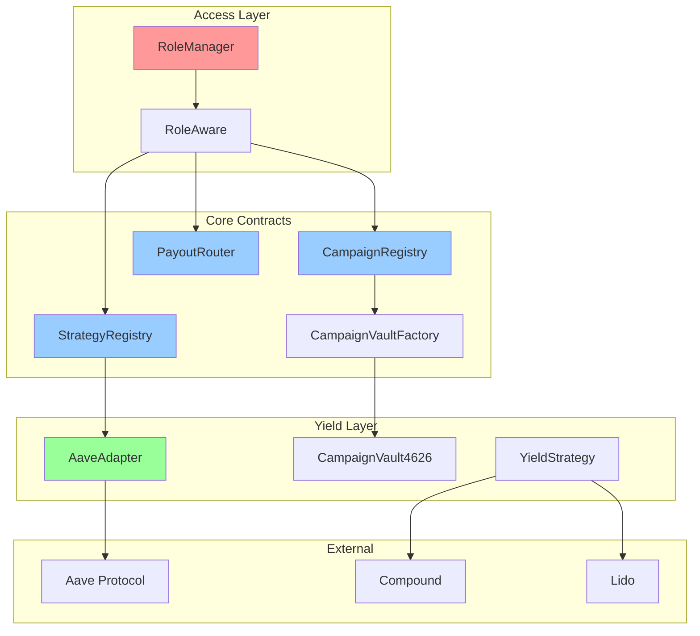

# 05 — Smart Contract Architecture Patterns

## Core Architecture Philosophy

The GIVE Protocol implements a modular, upgradeable architecture following established DeFi patterns while maintaining security-first principles.



## Design Pattern Implementation

### 1. Centralized Access Control Pattern

#### Core Implementation
```solidity
// contracts/access/RoleManager.sol
pragma solidity ^0.8.20;

import {AccessControlEnumerable} from "@openzeppelin/contracts/access/AccessControlEnumerable.sol";
import {Errors} from "../utils/Errors.sol";

/// @title RoleManager
/// @notice Centralized role management for the entire protocol
/// @dev Single source of truth for all access control decisions
contract RoleManager is AccessControlEnumerable {
    
    /*//////////////////////////////////////////////////////////////
                                ROLES
    //////////////////////////////////////////////////////////////*/
    
    bytes32 public constant CAMPAIGN_ADMIN_ROLE = keccak256("CAMPAIGN_ADMIN_ROLE");
    bytes32 public constant STRATEGY_ADMIN_ROLE = keccak256("STRATEGY_ADMIN_ROLE");
    bytes32 public constant KEEPER_ROLE = keccak256("KEEPER_ROLE");
    bytes32 public constant CURATOR_ROLE = keccak256("CURATOR_ROLE");
    bytes32 public constant VAULT_OPS_ROLE = keccak256("VAULT_OPS_ROLE");
    bytes32 public constant TREASURY_ROLE = keccak256("TREASURY_ROLE");
    bytes32 public constant GUARDIAN_ROLE = keccak256("GUARDIAN_ROLE");
    bytes32 public constant DONATION_RECORDER_ROLE = keccak256("DONATION_RECORDER_ROLE");
    
    /*//////////////////////////////////////////////////////////////
                                EVENTS
    //////////////////////////////////////////////////////////////*/
    
    event RolesBatchGranted(bytes32[] roles, address[] accounts, address indexed granter);
    event RolesBatchRevoked(bytes32[] roles, address[] accounts, address indexed revoker);
    
    /*//////////////////////////////////////////////////////////////
                                CONSTRUCTOR
    //////////////////////////////////////////////////////////////*/
    
    constructor(address defaultAdmin) {
        if (defaultAdmin == address(0)) revert Errors.ZeroAddress();
        _grantRole(DEFAULT_ADMIN_ROLE, defaultAdmin);
        
        // Set up role hierarchy
        _setRoleAdmin(CAMPAIGN_ADMIN_ROLE, DEFAULT_ADMIN_ROLE);
        _setRoleAdmin(STRATEGY_ADMIN_ROLE, DEFAULT_ADMIN_ROLE);
        _setRoleAdmin(KEEPER_ROLE, DEFAULT_ADMIN_ROLE);
        _setRoleAdmin(CURATOR_ROLE, CAMPAIGN_ADMIN_ROLE);
        _setRoleAdmin(VAULT_OPS_ROLE, STRATEGY_ADMIN_ROLE);
        _setRoleAdmin(TREASURY_ROLE, DEFAULT_ADMIN_ROLE);
        _setRoleAdmin(GUARDIAN_ROLE, DEFAULT_ADMIN_ROLE);
        _setRoleAdmin(DONATION_RECORDER_ROLE, CAMPAIGN_ADMIN_ROLE);
    }
    
    /*//////////////////////////////////////////////////////////////
                            EXTERNAL FUNCTIONS
    //////////////////////////////////////////////////////////////*/
    
    /// @notice Grant multiple roles to multiple accounts efficiently
    /// @param roles Array of role identifiers to grant
    /// @param accounts Array of accounts to receive roles
    /// @dev Arrays must be same length, requires appropriate admin role
    function grantRoles(bytes32[] calldata roles, address[] calldata accounts) 
        external {
        if (roles.length != accounts.length) revert Errors.ArrayLengthMismatch();
        if (roles.length == 0) revert Errors.EmptyArray();
        
        for (uint256 i = 0; i < roles.length;) {
            grantRole(roles[i], accounts[i]);
            unchecked { ++i; }
        }
        
        emit RolesBatchGranted(roles, accounts, msg.sender);
    }
    
    /// @notice Revoke multiple roles from multiple accounts efficiently  
    /// @param roles Array of role identifiers to revoke
    /// @param accounts Array of accounts to lose roles
    /// @dev Arrays must be same length, requires appropriate admin role
    function revokeRoles(bytes32[] calldata roles, address[] calldata accounts)
        external {
        if (roles.length != accounts.length) revert Errors.ArrayLengthMismatch();
        if (roles.length == 0) revert Errors.EmptyArray();
        
        for (uint256 i = 0; i < roles.length;) {
            revokeRole(roles[i], accounts[i]);
            unchecked { ++i; }
        }
        
        emit RolesBatchRevoked(roles, accounts, msg.sender);
    }
    
    /// @notice Check if an account has any of the specified roles
    /// @param roles Array of roles to check
    /// @param account Account to verify
    /// @return hasRole True if account has at least one of the roles
    function hasAnyRole(bytes32[] calldata roles, address account) 
        external view returns (bool hasRole) {
        for (uint256 i = 0; i < roles.length;) {
            if (hasRole(roles[i], account)) return true;
            unchecked { ++i; }
        }
        return false;
    }
}
```

#### RoleAware Inheritance Pattern
```solidity
// contracts/access/RoleAware.sol
pragma solidity ^0.8.20;

import {RoleManager} from "./RoleManager.sol";
import {Errors} from "../utils/Errors.sol";

/// @title RoleAware
/// @notice Base contract providing role-based access control via RoleManager
/// @dev Inherit from this contract to gain access control capabilities
abstract contract RoleAware {
    
    /*//////////////////////////////////////////////////////////////
                                STORAGE
    //////////////////////////////////////////////////////////////*/
    
    RoleManager public immutable roleManager;
    
    /*//////////////////////////////////////////////////////////////
                                CONSTRUCTOR
    //////////////////////////////////////////////////////////////*/
    
    constructor(address _roleManager) {
        if (_roleManager == address(0)) revert Errors.ZeroAddress();
        roleManager = RoleManager(_roleManager);
    }
    
    /*//////////////////////////////////////////////////////////////
                                MODIFIERS
    //////////////////////////////////////////////////////////////*/
    
    /// @dev Restrict function access to accounts with specified role
    modifier onlyRole(bytes32 role) {
        if (!roleManager.hasRole(role, msg.sender)) {
            revert Errors.UnauthorizedAccess(msg.sender, role);
        }
        _;
    }
    
    /// @dev Restrict function access to accounts with any of the specified roles
    modifier onlyRoles(bytes32[] memory roles) {
        if (!roleManager.hasAnyRole(roles, msg.sender)) {
            revert Errors.UnauthorizedMultiRoleAccess(msg.sender, roles);
        }
        _;
    }
    
    /// @dev Restrict function access to campaign admin or higher
    modifier onlyCampaignAdmin() {
        if (!roleManager.hasRole(roleManager.CAMPAIGN_ADMIN_ROLE(), msg.sender)) {
            revert Errors.UnauthorizedAccess(msg.sender, roleManager.CAMPAIGN_ADMIN_ROLE());
        }
        _;
    }
    
    /// @dev Restrict function access to strategy admin or higher
    modifier onlyStrategyAdmin() {
        if (!roleManager.hasRole(roleManager.STRATEGY_ADMIN_ROLE(), msg.sender)) {
            revert Errors.UnauthorizedAccess(msg.sender, roleManager.STRATEGY_ADMIN_ROLE());
        }
        _;
    }
}
```

### 2. Registry Pattern Implementation

#### Campaign Registry with State Management
```solidity
// contracts/campaign/CampaignRegistry.sol
pragma solidity ^0.8.20;

import {ReentrancyGuard} from "@openzeppelin/contracts/utils/ReentrancyGuard.sol";
import {Pausable} from "@openzeppelin/contracts/utils/Pausable.sol";
import {Address} from "@openzeppelin/contracts/utils/Address.sol";

import {RoleAware} from "../access/RoleAware.sol";
import {Errors} from "../utils/Errors.sol";

/// @title CampaignRegistry  
/// @notice Manages campaign lifecycle with permissionless submission and approval workflow
/// @dev Implements stake-based spam protection and curator approval system
contract CampaignRegistry is RoleAware, ReentrancyGuard, Pausable {
    using Address for address payable;
    
    /*//////////////////////////////////////////////////////////////
                                STRUCTS
    //////////////////////////////////////////////////////////////*/
    
    /// @dev Optimized struct packing for gas efficiency
    struct Campaign {
        uint256 id;                    // Campaign unique identifier
        address creator;               // Campaign creator address
        address curator;               // Assigned curator (if any)
        address payoutAddress;         // Address to receive campaign funds
        uint96 stakeAmount;           // ETH staked by creator (fits in 96 bits)
        CampaignStatus status;         // Current campaign status
        string metadataURI;           // IPFS hash for campaign metadata
        uint64[] attachedStrategies;  // Yield strategies attached to campaign
        uint256 createdAt;            // Block timestamp of creation
        uint256 updatedAt;            // Block timestamp of last update
    }
    
    /// @dev Campaign lifecycle states
    enum CampaignStatus { 
        Submitted,   // Initial state after submission
        Active,      // Approved and accepting donations
        Paused,      // Temporarily suspended
        Completed,   // Successfully completed
        Rejected     // Rejected by curator
    }
    
    /*//////////////////////////////////////////////////////////////
                                EVENTS
    //////////////////////////////////////////////////////////////*/
    
    event CampaignSubmitted(
        uint256 indexed campaignId,
        address indexed creator,
        address indexed curator,
        string metadataURI,
        uint256 stakeAmount
    );
    
    event CampaignApproved(
        uint256 indexed campaignId,
        address indexed approver,
        address indexed curator
    );
    
    event CampaignRejected(
        uint256 indexed campaignId,
        address indexed rejector,
        string reason,
        uint256 stakeRefunded
    );
    
    event StrategyAttached(
        uint256 indexed campaignId,
        uint64 indexed strategyId,
        address indexed attacher
    );
    
    /*//////////////////////////////////////////////////////////////
                                STORAGE
    //////////////////////////////////////////////////////////////*/
    
    mapping(uint256 => Campaign) public campaigns;
    mapping(address => uint256[]) public creatorCampaigns;
    mapping(address => uint256[]) public curatorCampaigns;
    
    uint256 public campaignCounter;
    uint256 public minimumStake;
    address payable public treasury;
    
    /*//////////////////////////////////////////////////////////////
                                CONSTRUCTOR
    //////////////////////////////////////////////////////////////*/
    
    constructor(
        address _roleManager,
        address payable _treasury,
        uint256 _minimumStake
    ) RoleAware(_roleManager) {
        if (_treasury == address(0)) revert Errors.ZeroAddress();
        if (_minimumStake == 0) revert Errors.ZeroAmount();
        
        treasury = _treasury;
        minimumStake = _minimumStake;
    }
    
    /*//////////////////////////////////////////////////////////////
                            EXTERNAL FUNCTIONS
    //////////////////////////////////////////////////////////////*/
    
    /// @notice Submit a new campaign for approval
    /// @param metadataURI IPFS hash containing campaign metadata
    /// @param payoutAddress Address to receive approved campaign funds
    /// @return campaignId Unique identifier for the created campaign
    /// @dev Requires ETH stake equal to minimumStake to prevent spam
    function submitCampaign(
        string calldata metadataURI,
        address payoutAddress
    ) 
        external 
        payable 
        nonReentrant 
        whenNotPaused 
        returns (uint256 campaignId) 
    {
        if (msg.value < minimumStake) revert Errors.InsufficientStake(msg.value, minimumStake);
        if (payoutAddress == address(0)) revert Errors.ZeroAddress();
        if (bytes(metadataURI).length == 0) revert Errors.EmptyString();
        
        campaignId = ++campaignCounter;
        
        campaigns[campaignId] = Campaign({
            id: campaignId,
            creator: msg.sender,
            curator: address(0),
            payoutAddress: payoutAddress,
            stakeAmount: uint96(msg.value),
            status: CampaignStatus.Submitted,
            metadataURI: metadataURI,
            attachedStrategies: new uint64[](0),
            createdAt: block.timestamp,
            updatedAt: block.timestamp
        });
        
        creatorCampaigns[msg.sender].push(campaignId);
        
        emit CampaignSubmitted(
            campaignId,
            msg.sender,
            address(0),
            metadataURI,
            msg.value
        );
    }
    
    /// @notice Approve a submitted campaign
    /// @param campaignId Campaign to approve
    /// @param curator Optional curator to assign to campaign
    /// @dev Only CAMPAIGN_ADMIN or CURATOR can approve campaigns
    function approveCampaign(uint256 campaignId, address curator) 
        external 
        onlyRoles(_getCampaignApprovalRoles()) 
        nonReentrant 
    {
        Campaign storage campaign = campaigns[campaignId];
        
        if (campaign.id == 0) revert Errors.CampaignNotFound(campaignId);
        if (campaign.status != CampaignStatus.Submitted) {
            revert Errors.InvalidCampaignStatus(campaign.status, CampaignStatus.Submitted);
        }
        
        campaign.status = CampaignStatus.Active;
        campaign.curator = curator;
        campaign.updatedAt = block.timestamp;
        
        if (curator != address(0)) {
            curatorCampaigns[curator].push(campaignId);
        }
        
        // Transfer stake to treasury as approval fee
        treasury.sendValue(campaign.stakeAmount);
        
        emit CampaignApproved(campaignId, msg.sender, curator);
    }
    
    /// @notice Reject a submitted campaign with reason
    /// @param campaignId Campaign to reject
    /// @param reason Explanation for rejection
    /// @dev Refunds stake to creator, only CAMPAIGN_ADMIN or CURATOR can reject
    function rejectCampaign(uint256 campaignId, string calldata reason)
        external
        onlyRoles(_getCampaignApprovalRoles())
        nonReentrant
    {
        Campaign storage campaign = campaigns[campaignId];
        
        if (campaign.id == 0) revert Errors.CampaignNotFound(campaignId);
        if (campaign.status != CampaignStatus.Submitted) {
            revert Errors.InvalidCampaignStatus(campaign.status, CampaignStatus.Submitted);
        }
        
        campaign.status = CampaignStatus.Rejected;
        campaign.updatedAt = block.timestamp;
        
        uint256 refundAmount = campaign.stakeAmount;
        
        // Refund stake to creator
        payable(campaign.creator).sendValue(refundAmount);
        
        emit CampaignRejected(campaignId, msg.sender, reason, refundAmount);
    }
    
    /// @notice Attach yield strategy to approved campaign
    /// @param campaignId Campaign to attach strategy to
    /// @param strategyId Strategy identifier from StrategyRegistry
    /// @dev Only STRATEGY_ADMIN can attach strategies
    function attachStrategy(uint256 campaignId, uint64 strategyId)
        external
        onlyRole(roleManager.STRATEGY_ADMIN_ROLE())
        nonReentrant
    {
        Campaign storage campaign = campaigns[campaignId];
        
        if (campaign.id == 0) revert Errors.CampaignNotFound(campaignId);
        if (campaign.status != CampaignStatus.Active) {
            revert Errors.InvalidCampaignStatus(campaign.status, CampaignStatus.Active);
        }
        
        // Verify strategy exists (call to StrategyRegistry)
        // Implementation depends on StrategyRegistry interface
        
        campaign.attachedStrategies.push(strategyId);
        campaign.updatedAt = block.timestamp;
        
        emit StrategyAttached(campaignId, strategyId, msg.sender);
    }
    
    /*//////////////////////////////////////////////////////////////
                            VIEW FUNCTIONS
    //////////////////////////////////////////////////////////////*/
    
    /// @notice Get complete campaign information
    /// @param campaignId Campaign identifier
    /// @return campaign Complete campaign struct
    function getCampaign(uint256 campaignId) 
        external 
        view 
        returns (Campaign memory campaign) 
    {
        campaign = campaigns[campaignId];
        if (campaign.id == 0) revert Errors.CampaignNotFound(campaignId);
    }
    
    /// @notice Get campaigns created by specific address
    /// @param creator Creator address to query
    /// @return campaignIds Array of campaign identifiers
    function getCampaignsByCreator(address creator) 
        external 
        view 
        returns (uint256[] memory campaignIds) 
    {
        return creatorCampaigns[creator];
    }
    
    /// @notice Get campaigns assigned to specific curator
    /// @param curator Curator address to query
    /// @return campaignIds Array of campaign identifiers
    function getCampaignsByCurator(address curator)
        external
        view
        returns (uint256[] memory campaignIds)
    {
        return curatorCampaigns[curator];
    }
    
    /*//////////////////////////////////////////////////////////////
                            INTERNAL FUNCTIONS
    //////////////////////////////////////////////////////////////*/
    
    /// @dev Get roles allowed to approve/reject campaigns
    function _getCampaignApprovalRoles() internal view returns (bytes32[] memory roles) {
        roles = new bytes32[](2);
        roles[0] = roleManager.CAMPAIGN_ADMIN_ROLE();
        roles[1] = roleManager.CURATOR_ROLE();
    }
    
    /*//////////////////////////////////////////////////////////////
                            ADMIN FUNCTIONS
    //////////////////////////////////////////////////////////////*/
    
    /// @notice Update minimum stake requirement
    /// @param newMinimumStake New minimum stake amount
    /// @dev Only CAMPAIGN_ADMIN can update minimum stake
    function setMinimumStake(uint256 newMinimumStake) 
        external 
        onlyCampaignAdmin 
    {
        if (newMinimumStake == 0) revert Errors.ZeroAmount();
        
        uint256 oldStake = minimumStake;
        minimumStake = newMinimumStake;
        
        emit MinimumStakeUpdated(oldStake, newMinimumStake, msg.sender);
    }
    
    /// @notice Update treasury address
    /// @param newTreasury New treasury address
    /// @dev Only DEFAULT_ADMIN can update treasury
    function setTreasury(address payable newTreasury)
        external
        onlyRole(roleManager.DEFAULT_ADMIN_ROLE())
    {
        if (newTreasury == address(0)) revert Errors.ZeroAddress();
        
        address oldTreasury = treasury;
        treasury = newTreasury;
        
        emit TreasuryUpdated(oldTreasury, newTreasury, msg.sender);
    }
    
    /// @notice Emergency pause contract operations
    /// @dev Only GUARDIAN can pause contract
    function pause() external onlyRole(roleManager.GUARDIAN_ROLE()) {
        _pause();
    }
    
    /// @notice Resume contract operations
    /// @dev Only GUARDIAN can unpause contract
    function unpause() external onlyRole(roleManager.GUARDIAN_ROLE()) {
        _unpause();
    }
}
```

### 3. Factory Pattern for Vault Creation

#### Campaign Vault Factory
```solidity
// contracts/vault/CampaignVaultFactory.sol
pragma solidity ^0.8.20;

import {Clones} from "@openzeppelin/contracts/proxy/Clones.sol";
import {Address} from "@openzeppelin/contracts/utils/Address.sol";

import {RoleAware} from "../access/RoleAware.sol";
import {GiveVault4626} from "./GiveVault4626.sol";
import {Errors} from "../utils/Errors.sol";

/// @title CampaignVaultFactory
/// @notice Factory for creating isolated campaign vaults using minimal proxy pattern
/// @dev Uses OpenZeppelin Clones for gas-efficient vault deployment
contract CampaignVaultFactory is RoleAware {
    using Clones for address;
    using Address for address;
    
    /*//////////////////////////////////////////////////////////////
                                EVENTS
    //////////////////////////////////////////////////////////////*/
    
    event VaultCreated(
        address indexed vault,
        uint256 indexed campaignId,
        uint64 indexed strategyId,
        address creator
    );
    
    event ImplementationUpdated(
        address indexed oldImplementation,
        address indexed newImplementation,
        address updater
    );
    
    /*//////////////////////////////////////////////////////////////
                                STORAGE
    //////////////////////////////////////////////////////////////*/
    
    address public vaultImplementation;
    
    mapping(uint256 => mapping(uint64 => address)) public campaignVaults;
    mapping(address => bool) public isVault;
    
    uint256 public totalVaults;
    
    /*//////////////////////////////////////////////////////////////
                                CONSTRUCTOR
    //////////////////////////////////////////////////////////////*/
    
    constructor(address _roleManager, address _vaultImplementation) 
        RoleAware(_roleManager) 
    {
        if (_vaultImplementation == address(0)) revert Errors.ZeroAddress();
        if (!_vaultImplementation.isContract()) revert Errors.NotContract();
        
        vaultImplementation = _vaultImplementation;
    }
    
    /*//////////////////////////////////////////////////////////////
                            EXTERNAL FUNCTIONS
    //////////////////////////////////////////////////////////////*/
    
    /// @notice Create new campaign vault for specific campaign-strategy pair
    /// @param campaignId Campaign identifier
    /// @param strategyId Strategy identifier  
    /// @param asset Underlying asset for the vault
    /// @param name Vault name for ERC4626
    /// @param symbol Vault symbol for ERC4626
    /// @return vault Address of created vault
    /// @dev Only VAULT_OPS can create new vaults
    function createVault(
        uint256 campaignId,
        uint64 strategyId,
        address asset,
        string calldata name,
        string calldata symbol
    ) 
        external 
        onlyRole(roleManager.VAULT_OPS_ROLE()) 
        returns (address vault) 
    {
        if (campaignId == 0) revert Errors.InvalidCampaignId();
        if (asset == address(0)) revert Errors.ZeroAddress();
        if (bytes(name).length == 0 || bytes(symbol).length == 0) revert Errors.EmptyString();
        
        // Check if vault already exists for this campaign-strategy pair
        if (campaignVaults[campaignId][strategyId] != address(0)) {
            revert Errors.VaultAlreadyExists(campaignId, strategyId);
        }
        
        // Create deterministic salt for consistent addresses
        bytes32 salt = keccak256(abi.encodePacked(campaignId, strategyId, block.timestamp));
        
        // Deploy minimal proxy
        vault = vaultImplementation.cloneDeterministic(salt);
        
        // Initialize the vault
        GiveVault4626(vault).initialize(
            asset,
            name,
            symbol,
            campaignId,
            strategyId,
            address(roleManager)
        );
        
        // Update mappings
        campaignVaults[campaignId][strategyId] = vault;
        isVault[vault] = true;
        totalVaults++;
        
        emit VaultCreated(vault, campaignId, strategyId, msg.sender);
    }
    
    /// @notice Predict vault address before deployment
    /// @param campaignId Campaign identifier
    /// @param strategyId Strategy identifier
    /// @param salt Deterministic salt for address generation
    /// @return predicted Predicted vault address
    function predictVaultAddress(
        uint256 campaignId,
        uint64 strategyId,
        bytes32 salt
    ) external view returns (address predicted) {
        return vaultImplementation.predictDeterministicAddress(salt);
    }
    
    /// @notice Get vault address for campaign-strategy pair
    /// @param campaignId Campaign identifier
    /// @param strategyId Strategy identifier  
    /// @return vault Vault address (zero if doesn't exist)
    function getVault(uint256 campaignId, uint64 strategyId)
        external
        view
        returns (address vault)
    {
        return campaignVaults[campaignId][strategyId];
    }
    
    /*//////////////////////////////////////////////////////////////
                            ADMIN FUNCTIONS
    //////////////////////////////////////////////////////////////*/
    
    /// @notice Update vault implementation contract
    /// @param newImplementation New vault implementation address
    /// @dev Only STRATEGY_ADMIN can update implementation
    function setVaultImplementation(address newImplementation)
        external
        onlyStrategyAdmin
    {
        if (newImplementation == address(0)) revert Errors.ZeroAddress();
        if (!newImplementation.isContract()) revert Errors.NotContract();
        
        address oldImplementation = vaultImplementation;
        vaultImplementation = newImplementation;
        
        emit ImplementationUpdated(oldImplementation, newImplementation, msg.sender);
    }
}
```

### 4. ERC4626 Vault Pattern with Custom Logic

#### Enhanced Vault Implementation
```solidity
// contracts/vault/GiveVault4626.sol
pragma solidity ^0.8.20;

import {ERC4626} from "@openzeppelin/contracts/token/ERC20/extensions/ERC4626.sol";
import {ERC20} from "@openzeppelin/contracts/token/ERC20/ERC20.sol";
import {IERC20} from "@openzeppelin/contracts/token/ERC20/IERC20.sol";
import {SafeERC20} from "@openzeppelin/contracts/token/ERC20/utils/SafeERC20.sol";
import {Math} from "@openzeppelin/contracts/utils/math/Math.sol";
import {Initializable} from "@openzeppelin/contracts-upgradeable/proxy/utils/Initializable.sol";

import {RoleAware} from "../access/RoleAware.sol";
import {IYieldAdapter} from "../adapters/IYieldAdapter.sol";
import {Errors} from "../utils/Errors.sol";

/// @title GiveVault4626
/// @notice ERC4626-compliant vault with integrated yield generation for campaigns
/// @dev Implements automated yield distribution with user allocation preferences
contract GiveVault4626 is ERC4626, RoleAware, Initializable {
    using SafeERC20 for IERC20;
    using Math for uint256;
    
    /*//////////////////////////////////////////////////////////////
                                STRUCTS
    //////////////////////////////////////////////////////////////*/
    
    /// @dev User yield allocation preferences
    struct YieldAllocation {
        uint16 campaignPercent;    // Percentage to campaign (basis points)
        uint16 userPercent;        // Percentage to user (basis points)  
        uint16 protocolPercent;    // Percentage to protocol (basis points)
        address beneficiary;       // Alternative beneficiary for user portion
    }
    
    /*//////////////////////////////////////////////////////////////
                                EVENTS
    //////////////////////////////////////////////////////////////*/
    
    event YieldDistributed(
        address indexed user,
        uint256 totalYield,
        uint256 campaignAmount,
        uint256 userAmount,
        uint256 protocolAmount
    );
    
    event AllocationUpdated(
        address indexed user,
        uint16 campaignPercent,
        uint16 userPercent,
        uint16 protocolPercent,
        address beneficiary
    );
    
    /*//////////////////////////////////////////////////////////////
                                STORAGE
    //////////////////////////////////////////////////////////////*/
    
    uint256 public campaignId;
    uint64 public strategyId;
    IYieldAdapter public yieldAdapter;
    
    mapping(address => YieldAllocation) public userAllocations;
    mapping(address => uint256) public userYieldAccrued;
    
    uint256 public totalYieldGenerated;
    uint256 public protocolFeeBasisPoints;
    address public treasury;
    address public campaignPayoutAddress;
    
    // Default allocation: 50% campaign, 30% user, 20% protocol
    uint16 public constant DEFAULT_CAMPAIGN_PERCENT = 5000;
    uint16 public constant DEFAULT_USER_PERCENT = 3000;
    uint16 public constant DEFAULT_PROTOCOL_PERCENT = 2000;
    uint16 public constant BASIS_POINTS = 10000;
    
    /*//////////////////////////////////////////////////////////////
                                CONSTRUCTOR
    //////////////////////////////////////////////////////////////*/
    
    /// @dev Constructor for implementation contract (not used in proxies)
    constructor() ERC4626(IERC20(address(0))) ERC20("", "") RoleAware(address(0)) {
        _disableInitializers();
    }
    
    /*//////////////////////////////////////////////////////////////
                                INITIALIZER
    //////////////////////////////////////////////////////////////*/
    
    /// @notice Initialize vault with campaign and strategy parameters
    /// @param asset Underlying ERC20 asset
    /// @param name Vault name for ERC20
    /// @param symbol Vault symbol for ERC20
    /// @param _campaignId Campaign identifier
    /// @param _strategyId Strategy identifier
    /// @param _roleManager RoleManager contract address
    function initialize(
        address asset,
        string memory name,
        string memory symbol,
        uint256 _campaignId,
        uint64 _strategyId,
        address _roleManager
    ) external initializer {
        // Initialize parent contracts
        __ERC4626_init(IERC20(asset));
        __ERC20_init(name, symbol);
        
        // Set vault parameters
        campaignId = _campaignId;
        strategyId = _strategyId;
        protocolFeeBasisPoints = DEFAULT_PROTOCOL_PERCENT;
        
        // Initialize role manager
        if (_roleManager == address(0)) revert Errors.ZeroAddress();
        roleManager = RoleManager(_roleManager);
    }
    
    /*//////////////////////////////////////////////////////////////
                            DEPOSIT/WITHDRAW
    //////////////////////////////////////////////////////////////*/
    
    /// @notice Deposit assets and mint shares
    /// @param assets Amount of assets to deposit
    /// @param receiver Address to receive vault shares
    /// @return shares Amount of shares minted
    function deposit(uint256 assets, address receiver) 
        public 
        override 
        returns (uint256 shares) 
    {
        // Standard ERC4626 deposit
        shares = super.deposit(assets, receiver);
        
        // Deploy assets to yield strategy
        _deployToStrategy(assets);
        
        // Initialize user allocation if first deposit
        if (userAllocations[receiver].campaignPercent == 0) {
            _setDefaultAllocation(receiver);
        }
    }
    
    /// @notice Mint shares for specific assets amount
    /// @param shares Amount of shares to mint
    /// @param receiver Address to receive vault shares  
    /// @return assets Amount of assets required
    function mint(uint256 shares, address receiver)
        public
        override
        returns (uint256 assets)
    {
        assets = super.mint(shares, receiver);
        _deployToStrategy(assets);
        
        if (userAllocations[receiver].campaignPercent == 0) {
            _setDefaultAllocation(receiver);
        }
    }
    
    /// @notice Withdraw assets by burning shares
    /// @param assets Amount of assets to withdraw
    /// @param receiver Address to receive assets
    /// @param owner Address that owns the shares
    /// @return shares Amount of shares burned
    function withdraw(uint256 assets, address receiver, address owner)
        public
        override
        returns (uint256 shares)
    {
        // Harvest yield before withdrawal
        _harvestYield(owner);
        
        // Withdraw from strategy if needed
        _withdrawFromStrategy(assets);
        
        return super.withdraw(assets, receiver, owner);
    }
    
    /// @notice Redeem shares for assets
    /// @param shares Amount of shares to redeem
    /// @param receiver Address to receive assets
    /// @param owner Address that owns the shares
    /// @return assets Amount of assets received
    function redeem(uint256 shares, address receiver, address owner)
        public
        override
        returns (uint256 assets)
    {
        _harvestYield(owner);
        
        assets = previewRedeem(shares);
        _withdrawFromStrategy(assets);
        
        return super.redeem(shares, receiver, owner);
    }
    
    /*//////////////////////////////////////////////////////////////
                            YIELD MANAGEMENT
    //////////////////////////////////////////////////////////////*/
    
    /// @notice Set yield allocation preferences
    /// @param campaignPercent Percentage to campaign (basis points)
    /// @param userPercent Percentage to user (basis points)
    /// @param beneficiary Alternative beneficiary for user portion
    /// @dev Percentages must sum to 10000 basis points minus protocol fee
    function setYieldAllocation(
        uint16 campaignPercent,
        uint16 userPercent,
        address beneficiary
    ) external {
        uint16 protocolPercent = uint16(protocolFeeBasisPoints);
        
        if (campaignPercent + userPercent + protocolPercent != BASIS_POINTS) {
            revert Errors.InvalidAllocationTotal();
        }
        
        userAllocations[msg.sender] = YieldAllocation({
            campaignPercent: campaignPercent,
            userPercent: userPercent,
            protocolPercent: protocolPercent,
            beneficiary: beneficiary != address(0) ? beneficiary : msg.sender
        });
        
        emit AllocationUpdated(
            msg.sender,
            campaignPercent,
            userPercent,
            protocolPercent,
            beneficiary
        );
    }
    
    /// @notice Harvest and distribute yield for user
    /// @param user User to harvest yield for
    /// @dev Can be called by anyone to trigger yield distribution
    function harvestYield(address user) external {
        _harvestYield(user);
    }
    
    /// @notice Harvest yield for multiple users in batch
    /// @param users Array of users to harvest for
    /// @dev Gas-efficient batch processing
    function harvestYieldBatch(address[] calldata users) external {
        for (uint256 i = 0; i < users.length;) {
            _harvestYield(users[i]);
            unchecked { ++i; }
        }
    }
    
    /*//////////////////////////////////////////////////////////////
                            VIEW FUNCTIONS
    //////////////////////////////////////////////////////////////*/
    
    /// @notice Get total assets including yield from strategy
    /// @return totalManagedAssets Total assets under management
    function totalAssets() public view override returns (uint256 totalManagedAssets) {
        uint256 idleAssets = IERC20(asset()).balanceOf(address(this));
        uint256 strategyAssets = yieldAdapter != IYieldAdapter(address(0)) 
            ? yieldAdapter.totalAssets() 
            : 0;
        return idleAssets + strategyAssets;
    }
    
    /// @notice Preview yield available for user
    /// @param user User address
    /// @return yieldAmount Pending yield amount
    function previewYieldHarvest(address user) external view returns (uint256 yieldAmount) {
        if (yieldAdapter == IYieldAdapter(address(0))) return 0;
        
        uint256 userShares = balanceOf(user);
        if (userShares == 0) return 0;
        
        uint256 totalShares = totalSupply();
        uint256 pendingYield = yieldAdapter.pendingYield();
        
        return pendingYield.mulDiv(userShares, totalShares, Math.Rounding.Down);
    }
    
    /*//////////////////////////////////////////////////////////////
                            INTERNAL FUNCTIONS
    //////////////////////////////////////////////////////////////*/
    
    /// @dev Deploy assets to configured yield strategy
    function _deployToStrategy(uint256 assets) internal {
        if (yieldAdapter != IYieldAdapter(address(0)) && assets > 0) {
            IERC20(asset()).safeTransfer(address(yieldAdapter), assets);
            yieldAdapter.deposit(assets);
        }
    }
    
    /// @dev Withdraw assets from yield strategy
    function _withdrawFromStrategy(uint256 assets) internal {
        if (yieldAdapter != IYieldAdapter(address(0))) {
            yieldAdapter.withdraw(assets);
        }
    }
    
    /// @dev Harvest and distribute yield for specific user
    function _harvestYield(address user) internal {
        if (yieldAdapter == IYieldAdapter(address(0))) return;
        
        uint256 userShares = balanceOf(user);
        if (userShares == 0) return;
        
        // Harvest yield from strategy
        uint256 yieldHarvested = yieldAdapter.harvest();
        if (yieldHarvested == 0) return;
        
        // Calculate user's proportion
        uint256 totalShares = totalSupply();
        uint256 userYield = yieldHarvested.mulDiv(userShares, totalShares, Math.Rounding.Down);
        
        if (userYield == 0) return;
        
        // Get user's allocation preferences
        YieldAllocation memory allocation = userAllocations[user];
        
        // Distribute yield according to allocation
        uint256 campaignAmount = userYield.mulDiv(allocation.campaignPercent, BASIS_POINTS, Math.Rounding.Down);
        uint256 protocolAmount = userYield.mulDiv(allocation.protocolPercent, BASIS_POINTS, Math.Rounding.Down);
        uint256 userAmount = userYield - campaignAmount - protocolAmount;
        
        // Transfer yield to recipients
        if (campaignAmount > 0 && campaignPayoutAddress != address(0)) {
            IERC20(asset()).safeTransfer(campaignPayoutAddress, campaignAmount);
        }
        
        if (protocolAmount > 0 && treasury != address(0)) {
            IERC20(asset()).safeTransfer(treasury, protocolAmount);
        }
        
        if (userAmount > 0) {
            IERC20(asset()).safeTransfer(allocation.beneficiary, userAmount);
        }
        
        // Update tracking
        userYieldAccrued[user] += userYield;
        totalYieldGenerated += yieldHarvested;
        
        emit YieldDistributed(user, userYield, campaignAmount, userAmount, protocolAmount);
    }
    
    /// @dev Set default yield allocation for new user
    function _setDefaultAllocation(address user) internal {
        userAllocations[user] = YieldAllocation({
            campaignPercent: DEFAULT_CAMPAIGN_PERCENT,
            userPercent: DEFAULT_USER_PERCENT,
            protocolPercent: DEFAULT_PROTOCOL_PERCENT,
            beneficiary: user
        });
    }
}
```

### 5. Adapter Pattern for Yield Strategies

#### Yield Adapter Interface
```solidity
// contracts/adapters/IYieldAdapter.sol
pragma solidity ^0.8.20;

/// @title IYieldAdapter
/// @notice Interface for yield-generating protocol adapters
/// @dev Standardizes interaction with external yield protocols
interface IYieldAdapter {
    
    /*//////////////////////////////////////////////////////////////
                                EVENTS
    //////////////////////////////////////////////////////////////*/
    
    event Deposited(uint256 amount, uint256 totalDeposited);
    event Withdrawn(uint256 amount, uint256 totalRemaining);
    event YieldHarvested(uint256 amount, address recipient);
    
    /*//////////////////////////////////////////////////////////////
                            CORE FUNCTIONS
    //////////////////////////////////////////////////////////////*/
    
    /// @notice Deposit assets into yield protocol
    /// @param amount Amount of assets to deposit
    /// @return actualAmount Amount actually deposited
    function deposit(uint256 amount) external returns (uint256 actualAmount);
    
    /// @notice Withdraw assets from yield protocol
    /// @param amount Amount of assets to withdraw
    /// @return actualAmount Amount actually withdrawn
    function withdraw(uint256 amount) external returns (uint256 actualAmount);
    
    /// @notice Harvest accumulated yield
    /// @return yieldAmount Amount of yield harvested
    function harvest() external returns (uint256 yieldAmount);
    
    /*//////////////////////////////////////////////////////////////
                            VIEW FUNCTIONS
    //////////////////////////////////////////////////////////////*/
    
    /// @notice Get total assets under management
    /// @return totalManagedAssets Total assets in strategy
    function totalAssets() external view returns (uint256 totalManagedAssets);
    
    /// @notice Get pending unharvested yield
    /// @return pendingYieldAmount Pending yield amount
    function pendingYield() external view returns (uint256 pendingYieldAmount);
    
    /// @notice Get underlying asset address
    /// @return assetAddress Address of underlying asset
    function asset() external view returns (address assetAddress);
    
    /// @notice Get current APY from the strategy
    /// @return apy Annual percentage yield (basis points)
    function getCurrentAPY() external view returns (uint256 apy);
}
```

#### Aave Adapter Implementation
```solidity
// contracts/adapters/AaveAdapter.sol
pragma solidity ^0.8.20;

import {IERC20} from "@openzeppelin/contracts/token/ERC20/IERC20.sol";
import {SafeERC20} from "@openzeppelin/contracts/token/ERC20/utils/SafeERC20.sol";
import {Math} from "@openzeppelin/contracts/utils/math/Math.sol";

import {IPool} from "@aave/core-v3/contracts/interfaces/IPool.sol";
import {IPoolAddressesProvider} from "@aave/core-v3/contracts/interfaces/IPoolAddressesProvider.sol";
import {DataTypes} from "@aave/core-v3/contracts/protocol/libraries/types/DataTypes.sol";

import {RoleAware} from "../access/RoleAware.sol";
import {IYieldAdapter} from "./IYieldAdapter.sol";
import {Errors} from "../utils/Errors.sol";

/// @title AaveAdapter
/// @notice Adapter for Aave V3 yield generation
/// @dev Implements IYieldAdapter for seamless integration with vaults
contract AaveAdapter is IYieldAdapter, RoleAware {
    using SafeERC20 for IERC20;
    using Math for uint256;
    
    /*//////////////////////////////////////////////////////////////
                                STORAGE
    //////////////////////////////////////////////////////////////*/
    
    IPool public immutable aavePool;
    IERC20 public immutable underlyingAsset;
    IERC20 public immutable aToken;
    
    address public vault;
    uint256 public totalDeposited;
    uint256 public lastHarvestTimestamp;
    
    /*//////////////////////////////////////////////////////////////
                                CONSTRUCTOR
    //////////////////////////////////////////////////////////////*/
    
    constructor(
        address _roleManager,
        address _poolAddressesProvider,
        address _underlyingAsset,
        address _vault
    ) RoleAware(_roleManager) {
        if (_poolAddressesProvider == address(0)) revert Errors.ZeroAddress();
        if (_underlyingAsset == address(0)) revert Errors.ZeroAddress();
        if (_vault == address(0)) revert Errors.ZeroAddress();
        
        IPoolAddressesProvider provider = IPoolAddressesProvider(_poolAddressesProvider);
        aavePool = IPool(provider.getPool());
        underlyingAsset = IERC20(_underlyingAsset);
        vault = _vault;
        
        // Get aToken address
        DataTypes.ReserveData memory reserveData = aavePool.getReserveData(_underlyingAsset);
        aToken = IERC20(reserveData.aTokenAddress);
        
        lastHarvestTimestamp = block.timestamp;
    }
    
    /*//////////////////////////////////////////////////////////////
                                MODIFIERS
    //////////////////////////////////////////////////////////////*/
    
    modifier onlyVault() {
        if (msg.sender != vault) revert Errors.UnauthorizedCaller(msg.sender);
        _;
    }
    
    /*//////////////////////////////////////////////////////////////
                            CORE FUNCTIONS
    //////////////////////////////////////////////////////////////*/
    
    /// @inheritdoc IYieldAdapter
    function deposit(uint256 amount) 
        external 
        override 
        onlyVault 
        returns (uint256 actualAmount) 
    {
        if (amount == 0) revert Errors.ZeroAmount();
        
        uint256 balanceBefore = underlyingAsset.balanceOf(address(this));
        underlyingAsset.safeTransferFrom(msg.sender, address(this), amount);
        actualAmount = underlyingAsset.balanceOf(address(this)) - balanceBefore;
        
        // Approve Aave pool
        underlyingAsset.safeIncreaseAllowance(address(aavePool), actualAmount);
        
        // Deposit to Aave
        aavePool.supply(address(underlyingAsset), actualAmount, address(this), 0);
        
        totalDeposited += actualAmount;
        
        emit Deposited(actualAmount, totalDeposited);
    }
    
    /// @inheritdoc IYieldAdapter
    function withdraw(uint256 amount) 
        external 
        override 
        onlyVault 
        returns (uint256 actualAmount) 
    {
        if (amount == 0) revert Errors.ZeroAmount();
        if (amount > totalAssets()) revert Errors.InsufficientBalance();
        
        // Withdraw from Aave
        actualAmount = aavePool.withdraw(address(underlyingAsset), amount, msg.sender);
        
        totalDeposited = totalDeposited > actualAmount ? totalDeposited - actualAmount : 0;
        
        emit Withdrawn(actualAmount, totalAssets());
    }
    
    /// @inheritdoc IYieldAdapter
    function harvest() external override onlyVault returns (uint256 yieldAmount) {
        uint256 currentBalance = aToken.balanceOf(address(this));
        
        if (currentBalance > totalDeposited) {
            yieldAmount = currentBalance - totalDeposited;
            
            // Withdraw yield only
            aavePool.withdraw(address(underlyingAsset), yieldAmount, msg.sender);
            
            lastHarvestTimestamp = block.timestamp;
            
            emit YieldHarvested(yieldAmount, msg.sender);
        }
    }
    
    /*//////////////////////////////////////////////////////////////
                            VIEW FUNCTIONS
    //////////////////////////////////////////////////////////////*/
    
    /// @inheritdoc IYieldAdapter
    function totalAssets() external view override returns (uint256 totalManagedAssets) {
        return aToken.balanceOf(address(this));
    }
    
    /// @inheritdoc IYieldAdapter
    function pendingYield() external view override returns (uint256 pendingYieldAmount) {
        uint256 currentBalance = aToken.balanceOf(address(this));
        return currentBalance > totalDeposited ? currentBalance - totalDeposited : 0;
    }
    
    /// @inheritdoc IYieldAdapter
    function asset() external view override returns (address assetAddress) {
        return address(underlyingAsset);
    }
    
    /// @inheritdoc IYieldAdapter
    function getCurrentAPY() external view override returns (uint256 apy) {
        DataTypes.ReserveData memory reserveData = aavePool.getReserveData(address(underlyingAsset));
        return reserveData.currentLiquidityRate / 1e23; // Convert from ray to basis points
    }
    
    /*//////////////////////////////////////////////////////////////
                            ADMIN FUNCTIONS
    //////////////////////////////////////////////////////////////*/
    
    /// @notice Emergency withdraw all assets
    /// @dev Only GUARDIAN can call in emergency situations
    function emergencyWithdraw() 
        external 
        onlyRole(roleManager.GUARDIAN_ROLE()) 
        returns (uint256 withdrawnAmount) 
    {
        uint256 balance = aToken.balanceOf(address(this));
        if (balance > 0) {
            withdrawnAmount = aavePool.withdraw(address(underlyingAsset), type(uint256).max, vault);
            totalDeposited = 0;
        }
    }
}
```

## Security Pattern Implementation

### Custom Error Handling
```solidity
// contracts/utils/Errors.sol
pragma solidity ^0.8.20;

/// @title Errors
/// @notice Custom error definitions for gas-efficient error handling
library Errors {
    
    /*//////////////////////////////////////////////////////////////
                            ACCESS CONTROL
    //////////////////////////////////////////////////////////////*/
    
    error UnauthorizedAccess(address caller, bytes32 requiredRole);
    error UnauthorizedMultiRoleAccess(address caller, bytes32[] requiredRoles);
    error UnauthorizedCaller(address caller);
    
    /*//////////////////////////////////////////////////////////////
                                VALIDATION
    //////////////////////////////////////////////////////////////*/
    
    error ZeroAddress();
    error ZeroAmount();
    error EmptyString();
    error EmptyArray();
    error ArrayLengthMismatch();
    error NotContract();
    
    /*//////////////////////////////////////////////////////////////
                                CAMPAIGNS
    //////////////////////////////////////////////////////////////*/
    
    error CampaignNotFound(uint256 campaignId);
    error InvalidCampaignId();
    error InvalidCampaignStatus(CampaignStatus current, CampaignStatus required);
    error InsufficientStake(uint256 provided, uint256 required);
    
    /*//////////////////////////////////////////////////////////////
                                VAULTS
    //////////////////////////////////////////////////////////////*/
    
    error VaultAlreadyExists(uint256 campaignId, uint64 strategyId);
    error InsufficientBalance();
    error InvalidAllocationTotal();
    
    /*//////////////////////////////////////////////////////////////
                                STRATEGIES
    //////////////////////////////////////////////////////////////*/
    
    error StrategyNotFound(uint64 strategyId);
    error StrategyNotActive(uint64 strategyId);
    error IncompatibleStrategy(uint64 strategyId, address asset);
}
```

This comprehensive smart contract architecture provides a robust, secure, and scalable foundation for the GIVE Protocol while following established DeFi patterns and best practices.