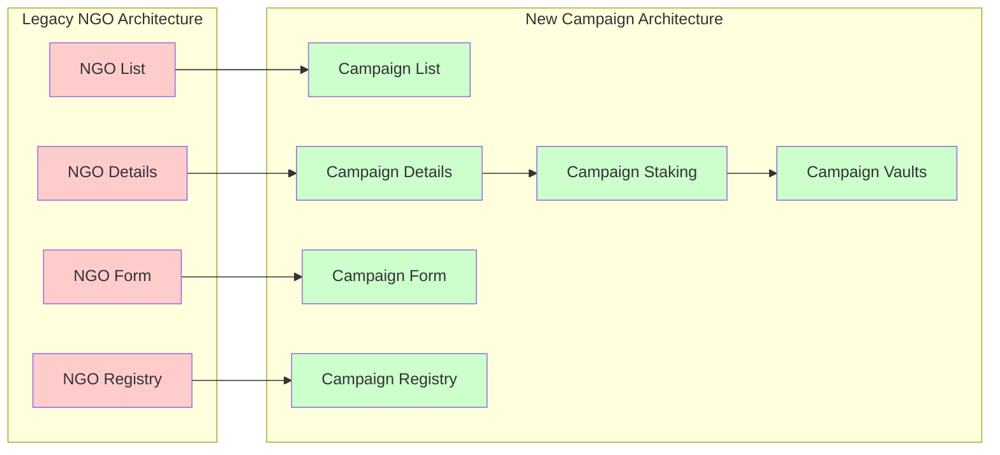

# 06 — Frontend Migration: NGO to Campaign Architecture

## Migration Overview

The frontend migration transforms the GIVE Protocol interface from NGO-centric to campaign-driven architecture, aligning with the refined smart contract implementation.



## Component Migration Strategy

### 1. Component Mapping and Transformation

#### Legacy NGO Components → New Campaign Components

| Legacy Component | New Component | Changes Required |
|------------------|---------------|------------------|
| `NGOCard.tsx` | `CampaignCard.tsx` | Data structure, display fields, interaction patterns |
| `NGODetails.tsx` | `CampaignDetails.tsx` | Metadata schema, status management, action buttons |
| `CreateNGO.tsx` | `CreateCampaign.tsx` | Form fields, validation, submission flow |
| `NGOs.tsx` | `Campaigns.tsx` | List management, filtering, pagination |
| `DebugNGO.tsx` | `DebugCampaign.tsx` | Admin debugging interface |

#### New Campaign-Specific Components

| Component | Purpose | Features |
|-----------|---------|----------|
| `CampaignStaking.tsx` | Staking interface | Deposit, withdraw, yield allocation |
| `CampaignApproval.tsx` | Curator workflow | Approve/reject campaigns |
| `VaultManagement.tsx` | Vault operations | Strategy attachment, monitoring |
| `YieldDashboard.tsx` | Yield tracking | Distribution history, projections |

### 2. Data Structure Migration

#### Legacy NGO Schema
```typescript
// Legacy NGO interface
interface NGO {
  id: string;
  name: string;
  description: string;
  website?: string;
  imageUrl?: string;
  walletAddress: string;
  isVerified: boolean;
  totalDonations: bigint;
  donorCount: number;
  category: string;
}

interface Donation {
  id: string;
  ngoId: string;
  donorAddress: string;
  amount: bigint;
  timestamp: number;
  txHash: string;
}
```

#### New Campaign Schema
```typescript
// New Campaign interface
interface Campaign {
  id: bigint;
  creator: string;
  curator?: string;
  payoutAddress: string;
  stakeAmount: bigint;
  status: CampaignStatus;
  metadataURI: string;
  attachedStrategies: bigint[];
  createdAt: bigint;
  updatedAt: bigint;
  
  // Metadata (from IPFS)
  metadata?: CampaignMetadata;
}

interface CampaignMetadata {
  title: string;
  description: string;
  category: string;
  website?: string;
  imageUrl?: string;
  documents?: string[];
  socialMedia?: {
    twitter?: string;
    linkedin?: string;
    facebook?: string;
  };
  targetAmount?: bigint;
  timeline?: {
    startDate: string;
    endDate: string;
    milestones: Milestone[];
  };
}

enum CampaignStatus {
  Submitted = 0,
  Active = 1,
  Paused = 2,
  Completed = 3,
  Rejected = 4
}

interface Stake {
  campaignId: bigint;
  userAddress: string;
  amount: bigint;
  shares: bigint;
  yieldAllocation: YieldAllocation;
  depositedAt: bigint;
}

interface YieldAllocation {
  campaignPercent: number;  // basis points
  userPercent: number;      // basis points
  protocolPercent: number;  // basis points
  beneficiary?: string;
}
```

### 3. Component Implementation Guide

#### Campaign Card Component
```tsx
// components/campaign/CampaignCard.tsx
import React from 'react';
import { useReadContract } from 'wagmi';
import { formatUnits, formatDistanceToNow } from 'date-fns';
import { Badge } from '../ui/Badge';
import { Button } from '../ui/Button';
import { Progress } from '../ui/Progress';
import { CampaignRegistryABI } from '../../abis';
import { CONTRACT_ADDRESSES } from '../../config/contracts';
import type { Campaign } from '../../types';

interface CampaignCardProps {
  campaignId: bigint;
  onStake?: (campaignId: bigint) => void;
  onViewDetails?: (campaignId: bigint) => void;
}

export function CampaignCard({ 
  campaignId, 
  onStake, 
  onViewDetails 
}: CampaignCardProps): JSX.Element {
  
  // Fetch campaign data
  const { data: campaign, isError, isLoading } = useReadContract({
    address: CONTRACT_ADDRESSES.CampaignRegistry,
    abi: CampaignRegistryABI,
    functionName: 'getCampaign',
    args: [campaignId],
  });

  // Fetch campaign metadata from IPFS
  const { data: metadata } = useCampaignMetadata(campaign?.metadataURI);
  
  // Fetch staking statistics
  const { data: stakingStats } = useCampaignStaking(campaignId);

  if (isLoading) {
    return <CampaignCardSkeleton />;
  }

  if (isError || !campaign) {
    return (
      <div className="campaign-card-error p-6 border border-red-200 rounded-lg">
        <p className="text-red-600">Failed to load campaign</p>
      </div>
    );
  }

  const statusColor = getStatusColor(campaign.status);
  const progress = calculateProgress(stakingStats?.totalStaked, metadata?.targetAmount);

  return (
    <div className="campaign-card bg-white rounded-lg shadow-sm border border-gray-200 overflow-hidden hover:shadow-md transition-shadow">
      {/* Campaign Image */}
      <div className="campaign-image relative h-48 bg-gray-100">
        {metadata?.imageUrl ? (
          
        ) : (
          <div className="flex items-center justify-center h-full">
            <span className="text-gray-400">No image</span>
          </div>
        )}
        
        {/* Status Badge */}
        <div className="absolute top-3 right-3">
          <Badge variant={statusColor}>
            {CampaignStatus[campaign.status]}
          </Badge>
        </div>
      </div>

      {/* Campaign Content */}
      <div className="p-6">
        {/* Title and Description */}
        <div className="mb-4">
          <h3 className="text-lg font-semibold text-gray-900 mb-2 line-clamp-2">
            {metadata?.title || `Campaign ${campaignId}`}
          </h3>
          <p className="text-gray-600 text-sm line-clamp-3">
            {metadata?.description || 'No description available'}
          </p>
        </div>

        {/* Progress Bar */}
        {metadata?.targetAmount && (
          <div className="mb-4">
            <div className="flex justify-between text-sm text-gray-600 mb-2">
              <span>Progress</span>
              <span>{progress}%</span>
            </div>
            <Progress value={progress} className="h-2" />
          </div>
        )}

        {/* Stats Grid */}
        <div className="grid grid-cols-2 gap-4 mb-4 text-sm">
          <div>
            <span className="text-gray-500">Staked</span>
            <p className="font-semibold">
              {formatUnits(stakingStats?.totalStaked || 0n, 18)} ETH
            </p>
          </div>
          <div>
            <span className="text-gray-500">Stakers</span>
            <p className="font-semibold">{stakingStats?.stakerCount || 0}</p>
          </div>
          <div>
            <span className="text-gray-500">Created</span>
            <p className="font-semibold">
              {formatDistanceToNow(new Date(Number(campaign.createdAt) * 1000), { 
                addSuffix: true 
              })}
            </p>
          </div>
          <div>
            <span className="text-gray-500">Category</span>
            <p className="font-semibold">{metadata?.category || 'Other'}</p>
          </div>
        </div>

        {/* Action Buttons */}
        <div className="flex space-x-2">
          <Button
            variant="outline"
            size="sm"
            onClick={() => onViewDetails?.(campaignId)}
            className="flex-1"
          >
            View Details
          </Button>
          
          {campaign.status === CampaignStatus.Active && (
            <Button
              variant="primary"
              size="sm"
              onClick={() => onStake?.(campaignId)}
              className="flex-1"
            >
              Stake & Support
            </Button>
          )}
        </div>
      </div>
    </div>
  );
}

// Helper function to determine status color
function getStatusColor(status: CampaignStatus): 'default' | 'success' | 'warning' | 'error' {
  switch (status) {
    case CampaignStatus.Active:
      return 'success';
    case CampaignStatus.Submitted:
      return 'warning';
    case CampaignStatus.Paused:
      return 'warning';
    case CampaignStatus.Completed:
      return 'default';
    case CampaignStatus.Rejected:
      return 'error';
    default:
      return 'default';
  }
}

// Helper function to calculate progress
function calculateProgress(staked?: bigint, target?: bigint): number {
  if (!staked || !target || target === 0n) return 0;
  return Math.min(Number((staked * 100n) / target), 100);
}
```

#### Campaign Creation Form
```tsx
// components/campaign/CreateCampaignForm.tsx
import React, { useState } from 'react';
import { useForm } from 'react-hook-form';
import { zodResolver } from '@hookform/resolvers/zod';
import { z } from 'zod';
import { useAccount, useWriteContract } from 'wagmi';
import { parseEther } from 'viem';

import { Button } from '../ui/Button';
import { Input } from '../ui/Input';
import { Textarea } from '../ui/Textarea';
import { Select } from '../ui/Select';
import { FileUpload } from '../ui/FileUpload';
import { useCampaignRegistry } from '../../hooks/useCampaignRegistry';
import { useIPFS } from '../../hooks/useIPFS';
import { MINIMUM_STAKE } from '../../config/constants';

// Form validation schema
const createCampaignSchema = z.object({
  title: z.string().min(3, 'Title must be at least 3 characters').max(100, 'Title too long'),
  description: z.string().min(50, 'Description must be at least 50 characters').max(2000, 'Description too long'),
  category: z.string().min(1, 'Please select a category'),
  website: z.string().url('Invalid URL').optional().or(z.literal('')),
  payoutAddress: z.string().regex(/^0x[a-fA-F0-9]{40}$/, 'Invalid Ethereum address'),
  targetAmount: z.string().min(1, 'Target amount required'),
  timeline: z.object({
    startDate: z.string(),
    endDate: z.string(),
  }),
  socialMedia: z.object({
    twitter: z.string().optional(),
    linkedin: z.string().optional(),
    facebook: z.string().optional(),
  }),
});

type CreateCampaignFormData = z.infer<typeof createCampaignSchema>;

interface CreateCampaignFormProps {
  onSuccess?: (campaignId: bigint) => void;
  onCancel?: () => void;
}

export function CreateCampaignForm({ 
  onSuccess, 
  onCancel 
}: CreateCampaignFormProps): JSX.Element {
  const { address } = useAccount();
  const [isSubmitting, setIsSubmitting] = useState(false);
  const [uploadedImages, setUploadedImages] = useState<File[]>([]);

  const { uploadToIPFS } = useIPFS();
  const { submitCampaign, isPending } = useCampaignRegistry();

  const {
    register,
    handleSubmit,
    formState: { errors, isValid },
    watch,
    setValue,
  } = useForm<CreateCampaignFormData>({
    resolver: zodResolver(createCampaignSchema),
    mode: 'onChange',
  });

  const onSubmit = async (data: CreateCampaignFormData): Promise<void> => {
    if (!address) {
      toast.error('Please connect your wallet');
      return;
    }

    setIsSubmitting(true);

    try {
      // Upload images to IPFS
      let imageUrls: string[] = [];
      if (uploadedImages.length > 0) {
        imageUrls = await Promise.all(
          uploadedImages.map(file => uploadToIPFS(file))
        );
      }

      // Prepare metadata
      const metadata: CampaignMetadata = {
        title: data.title,
        description: data.description,
        category: data.category,
        website: data.website || undefined,
        imageUrl: imageUrls[0],
        socialMedia: {
          twitter: data.socialMedia.twitter || undefined,
          linkedin: data.socialMedia.linkedin || undefined,
          facebook: data.socialMedia.facebook || undefined,
        },
        targetAmount: parseEther(data.targetAmount),
        timeline: {
          startDate: data.timeline.startDate,
          endDate: data.timeline.endDate,
          milestones: [], // TODO: Add milestone support
        },
        documents: imageUrls.slice(1), // Additional images as documents
      };

      // Upload metadata to IPFS
      const metadataURI = await uploadToIPFS(
        new Blob([JSON.stringify(metadata, null, 2)], { type: 'application/json' })
      );

      // Submit campaign to smart contract
      const campaignId = await submitCampaign(
        metadataURI,
        data.payoutAddress,
        MINIMUM_STAKE
      );

      toast.success('Campaign submitted successfully!');
      onSuccess?.(campaignId);

    } catch (error) {
      console.error('Campaign submission failed:', error);
      toast.error('Failed to submit campaign. Please try again.');
    } finally {
      setIsSubmitting(false);
    }
  };

  return (
    <div className="create-campaign-form max-w-2xl mx-auto p-6">
      <div className="mb-6">
        <h2 className="text-2xl font-bold text-gray-900 mb-2">Create New Campaign</h2>
        <p className="text-gray-600">
          Submit your campaign for community review. A stake of {MINIMUM_STAKE} ETH is required.
        </p>
      </div>

      <form onSubmit={handleSubmit(onSubmit)} className="space-y-6">
        {/* Basic Information */}
        <div className="form-section">
          <h3 className="text-lg font-semibold mb-4">Basic Information</h3>
          
          <div className="grid grid-cols-1 gap-4">
            <Input
              label="Campaign Title"
              placeholder="Enter campaign title..."
              error={errors.title?.message}
              {...register('title')}
            />
            
            <Textarea
              label="Description"
              placeholder="Describe your campaign, its goals, and impact..."
              rows={4}
              error={errors.description?.message}
              {...register('description')}
            />
            
            <Select
              label="Category"
              options={[
                { value: 'education', label: 'Education' },
                { value: 'health', label: 'Health & Medicine' },
                { value: 'environment', label: 'Environment' },
                { value: 'humanitarian', label: 'Humanitarian Aid' },
                { value: 'technology', label: 'Technology & Innovation' },
                { value: 'arts', label: 'Arts & Culture' },
                { value: 'other', label: 'Other' },
              ]}
              error={errors.category?.message}
              {...register('category')}
            />
          </div>
        </div>

        {/* Media Upload */}
        <div className="form-section">
          <h3 className="text-lg font-semibold mb-4">Campaign Media</h3>
          
          <FileUpload
            accept="image/*"
            multiple
            maxFiles={5}
            onFilesChange={setUploadedImages}
            label="Upload campaign images (optional)"
            description="First image will be used as the main campaign image"
          />
        </div>

        {/* Financial Details */}
        <div className="form-section">
          <h3 className="text-lg font-semibold mb-4">Financial Details</h3>
          
          <div className="grid grid-cols-1 md:grid-cols-2 gap-4">
            <Input
              label="Payout Address"
              placeholder="0x..."
              error={errors.payoutAddress?.message}
              {...register('payoutAddress')}
            />
            
            <Input
              label="Target Amount (ETH)"
              type="number"
              step="0.001"
              placeholder="10.0"
              error={errors.targetAmount?.message}
              {...register('targetAmount')}
            />
          </div>
        </div>

        {/* Timeline */}
        <div className="form-section">
          <h3 className="text-lg font-semibold mb-4">Timeline</h3>
          
          <div className="grid grid-cols-1 md:grid-cols-2 gap-4">
            <Input
              label="Start Date"
              type="date"
              error={errors.timeline?.startDate?.message}
              {...register('timeline.startDate')}
            />
            
            <Input
              label="End Date"
              type="date"
              error={errors.timeline?.endDate?.message}
              {...register('timeline.endDate')}
            />
          </div>
        </div>

        {/* Contact Information */}
        <div className="form-section">
          <h3 className="text-lg font-semibold mb-4">Contact & Social Media</h3>
          
          <div className="grid grid-cols-1 gap-4">
            <Input
              label="Website (optional)"
              placeholder="https://yourwebsite.com"
              error={errors.website?.message}
              {...register('website')}
            />
            
            <div className="grid grid-cols-1 md:grid-cols-3 gap-4">
              <Input
                label="Twitter (optional)"
                placeholder="@username"
                {...register('socialMedia.twitter')}
              />
              
              <Input
                label="LinkedIn (optional)"
                placeholder="company/username"
                {...register('socialMedia.linkedin')}
              />
              
              <Input
                label="Facebook (optional)"
                placeholder="page/username"
                {...register('socialMedia.facebook')}
              />
            </div>
          </div>
        </div>

        {/* Stake Information */}
        <div className="stake-info bg-blue-50 border border-blue-200 rounded-lg p-4">
          <h4 className="font-semibold text-blue-900 mb-2">Submission Requirements</h4>
          <ul className="text-sm text-blue-700 space-y-1">
            <li>• Minimum stake: {MINIMUM_STAKE} ETH</li>
            <li>• Stake is refunded if campaign is rejected</li>
            <li>• Stake goes to protocol treasury if campaign is approved</li>
            <li>• Campaign will require curator approval before activation</li>
          </ul>
        </div>

        {/* Action Buttons */}
        <div className="flex space-x-4">
          <Button
            type="button"
            variant="outline"
            onClick={onCancel}
            disabled={isSubmitting || isPending}
            className="flex-1"
          >
            Cancel
          </Button>
          
          <Button
            type="submit"
            variant="primary"
            disabled={!isValid || isSubmitting || isPending}
            loading={isSubmitting || isPending}
            className="flex-1"
          >
            Submit Campaign ({MINIMUM_STAKE} ETH)
          </Button>
        </div>
      </form>
    </div>
  );
}
```

### 4. Hook Migration and Enhancement

#### Campaign Registry Hook
```tsx
// hooks/useCampaignRegistry.ts
import { useState } from 'react';
import { useReadContract, useWriteContract, useWaitForTransactionReceipt } from 'wagmi';
import { parseEventLogs } from 'viem';
import { CampaignRegistryABI } from '../abis';
import { CONTRACT_ADDRESSES } from '../config/contracts';
import type { Campaign } from '../types';

export function useCampaignRegistry() {
  const [lastTransactionHash, setLastTransactionHash] = useState<`0x${string}` | null>(null);

  // Write contract setup
  const { 
    writeContract, 
    isPending: isWritePending, 
    error: writeError 
  } = useWriteContract();

  // Transaction receipt monitoring
  const { 
    data: receipt, 
    isLoading: isReceiptLoading 
  } = useWaitForTransactionReceipt({
    hash: lastTransactionHash || undefined,
  });

  // Submit new campaign
  const submitCampaign = async (
    metadataURI: string,
    payoutAddress: string,
    stakeAmount: bigint
  ): Promise<bigint> => {
    return new Promise((resolve, reject) => {
      writeContract(
        {
          address: CONTRACT_ADDRESSES.CampaignRegistry,
          abi: CampaignRegistryABI,
          functionName: 'submitCampaign',
          args: [metadataURI, payoutAddress],
          value: stakeAmount,
        },
        {
          onSuccess: (hash) => {
            setLastTransactionHash(hash);
          },
          onError: (error) => {
            reject(error);
          },
          onSettled: (hash) => {
            if (hash && receipt) {
              // Parse campaign ID from events
              const logs = parseEventLogs({
                abi: CampaignRegistryABI,
                logs: receipt.logs,
              });
              
              const campaignSubmittedEvent = logs.find(
                log => log.eventName === 'CampaignSubmitted'
              );
              
              if (campaignSubmittedEvent) {
                resolve(campaignSubmittedEvent.args.campaignId);
              } else {
                reject(new Error('Campaign ID not found in transaction'));
              }
            }
          },
        }
      );
    });
  };

  // Approve campaign (curator/admin function)
  const approveCampaign = async (campaignId: bigint, curator?: string) => {
    return writeContract({
      address: CONTRACT_ADDRESSES.CampaignRegistry,
      abi: CampaignRegistryABI,
      functionName: 'approveCampaign',
      args: [campaignId, curator || '0x0000000000000000000000000000000000000000'],
    });
  };

  // Reject campaign (curator/admin function)
  const rejectCampaign = async (campaignId: bigint, reason: string) => {
    return writeContract({
      address: CONTRACT_ADDRESSES.CampaignRegistry,
      abi: CampaignRegistryABI,
      functionName: 'rejectCampaign',
      args: [campaignId, reason],
    });
  };

  return {
    submitCampaign,
    approveCampaign,
    rejectCampaign,
    isPending: isWritePending || isReceiptLoading,
    error: writeError,
    receipt,
  };
}

// Hook for reading campaign data
export function useCampaign(campaignId: bigint) {
  return useReadContract({
    address: CONTRACT_ADDRESSES.CampaignRegistry,
    abi: CampaignRegistryABI,
    functionName: 'getCampaign',
    args: [campaignId],
    query: {
      enabled: campaignId > 0n,
      refetchInterval: 30000, // Refetch every 30 seconds
    },
  });
}

// Hook for reading multiple campaigns
export function useCampaigns(campaignIds: bigint[]) {
  return useReadContracts({
    contracts: campaignIds.map(id => ({
      address: CONTRACT_ADDRESSES.CampaignRegistry,
      abi: CampaignRegistryABI,
      functionName: 'getCampaign',
      args: [id],
    })),
    query: {
      enabled: campaignIds.length > 0,
    },
  });
}

// Hook for user's campaigns
export function useUserCampaigns(userAddress?: string) {
  return useReadContract({
    address: CONTRACT_ADDRESSES.CampaignRegistry,
    abi: CampaignRegistryABI,
    functionName: 'getCampaignsByCreator',
    args: userAddress ? [userAddress] : undefined,
    query: {
      enabled: !!userAddress,
    },
  });
}
```

#### Campaign Staking Hook
```tsx
// hooks/useCampaignStaking.ts
import { useReadContract, useWriteContract } from 'wagmi';
import { GiveVault4626ABI } from '../abis';
import { useCampaignVault } from './useCampaignVault';
import type { YieldAllocation } from '../types';

export function useCampaignStaking(campaignId: bigint, strategyId: bigint = 1n) {
  const { data: vaultAddress } = useCampaignVault(campaignId, strategyId);

  // Read user's staked balance
  const { data: stakedBalance } = useReadContract({
    address: vaultAddress,
    abi: GiveVault4626ABI,
    functionName: 'balanceOf',
    args: [address],
    query: {
      enabled: !!vaultAddress && !!address,
    },
  });

  // Read user's yield allocation
  const { data: yieldAllocation } = useReadContract({
    address: vaultAddress,
    abi: GiveVault4626ABI,
    functionName: 'userAllocations',
    args: [address],
    query: {
      enabled: !!vaultAddress && !!address,
    },
  });

  // Write contract for staking operations
  const { writeContract, isPending } = useWriteContract();

  // Stake ETH in campaign
  const stake = async (amount: bigint) => {
    if (!vaultAddress) throw new Error('Vault not found');
    
    return writeContract({
      address: vaultAddress,
      abi: GiveVault4626ABI,
      functionName: 'deposit',
      args: [amount, address],
      value: amount,
    });
  };

  // Withdraw staked ETH
  const withdraw = async (amount: bigint) => {
    if (!vaultAddress) throw new Error('Vault not found');
    
    return writeContract({
      address: vaultAddress,
      abi: GiveVault4626ABI,
      functionName: 'withdraw',
      args: [amount, address, address],
    });
  };

  // Update yield allocation preferences
  const updateYieldAllocation = async (allocation: YieldAllocation) => {
    if (!vaultAddress) throw new Error('Vault not found');
    
    return writeContract({
      address: vaultAddress,
      abi: GiveVault4626ABI,
      functionName: 'setYieldAllocation',
      args: [
        allocation.campaignPercent,
        allocation.userPercent,
        allocation.beneficiary || address,
      ],
    });
  };

  // Harvest accumulated yield
  const harvestYield = async () => {
    if (!vaultAddress) throw new Error('Vault not found');
    
    return writeContract({
      address: vaultAddress,
      abi: GiveVault4626ABI,
      functionName: 'harvestYield',
      args: [address],
    });
  };

  return {
    vaultAddress,
    stakedBalance,
    yieldAllocation,
    stake,
    withdraw,
    updateYieldAllocation,
    harvestYield,
    isPending,
  };
}
```

### 5. Route Migration

#### Updated Routing Structure
```tsx
// App.tsx - Updated routing
import React from 'react';
import { BrowserRouter as Router, Routes, Route } from 'react-router-dom';
import { WagmiProvider } from 'wagmi';
import { QueryClient, QueryClientProvider } from '@tanstack/react-query';
import { config } from './config/web3';

// Pages
import Home from './pages/Home';
import Campaigns from './pages/Campaigns';
import CampaignDetails from './pages/CampaignDetails';
import CreateCampaign from './pages/CreateCampaign';
import CampaignStaking from './pages/CampaignStaking';
import Dashboard from './pages/Dashboard';
import Discover from './pages/Discover';

// Layout
import Header from './components/layout/Header';
import Footer from './components/layout/Footer';

const queryClient = new QueryClient();

function App(): JSX.Element {
  return (
    <WagmiProvider config={config}>
      <QueryClientProvider client={queryClient}>
        <Router>
          <div className="app min-h-screen flex flex-col">
            <Header />
            
            <main className="flex-1">
              <Routes>
                {/* Core routes */}
                <Route path="/" element={<Home />} />
                <Route path="/discover" element={<Discover />} />
                <Route path="/dashboard" element={<Dashboard />} />
                
                {/* Campaign routes */}
                <Route path="/campaigns" element={<Campaigns />} />
                <Route path="/campaigns/create" element={<CreateCampaign />} />
                <Route path="/campaigns/:id" element={<CampaignDetails />} />
                <Route path="/campaigns/:id/stake" element={<CampaignStaking />} />
                
                {/* Legacy redirects for NGO routes */}
                <Route path="/ngos" element={<Navigate to="/campaigns" replace />} />
                <Route path="/ngos/create" element={<Navigate to="/campaigns/create" replace />} />
                <Route path="/ngos/:id" element={<CampaignRedirect />} />
                
                {/* Fallback */}
                <Route path="*" element={<NotFound />} />
              </Routes>
            </main>
            
            <Footer />
          </div>
        </Router>
      </QueryClientProvider>
    </WagmiProvider>
  );
}

// Component to handle NGO -> Campaign redirects
function CampaignRedirect(): JSX.Element {
  const { id } = useParams();
  return <Navigate to={`/campaigns/${id}`} replace />;
}

export default App;
```

### 6. State Management Migration

#### Campaign Store (Zustand)
```tsx
// stores/campaignStore.ts
import { create } from 'zustand';
import { devtools, persist } from 'zustand/middleware';
import type { Campaign, CampaignMetadata, Stake } from '../types';

interface CampaignState {
  // Campaign data
  campaigns: Record<string, Campaign>;
  campaignMetadata: Record<string, CampaignMetadata>;
  userStakes: Record<string, Stake[]>;
  
  // UI state
  selectedCampaignId: bigint | null;
  isCreatingCampaign: boolean;
  
  // Actions
  setCampaign: (campaignId: bigint, campaign: Campaign) => void;
  setCampaignMetadata: (metadataURI: string, metadata: CampaignMetadata) => void;
  setUserStakes: (userAddress: string, stakes: Stake[]) => void;
  setSelectedCampaign: (campaignId: bigint | null) => void;
  setCreatingCampaign: (isCreating: boolean) => void;
  
  // Computed getters
  getCampaign: (campaignId: bigint) => Campaign | undefined;
  getCampaignWithMetadata: (campaignId: bigint) => (Campaign & { metadata?: CampaignMetadata }) | undefined;
  getUserStakes: (userAddress: string) => Stake[];
  getActiveCampaigns: () => Campaign[];
}

export const useCampaignStore = create<CampaignState>()(
  devtools(
    persist(
      (set, get) => ({
        // Initial state
        campaigns: {},
        campaignMetadata: {},
        userStakes: {},
        selectedCampaignId: null,
        isCreatingCampaign: false,
        
        // Actions
        setCampaign: (campaignId, campaign) =>
          set((state) => ({
            campaigns: {
              ...state.campaigns,
              [campaignId.toString()]: campaign,
            },
          })),
          
        setCampaignMetadata: (metadataURI, metadata) =>
          set((state) => ({
            campaignMetadata: {
              ...state.campaignMetadata,
              [metadataURI]: metadata,
            },
          })),
          
        setUserStakes: (userAddress, stakes) =>
          set((state) => ({
            userStakes: {
              ...state.userStakes,
              [userAddress]: stakes,
            },
          })),
          
        setSelectedCampaign: (campaignId) =>
          set({ selectedCampaignId: campaignId }),
          
        setCreatingCampaign: (isCreating) =>
          set({ isCreatingCampaign: isCreating }),
        
        // Computed getters
        getCampaign: (campaignId) => {
          const state = get();
          return state.campaigns[campaignId.toString()];
        },
        
        getCampaignWithMetadata: (campaignId) => {
          const state = get();
          const campaign = state.campaigns[campaignId.toString()];
          if (!campaign) return undefined;
          
          const metadata = state.campaignMetadata[campaign.metadataURI];
          return { ...campaign, metadata };
        },
        
        getUserStakes: (userAddress) => {
          const state = get();
          return state.userStakes[userAddress] || [];
        },
        
        getActiveCampaigns: () => {
          const state = get();
          return Object.values(state.campaigns).filter(
            campaign => campaign.status === CampaignStatus.Active
          );
        },
      }),
      {
        name: 'campaign-store',
        partialize: (state) => ({
          campaigns: state.campaigns,
          campaignMetadata: state.campaignMetadata,
        }),
      }
    )
  )
);
```

### 7. Testing Migration

#### Component Testing Updates
```tsx
// __tests__/components/CampaignCard.test.tsx
import React from 'react';
import { render, screen, fireEvent } from '@testing-library/react';
import { vi } from 'vitest';
import { WagmiProvider } from 'wagmi';
import { CampaignCard } from '../../../components/campaign/CampaignCard';
import { mockWagmiConfig } from '../../mocks/wagmi';
import type { Campaign, CampaignStatus } from '../../../types';

// Mock campaign data
const mockCampaign: Campaign = {
  id: 1n,
  creator: '0x123...',
  curator: '0x456...',
  payoutAddress: '0x789...',
  stakeAmount: parseEther('0.1'),
  status: CampaignStatus.Active,
  metadataURI: 'ipfs://test-hash',
  attachedStrategies: [1n],
  createdAt: BigInt(Date.now() / 1000),
  updatedAt: BigInt(Date.now() / 1000),
};

const mockMetadata = {
  title: 'Test Campaign',
  description: 'This is a test campaign for testing purposes',
  category: 'education',
  targetAmount: parseEther('10'),
};

// Mock hooks
vi.mock('wagmi', () => ({
  useReadContract: vi.fn(() => ({
    data: mockCampaign,
    isError: false,
    isLoading: false,
  })),
}));

vi.mock('../../../hooks/useCampaignMetadata', () => ({
  useCampaignMetadata: vi.fn(() => ({
    data: mockMetadata,
  })),
}));

vi.mock('../../../hooks/useCampaignStaking', () => ({
  useCampaignStaking: vi.fn(() => ({
    data: {
      totalStaked: parseEther('5'),
      stakerCount: 10,
    },
  })),
}));

describe('CampaignCard', () => {
  const renderComponent = (props = {}) => {
    return render(
      <WagmiProvider config={mockWagmiConfig}>
        <CampaignCard campaignId={1n} {...props} />
      </WagmiProvider>
    );
  };

  it('renders campaign information correctly', () => {
    renderComponent();
    
    expect(screen.getByText('Test Campaign')).toBeInTheDocument();
    expect(screen.getByText('This is a test campaign for testing purposes')).toBeInTheDocument();
    expect(screen.getByText('Active')).toBeInTheDocument();
    expect(screen.getByText('5.0 ETH')).toBeInTheDocument(); // Staked amount
    expect(screen.getByText('10')).toBeInTheDocument(); // Staker count
  });

  it('shows stake button for active campaigns', () => {
    renderComponent();
    
    const stakeButton = screen.getByText('Stake & Support');
    expect(stakeButton).toBeInTheDocument();
    expect(stakeButton).not.toBeDisabled();
  });

  it('calls onStake when stake button is clicked', () => {
    const onStake = vi.fn();
    renderComponent({ onStake });
    
    const stakeButton = screen.getByText('Stake & Support');
    fireEvent.click(stakeButton);
    
    expect(onStake).toHaveBeenCalledWith(1n);
  });

  it('shows loading skeleton when loading', () => {
    vi.mocked(useReadContract).mockReturnValue({
      data: undefined,
      isError: false,
      isLoading: true,
    });

    renderComponent();
    
    expect(screen.getByTestId('campaign-card-skeleton')).toBeInTheDocument();
  });

  it('shows error state when campaign load fails', () => {
    vi.mocked(useReadContract).mockReturnValue({
      data: undefined,
      isError: true,
      isLoading: false,
    });

    renderComponent();
    
    expect(screen.getByText('Failed to load campaign')).toBeInTheDocument();
  });
});
```

### 8. Migration Deployment Strategy

#### Phase 1: Component Migration (Week 1-2)
1. Create new campaign components alongside existing NGO components
2. Implement new hooks and state management
3. Add campaign routes with legacy redirects
4. Test new components in isolation

#### Phase 2: Data Integration (Week 3)
1. Integrate with new smart contracts
2. Implement IPFS metadata loading
3. Add campaign creation and staking flows
4. Test end-to-end workflows

#### Phase 3: Legacy Cleanup (Week 4)
1. Remove old NGO components
2. Clean up unused hooks and utilities
3. Update documentation and README
4. Final testing and deployment

#### Migration Checklist
- [ ] Component migration completed
- [ ] Hook migration completed  
- [ ] Route updates implemented
- [ ] State management migrated
- [ ] Testing suite updated
- [ ] Documentation updated
- [ ] Legacy code removed
- [ ] Performance optimization
- [ ] Accessibility verification
- [ ] Cross-browser testing

This comprehensive migration guide provides a systematic approach to transforming the GIVE Protocol frontend from NGO-centric to campaign-driven architecture while maintaining user experience and adding new functionality.