# 07 — Testing Strategy & Quality Assurance

## Testing Philosophy

The GIVE Protocol implements a comprehensive multi-layered testing strategy ensuring security, functionality, and reliability across smart contracts and frontend components.

```mermaid
flowchart TD
    subgraph "Testing Layers"
        UT[Unit Tests]
        IT[Integration Tests]  
        ST[System Tests]
        SEC[Security Tests]
        PERF[Performance Tests]
        E2E[End-to-End Tests]
    end
    
    subgraph "Smart Contract Testing"
        FORGE[Foundry/Forge Tests]
        FUZZ[Fuzz Testing]
        INV[Invariant Tests]
        FORK[Fork Tests]
    end
    
    subgraph "Frontend Testing"
        JEST[Jest Unit Tests]
        RTL[React Testing Library]
        CYPRESS[Cypress E2E]
        STORYBOOK[Storybook Tests]
    end
    
    subgraph "Security Testing"
        SLITHER[Slither Analysis]
        MYTHX[MythX Audit]
        MANUAL[Manual Review]
        BUG[Bug Bounty]
    end
    
    UT --> FORGE
    UT --> JEST
    IT --> FORK
    IT --> RTL
    ST --> CYPRESS
    SEC --> SLITHER
    SEC --> MYTHX
    PERF --> FUZZ
    E2E --> CYPRESS
    
    style SEC fill:#ff9999
    style PERF fill:#ffcc99
    style E2E fill:#99ccff
```



## Smart Contract Testing Strategy

### 1. Unit Testing Framework

#### Foundry Test Structure
```solidity
// test/unit/CampaignRegistry.t.sol
pragma solidity ^0.8.20;

import "forge-std/Test.sol";
import "forge-std/console.sol";

import {CampaignRegistry} from "../../src/campaign/CampaignRegistry.sol";
import {RoleManager} from "../../src/access/RoleManager.sol";
import {Errors} from "../../src/utils/Errors.sol";

/// @title CampaignRegistry Unit Tests
/// @notice Comprehensive unit testing for CampaignRegistry contract
contract CampaignRegistryTest is Test {
    
    /*//////////////////////////////////////////////////////////////
                                SETUP
    //////////////////////////////////////////////////////////////*/
    
    CampaignRegistry public campaignRegistry;
    RoleManager public roleManager;
    
    // Test accounts
    address public admin = makeAddr("admin");
    address public curator = makeAddr("curator");
    address public treasury = makeAddr("treasury");
    address public creator = makeAddr("creator");
    address public user = makeAddr("user");
    
    // Test constants
    uint256 public constant MINIMUM_STAKE = 0.0001 ether;
    string public constant TEST_METADATA_URI = "ipfs://QmTestHash";
    address public constant TEST_PAYOUT_ADDRESS = address(0x123);
    
    /*//////////////////////////////////////////////////////////////
                                EVENTS
    //////////////////////////////////////////////////////////////*/
    
    event CampaignSubmitted(
        uint256 indexed campaignId,
        address indexed creator,
        address indexed curator,
        string metadataURI,
        uint256 stakeAmount
    );
    
    event CampaignApproved(
        uint256 indexed campaignId,
        address indexed approver,
        address indexed curator
    );
    
    function setUp() public {
        // Deploy RoleManager
        vm.prank(admin);
        roleManager = new RoleManager(admin);
        
        // Grant necessary roles
        vm.startPrank(admin);
        roleManager.grantRole(roleManager.CAMPAIGN_ADMIN_ROLE(), admin);
        roleManager.grantRole(roleManager.CURATOR_ROLE(), curator);
        vm.stopPrank();
        
        // Deploy CampaignRegistry
        campaignRegistry = new CampaignRegistry(
            address(roleManager),
            payable(treasury),
            MINIMUM_STAKE
        );
        
        // Fund test accounts
        vm.deal(creator, 10 ether);
        vm.deal(user, 10 ether);
    }
    
    /*//////////////////////////////////////////////////////////////
                            CAMPAIGN SUBMISSION
    //////////////////////////////////////////////////////////////*/
    
    function testSubmitCampaign_Success() public {
        // Arrange
        vm.startPrank(creator);
        
        // Act & Assert - should emit event
        vm.expectEmit(true, true, true, true);
        emit CampaignSubmitted(1, creator, address(0), TEST_METADATA_URI, MINIMUM_STAKE);
        
        uint256 campaignId = campaignRegistry.submitCampaign{value: MINIMUM_STAKE}(
            TEST_METADATA_URI,
            TEST_PAYOUT_ADDRESS
        );
        
        vm.stopPrank();
        
        // Assert campaign data
        assertEq(campaignId, 1);
        
        CampaignRegistry.Campaign memory campaign = campaignRegistry.getCampaign(campaignId);
        assertEq(campaign.id, campaignId);
        assertEq(campaign.creator, creator);
        assertEq(campaign.payoutAddress, TEST_PAYOUT_ADDRESS);
        assertEq(campaign.stakeAmount, MINIMUM_STAKE);
        assertEq(uint8(campaign.status), uint8(CampaignRegistry.CampaignStatus.Submitted));
        assertEq(campaign.metadataURI, TEST_METADATA_URI);
        assertEq(campaign.createdAt, block.timestamp);
        assertEq(campaign.updatedAt, block.timestamp);
        
        // Assert campaign counter
        assertEq(campaignRegistry.campaignCounter(), 1);
        
        // Assert creator campaigns mapping
        uint256[] memory creatorCampaigns = campaignRegistry.getCampaignsByCreator(creator);
        assertEq(creatorCampaigns.length, 1);
        assertEq(creatorCampaigns[0], campaignId);
    }
    
    function testSubmitCampaign_InsufficientStake() public {
        vm.startPrank(creator);
        
        vm.expectRevert(
            abi.encodeWithSelector(
                Errors.InsufficientStake.selector,
                MINIMUM_STAKE - 1,
                MINIMUM_STAKE
            )
        );
        
        campaignRegistry.submitCampaign{value: MINIMUM_STAKE - 1}(
            TEST_METADATA_URI,
            TEST_PAYOUT_ADDRESS
        );
        
        vm.stopPrank();
    }
    
    function testSubmitCampaign_ZeroPayoutAddress() public {
        vm.startPrank(creator);
        
        vm.expectRevert(Errors.ZeroAddress.selector);
        
        campaignRegistry.submitCampaign{value: MINIMUM_STAKE}(
            TEST_METADATA_URI,
            address(0)
        );
        
        vm.stopPrank();
    }
    
    function testSubmitCampaign_EmptyMetadataURI() public {
        vm.startPrank(creator);
        
        vm.expectRevert(Errors.EmptyString.selector);
        
        campaignRegistry.submitCampaign{value: MINIMUM_STAKE}(
            "",
            TEST_PAYOUT_ADDRESS
        );
        
        vm.stopPrank();
    }
    
    function testSubmitCampaign_WhenPaused() public {
        // Pause contract
        vm.prank(admin);
        campaignRegistry.pause();
        
        vm.startPrank(creator);
        
        vm.expectRevert("Pausable: paused");
        
        campaignRegistry.submitCampaign{value: MINIMUM_STAKE}(
            TEST_METADATA_URI,
            TEST_PAYOUT_ADDRESS
        );
        
        vm.stopPrank();
    }
    
    /*//////////////////////////////////////////////////////////////
                            CAMPAIGN APPROVAL
    //////////////////////////////////////////////////////////////*/
    
    function testApproveCampaign_Success() public {
        // Setup: Submit campaign
        vm.prank(creator);
        uint256 campaignId = campaignRegistry.submitCampaign{value: MINIMUM_STAKE}(
            TEST_METADATA_URI,
            TEST_PAYOUT_ADDRESS
        );
        
        // Record treasury balance before
        uint256 treasuryBalanceBefore = treasury.balance;
        
        // Act: Approve campaign
        vm.expectEmit(true, true, true, true);
        emit CampaignApproved(campaignId, admin, curator);
        
        vm.prank(admin);
        campaignRegistry.approveCampaign(campaignId, curator);
        
        // Assert: Campaign status updated
        CampaignRegistry.Campaign memory campaign = campaignRegistry.getCampaign(campaignId);
        assertEq(uint8(campaign.status), uint8(CampaignRegistry.CampaignStatus.Active));
        assertEq(campaign.curator, curator);
        assertEq(campaign.updatedAt, block.timestamp);
        
        // Assert: Stake transferred to treasury
        assertEq(treasury.balance, treasuryBalanceBefore + MINIMUM_STAKE);
        
        // Assert: Curator campaigns mapping updated
        uint256[] memory curatorCampaigns = campaignRegistry.getCampaignsByCurator(curator);
        assertEq(curatorCampaigns.length, 1);
        assertEq(curatorCampaigns[0], campaignId);
    }
    
    function testApproveCampaign_UnauthorizedAccess() public {
        // Setup: Submit campaign
        vm.prank(creator);
        uint256 campaignId = campaignRegistry.submitCampaign{value: MINIMUM_STAKE}(
            TEST_METADATA_URI,
            TEST_PAYOUT_ADDRESS
        );
        
        // Act & Assert: Unauthorized user cannot approve
        vm.expectRevert(
            abi.encodeWithSelector(
                Errors.UnauthorizedMultiRoleAccess.selector,
                user,
                _getCampaignApprovalRoles()
            )
        );
        
        vm.prank(user);
        campaignRegistry.approveCampaign(campaignId, curator);
    }
    
    function testApproveCampaign_CampaignNotFound() public {
        uint256 nonExistentId = 999;
        
        vm.expectRevert(
            abi.encodeWithSelector(Errors.CampaignNotFound.selector, nonExistentId)
        );
        
        vm.prank(admin);
        campaignRegistry.approveCampaign(nonExistentId, curator);
    }
    
    function testApproveCampaign_InvalidStatus() public {
        // Setup: Submit and approve campaign
        vm.prank(creator);
        uint256 campaignId = campaignRegistry.submitCampaign{value: MINIMUM_STAKE}(
            TEST_METADATA_URI,
            TEST_PAYOUT_ADDRESS
        );
        
        vm.prank(admin);
        campaignRegistry.approveCampaign(campaignId, curator);
        
        // Try to approve again
        vm.expectRevert(
            abi.encodeWithSelector(
                Errors.InvalidCampaignStatus.selector,
                CampaignRegistry.CampaignStatus.Active,
                CampaignRegistry.CampaignStatus.Submitted
            )
        );
        
        vm.prank(admin);
        campaignRegistry.approveCampaign(campaignId, curator);
    }
    
    /*//////////////////////////////////////////////////////////////
                            FUZZ TESTING
    //////////////////////////////////////////////////////////////*/
    
    /// @notice Fuzz test campaign submission with various stake amounts
    /// @param stakeAmount Random stake amount to test
    function testFuzz_SubmitCampaign_StakeAmount(uint256 stakeAmount) public {
        vm.assume(stakeAmount <= 1000 ether); // Reasonable upper bound
        vm.deal(creator, stakeAmount + 1 ether); // Ensure sufficient funds
        
        vm.startPrank(creator);
        
        if (stakeAmount < MINIMUM_STAKE) {
            vm.expectRevert(
                abi.encodeWithSelector(
                    Errors.InsufficientStake.selector,
                    stakeAmount,
                    MINIMUM_STAKE
                )
            );
        }
        
        campaignRegistry.submitCampaign{value: stakeAmount}(
            TEST_METADATA_URI,
            TEST_PAYOUT_ADDRESS
        );
        
        vm.stopPrank();
        
        if (stakeAmount >= MINIMUM_STAKE) {
            // Assert successful submission
            CampaignRegistry.Campaign memory campaign = campaignRegistry.getCampaign(1);
            assertEq(campaign.stakeAmount, stakeAmount);
        }
    }
    
    /// @notice Fuzz test with random metadata URIs
    /// @param metadataURI Random metadata URI to test
    function testFuzz_SubmitCampaign_MetadataURI(string calldata metadataURI) public {
        vm.deal(creator, 1 ether);
        vm.startPrank(creator);
        
        if (bytes(metadataURI).length == 0) {
            vm.expectRevert(Errors.EmptyString.selector);
        }
        
        campaignRegistry.submitCampaign{value: MINIMUM_STAKE}(
            metadataURI,
            TEST_PAYOUT_ADDRESS
        );
        
        vm.stopPrank();
        
        if (bytes(metadataURI).length > 0) {
            CampaignRegistry.Campaign memory campaign = campaignRegistry.getCampaign(1);
            assertEq(campaign.metadataURI, metadataURI);
        }
    }
    
    /*//////////////////////////////////////////////////////////////
                            HELPER FUNCTIONS
    //////////////////////////////////////////////////////////////*/
    
    function _getCampaignApprovalRoles() internal view returns (bytes32[] memory roles) {
        roles = new bytes32[](2);
        roles[0] = roleManager.CAMPAIGN_ADMIN_ROLE();
        roles[1] = roleManager.CURATOR_ROLE();
    }
}
```

### 2. Integration Testing

#### Cross-Contract Integration Tests
```solidity
// test/integration/CampaignLifecycle.t.sol
pragma solidity ^0.8.20;

import "forge-std/Test.sol";
import {CampaignRegistry} from "../../src/campaign/CampaignRegistry.sol";
import {StrategyRegistry} from "../../src/manager/StrategyRegistry.sol";
import {CampaignVaultFactory} from "../../src/vault/CampaignVaultFactory.sol";
import {GiveVault4626} from "../../src/vault/GiveVault4626.sol";
import {PayoutRouter} from "../../src/payout/PayoutRouter.sol";
import {RoleManager} from "../../src/access/RoleManager.sol";

/// @title Campaign Lifecycle Integration Tests
/// @notice Test complete campaign workflow from creation to yield distribution
contract CampaignLifecycleTest is Test {
    
    // Core contracts
    RoleManager public roleManager;
    CampaignRegistry public campaignRegistry;
    StrategyRegistry public strategyRegistry;
    CampaignVaultFactory public vaultFactory;
    PayoutRouter public payoutRouter;
    
    // Test accounts
    address public admin = makeAddr("admin");
    address public curator = makeAddr("curator");
    address public treasury = makeAddr("treasury");
    address public campaignCreator = makeAddr("campaignCreator");
    address public staker1 = makeAddr("staker1");
    address public staker2 = makeAddr("staker2");
    
    // Test data
    uint256 public constant MINIMUM_STAKE = 0.0001 ether;
    string public constant METADATA_URI = "ipfs://QmTestCampaign";
    address public constant PAYOUT_ADDRESS = address(0x789);
    
    function setUp() public {
        // Deploy core infrastructure
        vm.startPrank(admin);
        
        roleManager = new RoleManager(admin);
        
        // Grant roles
        roleManager.grantRole(roleManager.CAMPAIGN_ADMIN_ROLE(), admin);
        roleManager.grantRole(roleManager.STRATEGY_ADMIN_ROLE(), admin);
        roleManager.grantRole(roleManager.CURATOR_ROLE(), curator);
        roleManager.grantRole(roleManager.VAULT_OPS_ROLE(), admin);
        
        // Deploy registries
        campaignRegistry = new CampaignRegistry(
            address(roleManager),
            payable(treasury),
            MINIMUM_STAKE
        );
        
        strategyRegistry = new StrategyRegistry(address(roleManager));
        
        // Deploy vault factory
        GiveVault4626 vaultImpl = new GiveVault4626();
        vaultFactory = new CampaignVaultFactory(
            address(roleManager),
            address(vaultImpl)
        );
        
        // Deploy payout router
        payoutRouter = new PayoutRouter(
            address(roleManager),
            address(campaignRegistry),
            address(vaultFactory)
        );
        
        vm.stopPrank();
        
        // Fund test accounts
        vm.deal(campaignCreator, 10 ether);
        vm.deal(staker1, 100 ether);
        vm.deal(staker2, 100 ether);
    }
    
    /// @notice Test complete campaign workflow
    function testCompleteCampaignWorkflow() public {
        // 1. Submit campaign
        vm.prank(campaignCreator);
        uint256 campaignId = campaignRegistry.submitCampaign{value: MINIMUM_STAKE}(
            METADATA_URI,
            PAYOUT_ADDRESS
        );
        
        assertEq(campaignId, 1);
        
        // 2. Register yield strategy
        vm.prank(admin);
        uint64 strategyId = strategyRegistry.registerStrategy(
            address(0), // Mock adapter for testing
            "Test Strategy",
            "Low risk test strategy",
            500, // 5% APY
            StrategyRegistry.RiskLevel.Low
        );
        
        assertEq(strategyId, 1);
        
        // 3. Approve campaign
        vm.prank(curator);
        campaignRegistry.approveCampaign(campaignId, curator);
        
        // Verify campaign is active
        CampaignRegistry.Campaign memory campaign = campaignRegistry.getCampaign(campaignId);
        assertEq(uint8(campaign.status), uint8(CampaignRegistry.CampaignStatus.Active));
        
        // 4. Attach strategy to campaign
        vm.prank(admin);
        campaignRegistry.attachStrategy(campaignId, strategyId);
        
        // 5. Create vault for campaign-strategy pair
        vm.prank(admin);
        address vaultAddress = vaultFactory.createVault(
            campaignId,
            strategyId,
            address(0), // ETH (use zero address for native ETH)
            "Campaign Vault 1",
            "CV1"
        );
        
        assertEq(vaultFactory.getVault(campaignId, strategyId), vaultAddress);
        
        // 6. Users stake in campaign
        GiveVault4626 vault = GiveVault4626(vaultAddress);
        
        vm.prank(staker1);
        uint256 shares1 = vault.deposit{value: 10 ether}(10 ether, staker1);
        
        vm.prank(staker2);
        uint256 shares2 = vault.deposit{value: 5 ether}(5 ether, staker2);
        
        // Verify staking
        assertEq(vault.balanceOf(staker1), shares1);
        assertEq(vault.balanceOf(staker2), shares2);
        assertEq(vault.totalSupply(), shares1 + shares2);
        
        // 7. Simulate yield generation and distribution
        // This would typically involve mock yield adapter
        // For testing, we can manually transfer yield to vault
        
        vm.deal(vaultAddress, vault.totalAssets() + 1 ether); // Simulate 1 ETH yield
        
        // 8. Harvest yield for stakers
        vm.prank(staker1);
        vault.harvestYield(staker1);
        
        vm.prank(staker2);
        vault.harvestYield(staker2);
        
        // 9. Verify yield distribution
        // Check that campaign, users, and protocol received appropriate shares
        // Implementation depends on yield allocation settings
        
        // 10. Users can withdraw their stakes
        vm.prank(staker1);
        uint256 withdrawnAssets1 = vault.redeem(shares1, staker1, staker1);
        
        assertGt(withdrawnAssets1, 9.9 ether); // Should be close to 10 ETH plus yield
        assertEq(vault.balanceOf(staker1), 0);
    }
    
    /// @notice Test campaign rejection workflow
    function testCampaignRejectionWorkflow() public {
        // Submit campaign
        uint256 creatorBalanceBefore = campaignCreator.balance;
        
        vm.prank(campaignCreator);
        uint256 campaignId = campaignRegistry.submitCampaign{value: MINIMUM_STAKE}(
            METADATA_URI,
            PAYOUT_ADDRESS
        );
        
        // Reject campaign
        string memory rejectionReason = "Insufficient documentation";
        
        vm.prank(curator);
        campaignRegistry.rejectCampaign(campaignId, rejectionReason);
        
        // Verify campaign status and stake refund
        CampaignRegistry.Campaign memory campaign = campaignRegistry.getCampaign(campaignId);
        assertEq(uint8(campaign.status), uint8(CampaignRegistry.CampaignStatus.Rejected));
        assertEq(campaignCreator.balance, creatorBalanceBefore); // Stake refunded
    }
}
```

### 3. Fork Testing

#### Mainnet Fork Tests
```solidity
// test/fork/Fork_AaveSepolia.t.sol
pragma solidity ^0.8.20;

import "forge-std/Test.sol";
import {AaveAdapter} from "../../src/adapters/AaveAdapter.sol";
import {GiveVault4626} from "../../src/vault/GiveVault4626.sol";
import {RoleManager} from "../../src/access/RoleManager.sol";

/// @title Aave Sepolia Fork Tests
/// @notice Test Aave integration using Sepolia testnet fork
contract Fork_AaveSepoliaTest is Test {
    
    // Sepolia Aave addresses
    address constant AAVE_POOL_PROVIDER = 0x0496275d34753A48320CA58103d5220d394FF77F;
    address constant USDC_SEPOLIA = 0x94a9D9AC8a22534E3FaCa9F4e7F2E2cf85d5E4C8;
    address constant AUSDC_SEPOLIA = 0x16dA4541aD1807f4443d92D26044C1147406EB80;
    
    // Test contracts
    AaveAdapter public aaveAdapter;
    GiveVault4626 public vault;
    RoleManager public roleManager;
    
    // Test accounts
    address public admin = makeAddr("admin");
    address public user = makeAddr("user");
    
    // Fork setup
    uint256 sepoliaFork;
    
    function setUp() public {
        // Create Sepolia fork
        sepoliaFork = vm.createFork(vm.envString("SEPOLIA_RPC_URL"));
        vm.selectFork(sepoliaFork);
        
        // Deploy contracts
        vm.startPrank(admin);
        
        roleManager = new RoleManager(admin);
        
        vault = new GiveVault4626();
        vault.initialize(
            USDC_SEPOLIA,
            "Test Campaign Vault",
            "TCV",
            1, // Campaign ID
            1, // Strategy ID
            address(roleManager)
        );
        
        aaveAdapter = new AaveAdapter(
            address(roleManager),
            AAVE_POOL_PROVIDER,
            USDC_SEPOLIA,
            address(vault)
        );
        
        vm.stopPrank();
        
        // Get USDC for testing
        deal(USDC_SEPOLIA, user, 1000e6); // 1000 USDC
    }
    
    function testAaveDeposit() public {
        uint256 depositAmount = 100e6; // 100 USDC
        
        vm.startPrank(user);
        
        // Approve vault to spend USDC
        IERC20(USDC_SEPOLIA).approve(address(vault), depositAmount);
        
        // Deposit to vault
        vault.deposit(depositAmount, user);
        
        // Check that adapter deployed to Aave
        assertGt(aaveAdapter.totalAssets(), 0);
        
        vm.stopPrank();
    }
    
    function testAaveYieldGeneration() public {
        uint256 depositAmount = 100e6; // 100 USDC
        
        vm.startPrank(user);
        
        // Deposit
        IERC20(USDC_SEPOLIA).approve(address(vault), depositAmount);
        vault.deposit(depositAmount, user);
        
        vm.stopPrank();
        
        // Skip time to accrue yield
        vm.warp(block.timestamp + 365 days);
        vm.roll(block.number + 365 * 24 * 60 * 60 / 12); // Approximate block progression
        
        // Check for yield accumulation
        uint256 pendingYield = aaveAdapter.pendingYield();
        assertGt(pendingYield, 0, "Should have accrued yield after 1 year");
        
        // Harvest yield
        vm.prank(address(vault));
        uint256 harvestedYield = aaveAdapter.harvest();
        
        assertEq(harvestedYield, pendingYield, "Harvested yield should match pending");
    }
    
    function testAaveWithdrawal() public {
        uint256 depositAmount = 100e6; // 100 USDC
        
        vm.startPrank(user);
        
        // Deposit
        IERC20(USDC_SEPOLIA).approve(address(vault), depositAmount);
        uint256 shares = vault.deposit(depositAmount, user);
        
        // Skip some time
        vm.warp(block.timestamp + 30 days);
        
        // Withdraw
        uint256 withdrawnAssets = vault.redeem(shares, user, user);
        
        vm.stopPrank();
        
        // Should withdraw at least the deposited amount (plus potential yield)
        assertGe(withdrawnAssets, depositAmount);
    }
}
```

### 4. Invariant Testing

#### Property-Based Testing
```solidity
// test/invariant/CampaignInvariants.t.sol
pragma solidity ^0.8.20;

import "forge-std/Test.sol";
import "forge-std/invariant/InvariantTest.sol";
import {CampaignRegistry} from "../../src/campaign/CampaignRegistry.sol";
import {RoleManager} from "../../src/access/RoleManager.sol";

/// @title Campaign Registry Invariant Tests
/// @notice Property-based testing for campaign registry
contract CampaignInvariantsTest is Test, InvariantTest {
    
    CampaignRegistry public campaignRegistry;
    RoleManager public roleManager;
    CampaignHandler public handler;
    
    function setUp() public {
        address admin = makeAddr("admin");
        
        vm.startPrank(admin);
        roleManager = new RoleManager(admin);
        roleManager.grantRole(roleManager.CAMPAIGN_ADMIN_ROLE(), admin);
        
        campaignRegistry = new CampaignRegistry(
            address(roleManager),
            payable(makeAddr("treasury")),
            0.0001 ether
        );
        vm.stopPrank();
        
        handler = new CampaignHandler(campaignRegistry, roleManager);
        
        targetContract(address(handler));
        
        // Define function selectors to fuzz
        bytes4[] memory selectors = new bytes4[](3);
        selectors[0] = handler.submitCampaign.selector;
        selectors[1] = handler.approveCampaign.selector;
        selectors[2] = handler.rejectCampaign.selector;
        
        targetSelector(FuzzSelector({
            addr: address(handler),
            selectors: selectors
        }));
    }
    
    /// @notice Campaign counter should never decrease
    function invariant_CampaignCounterMonotonic() public {
        uint256 currentCounter = campaignRegistry.campaignCounter();
        assertGe(currentCounter, handler.lastCampaignCounter());
        handler.updateLastCampaignCounter(currentCounter);
    }
    
    /// @notice Total submitted campaigns equals campaign counter
    function invariant_SubmittedCampaignsCount() public {
        assertEq(
            handler.getSubmittedCampaignsCount(),
            campaignRegistry.campaignCounter()
        );
    }
    
    /// @notice Active campaigns + completed + rejected + paused = approved campaigns
    function invariant_CampaignStatusConsistency() public {
        uint256 activeCampaigns = handler.getActiveCampaignsCount();
        uint256 completedCampaigns = handler.getCompletedCampaignsCount();
        uint256 rejectedCampaigns = handler.getRejectedCampaignsCount();
        uint256 pausedCampaigns = handler.getPausedCampaignsCount();
        uint256 approvedCampaigns = handler.getApprovedCampaignsCount();
        
        assertEq(
            activeCampaigns + completedCampaigns + pausedCampaigns,
            approvedCampaigns
        );
    }
    
    /// @notice Campaign IDs should be sequential starting from 1
    function invariant_CampaignIdSequential() public {
        uint256 counter = campaignRegistry.campaignCounter();
        
        for (uint256 i = 1; i <= counter; i++) {
            CampaignRegistry.Campaign memory campaign = campaignRegistry.getCampaign(i);
            assertEq(campaign.id, i);
        }
    }
    
    /// @notice Stake amounts should never be zero for submitted campaigns
    function invariant_NonZeroStakeAmounts() public {
        uint256 counter = campaignRegistry.campaignCounter();
        
        for (uint256 i = 1; i <= counter; i++) {
            CampaignRegistry.Campaign memory campaign = campaignRegistry.getCampaign(i);
            assertGt(campaign.stakeAmount, 0);
            assertGe(campaign.stakeAmount, campaignRegistry.minimumStake());
        }
    }
}

/// @title Campaign Handler for Invariant Testing
/// @notice Handles campaign operations for property-based testing
contract CampaignHandler is Test {
    
    CampaignRegistry public campaignRegistry;
    RoleManager public roleManager;
    
    // State tracking
    uint256 public lastCampaignCounter;
    uint256 public submittedCampaignsCount;
    uint256 public approvedCampaignsCount;
    uint256 public rejectedCampaignsCount;
    uint256 public activeCampaignsCount;
    uint256 public completedCampaignsCount;
    uint256 public pausedCampaignsCount;
    
    // Test accounts
    address[] public creators;
    address public admin;
    address public curator;
    
    constructor(CampaignRegistry _campaignRegistry, RoleManager _roleManager) {
        campaignRegistry = _campaignRegistry;
        roleManager = _roleManager;
        
        admin = makeAddr("admin");
        curator = makeAddr("curator");
        
        // Create test accounts
        for (uint256 i = 0; i < 10; i++) {
            creators.push(makeAddr(string.concat("creator", vm.toString(i))));
            vm.deal(creators[i], 100 ether);
        }
    }
    
    function submitCampaign(uint256 creatorIndex, uint256 stakeAmount, string calldata metadataURI) 
        external {
        creatorIndex = bound(creatorIndex, 0, creators.length - 1);
        stakeAmount = bound(stakeAmount, campaignRegistry.minimumStake(), 10 ether);
        
        address creator = creators[creatorIndex];
        
        // Ensure metadata URI is not empty
        string memory uri = bytes(metadataURI).length > 0 ? metadataURI : "ipfs://default";
        
        vm.prank(creator);
        try campaignRegistry.submitCampaign{value: stakeAmount}(
            uri,
            makeAddr("payout")
        ) {
            submittedCampaignsCount++;
        } catch {
            // Failed submission - don't increment counter
        }
    }
    
    function approveCampaign(uint256 campaignId) external {
        if (campaignId == 0) return;
        
        campaignId = bound(campaignId, 1, campaignRegistry.campaignCounter());
        
        try campaignRegistry.getCampaign(campaignId) returns (CampaignRegistry.Campaign memory campaign) {
            if (campaign.status == CampaignRegistry.CampaignStatus.Submitted) {
                vm.prank(admin);
                try campaignRegistry.approveCampaign(campaignId, curator) {
                    approvedCampaignsCount++;
                    activeCampaignsCount++;
                } catch {
                    // Failed approval
                }
            }
        } catch {
            // Campaign doesn't exist
        }
    }
    
    function rejectCampaign(uint256 campaignId) external {
        if (campaignId == 0) return;
        
        campaignId = bound(campaignId, 1, campaignRegistry.campaignCounter());
        
        try campaignRegistry.getCampaign(campaignId) returns (CampaignRegistry.Campaign memory campaign) {
            if (campaign.status == CampaignRegistry.CampaignStatus.Submitted) {
                vm.prank(admin);
                try campaignRegistry.rejectCampaign(campaignId, "Test rejection") {
                    rejectedCampaignsCount++;
                } catch {
                    // Failed rejection
                }
            }
        } catch {
            // Campaign doesn't exist
        }
    }
    
    // Getter functions for invariants
    function getSubmittedCampaignsCount() external view returns (uint256) {
        return submittedCampaignsCount;
    }
    
    function getApprovedCampaignsCount() external view returns (uint256) {
        return approvedCampaignsCount;
    }
    
    function getRejectedCampaignsCount() external view returns (uint256) {
        return rejectedCampaignsCount;
    }
    
    function getActiveCampaignsCount() external view returns (uint256) {
        return activeCampaignsCount;
    }
    
    function getCompletedCampaignsCount() external view returns (uint256) {
        return completedCampaignsCount;
    }
    
    function getPausedCampaignsCount() external view returns (uint256) {
        return pausedCampaignsCount;
    }
    
    function updateLastCampaignCounter(uint256 counter) external {
        lastCampaignCounter = counter;
    }
}
```

## Frontend Testing Strategy

### 1. Component Unit Testing

#### React Testing Library Setup
```tsx
// __tests__/setup.ts
import '@testing-library/jest-dom';
import { vi } from 'vitest';

// Mock wagmi hooks
vi.mock('wagmi', () => ({
  useAccount: vi.fn(() => ({
    address: '0x1234567890123456789012345678901234567890',
    isConnected: true,
  })),
  useReadContract: vi.fn(),
  useWriteContract: vi.fn(),
  useWaitForTransactionReceipt: vi.fn(),
}));

// Mock Next.js router
vi.mock('next/navigation', () => ({
  useRouter: vi.fn(() => ({
    push: vi.fn(),
    back: vi.fn(),
    pathname: '/',
  })),
  useSearchParams: vi.fn(() => new URLSearchParams()),
}));

// Global test utilities
global.ResizeObserver = vi.fn(() => ({
  observe: vi.fn(),
  unobserve: vi.fn(),
  disconnect: vi.fn(),
}));
```

#### Component Tests
```tsx
// __tests__/components/CampaignCard.test.tsx
import React from 'react';
import { render, screen, fireEvent, waitFor } from '@testing-library/react';
import { vi, expect, describe, it, beforeEach } from 'vitest';
import { useReadContract } from 'wagmi';
import { CampaignCard } from '../../src/components/campaign/CampaignCard';
import { CampaignStatus } from '../../src/types';

// Mock dependencies
vi.mock('wagmi');
vi.mock('../../src/hooks/useCampaignMetadata');
vi.mock('../../src/hooks/useCampaignStaking');

const mockUseReadContract = vi.mocked(useReadContract);

describe('CampaignCard', () => {
  const mockCampaign = {
    id: 1n,
    creator: '0x123...',
    curator: '0x456...',
    payoutAddress: '0x789...',
    stakeAmount: 100000000000000000n, // 0.1 ETH
    status: CampaignStatus.Active,
    metadataURI: 'ipfs://test-hash',
    attachedStrategies: [1n],
    createdAt: 1640000000n,
    updatedAt: 1640000000n,
  };

  const mockMetadata = {
    title: 'Test Campaign',
    description: 'This is a test campaign for education',
    category: 'education',
    targetAmount: 10000000000000000000n, // 10 ETH
  };

  const mockStakingStats = {
    totalStaked: 5000000000000000000n, // 5 ETH
    stakerCount: 25,
  };

  beforeEach(() => {
    // Reset mocks
    vi.clearAllMocks();
    
    // Setup default mock returns
    mockUseReadContract.mockReturnValue({
      data: mockCampaign,
      isError: false,
      isLoading: false,
      refetch: vi.fn(),
    });

    vi.mocked(useCampaignMetadata).mockReturnValue({
      data: mockMetadata,
    });

    vi.mocked(useCampaignStaking).mockReturnValue({
      data: mockStakingStats,
    });
  });

  it('renders campaign information correctly', () => {
    render(<CampaignCard campaignId={1n} />);

    expect(screen.getByText('Test Campaign')).toBeInTheDocument();
    expect(screen.getByText(/This is a test campaign for education/)).toBeInTheDocument();
    expect(screen.getByText('Active')).toBeInTheDocument();
    expect(screen.getByText('5.0 ETH')).toBeInTheDocument();
    expect(screen.getByText('25')).toBeInTheDocument();
  });

  it('calculates progress correctly', () => {
    render(<CampaignCard campaignId={1n} />);

    // 5 ETH staked out of 10 ETH target = 50%
    expect(screen.getByText('50%')).toBeInTheDocument();
  });

  it('shows stake button for active campaigns', () => {
    render(<CampaignCard campaignId={1n} />);

    const stakeButton = screen.getByRole('button', { name: /stake & support/i });
    expect(stakeButton).toBeInTheDocument();
    expect(stakeButton).not.toBeDisabled();
  });

  it('hides stake button for inactive campaigns', () => {
    mockUseReadContract.mockReturnValue({
      data: { ...mockCampaign, status: CampaignStatus.Completed },
      isError: false,
      isLoading: false,
      refetch: vi.fn(),
    });

    render(<CampaignCard campaignId={1n} />);

    expect(screen.queryByRole('button', { name: /stake & support/i })).not.toBeInTheDocument();
  });

  it('calls onStake when stake button is clicked', () => {
    const onStake = vi.fn();
    render(<CampaignCard campaignId={1n} onStake={onStake} />);

    const stakeButton = screen.getByRole('button', { name: /stake & support/i });
    fireEvent.click(stakeButton);

    expect(onStake).toHaveBeenCalledWith(1n);
  });

  it('shows loading skeleton when loading', () => {
    mockUseReadContract.mockReturnValue({
      data: undefined,
      isError: false,
      isLoading: true,
      refetch: vi.fn(),
    });

    render(<CampaignCard campaignId={1n} />);

    expect(screen.getByTestId('campaign-card-skeleton')).toBeInTheDocument();
  });

  it('shows error state when campaign fails to load', () => {
    mockUseReadContract.mockReturnValue({
      data: undefined,
      isError: true,
      isLoading: false,
      refetch: vi.fn(),
    });

    render(<CampaignCard campaignId={1n} />);

    expect(screen.getByText('Failed to load campaign')).toBeInTheDocument();
  });

  it('handles missing metadata gracefully', () => {
    vi.mocked(useCampaignMetadata).mockReturnValue({
      data: undefined,
    });

    render(<CampaignCard campaignId={1n} />);

    expect(screen.getByText(`Campaign 1`)).toBeInTheDocument();
    expect(screen.getByText('No description available')).toBeInTheDocument();
  });

  it('formats dates correctly', () => {
    render(<CampaignCard campaignId={1n} />);

    // Should show relative time (implementation depends on date-fns)
    expect(screen.getByText(/ago$/)).toBeInTheDocument();
  });
});
```

### 2. Integration Testing

#### Hook Integration Tests  
```tsx
// __tests__/integration/useCampaignRegistry.integration.test.tsx
import React from 'react';
import { renderHook, act } from '@testing-library/react';
import { vi, expect, describe, it, beforeEach } from 'vitest';
import { WagmiProvider } from 'wagmi';
import { QueryClient, QueryClientProvider } from '@tanstack/react-query';
import { useCampaignRegistry } from '../../src/hooks/useCampaignRegistry';
import { mockWagmiConfig } from '../mocks/wagmi';

describe('useCampaignRegistry Integration', () => {
  let queryClient: QueryClient;
  
  const wrapper = ({ children }: { children: React.ReactNode }) => (
    <WagmiProvider config={mockWagmiConfig}>
      <QueryClientProvider client={queryClient}>
        {children}
      </QueryClientProvider>
    </WagmiProvider>
  );

  beforeEach(() => {
    queryClient = new QueryClient({
      defaultOptions: {
        queries: { retry: false },
        mutations: { retry: false },
      },
    });
  });

  it('submits campaign successfully', async () => {
    const { result } = renderHook(() => useCampaignRegistry(), { wrapper });

    await act(async () => {
      const campaignId = await result.current.submitCampaign(
        'ipfs://test-metadata',
        '0x1234567890123456789012345678901234567890',
        BigInt('100000000000000000') // 0.1 ETH
      );
      
      expect(campaignId).toBe(1n);
    });

    expect(result.current.error).toBe(null);
  });

  it('handles submission errors correctly', async () => {
    // Mock a failing transaction
    vi.mocked(useWriteContract).mockReturnValue({
      writeContract: vi.fn().mockRejectedValue(new Error('Insufficient funds')),
      isPending: false,
      error: new Error('Insufficient funds'),
    });

    const { result } = renderHook(() => useCampaignRegistry(), { wrapper });

    await act(async () => {
      try {
        await result.current.submitCampaign(
          'ipfs://test-metadata',
          '0x1234567890123456789012345678901234567890',
          BigInt('100000000000000000')
        );
      } catch (error) {
        expect(error.message).toBe('Insufficient funds');
      }
    });
  });

  it('tracks pending state correctly', async () => {
    vi.mocked(useWriteContract).mockReturnValue({
      writeContract: vi.fn().mockImplementation(() => new Promise(resolve => setTimeout(resolve, 1000))),
      isPending: true,
      error: null,
    });

    const { result } = renderHook(() => useCampaignRegistry(), { wrapper });

    expect(result.current.isPending).toBe(true);
  });
});
```

### 3. End-to-End Testing

#### Cypress E2E Tests
```typescript
// cypress/e2e/campaign-lifecycle.cy.ts
describe('Campaign Lifecycle', () => {
  beforeEach(() => {
    // Setup test environment
    cy.visit('/');
    cy.connectWallet(); // Custom command
  });

  it('creates and stakes in campaign', () => {
    // Navigate to campaign creation
    cy.get('[data-testid="create-campaign-button"]').click();
    
    // Fill campaign form
    cy.get('[data-testid="campaign-title"]').type('Test Campaign E2E');
    cy.get('[data-testid="campaign-description"]').type(
      'This is a comprehensive test campaign created during E2E testing to verify the complete workflow from creation to staking and yield distribution.'
    );
    cy.get('[data-testid="campaign-category"]').select('education');
    cy.get('[data-testid="payout-address"]').type('0x742d35Cc6854D2532CC49D0b92C7aC14EeCd1d47');
    cy.get('[data-testid="target-amount"]').type('10');
    
    // Submit campaign
    cy.get('[data-testid="submit-campaign"]').click();
    
    // Confirm transaction in wallet (mocked)
    cy.confirmTransaction();
    
    // Verify success
    cy.contains('Campaign submitted successfully').should('be.visible');
    cy.url().should('include', '/campaigns/');
    
    // Store campaign ID for later use
    cy.url().then((url) => {
      const campaignId = url.split('/').pop();
      cy.wrap(campaignId).as('campaignId');
    });
  });

  it('approves campaign as curator', () => {
    cy.get('@campaignId').then((campaignId) => {
      // Switch to curator account
      cy.switchAccount('curator');
      
      // Navigate to campaign
      cy.visit(`/campaigns/${campaignId}`);
      
      // Approve campaign
      cy.get('[data-testid="approve-campaign"]').click();
      cy.confirmTransaction();
      
      // Verify approval
      cy.contains('Campaign approved').should('be.visible');
      cy.get('[data-testid="campaign-status"]').should('contain', 'Active');
    });
  });

  it('stakes in approved campaign', () => {
    cy.get('@campaignId').then((campaignId) => {
      // Switch back to user account
      cy.switchAccount('user');
      
      // Navigate to campaign staking
      cy.visit(`/campaigns/${campaignId}/stake`);
      
      // Enter stake amount
      cy.get('[data-testid="stake-amount"]').type('1');
      
      // Set yield allocation
      cy.get('[data-testid="campaign-allocation"]').clear().type('50');
      cy.get('[data-testid="user-allocation"]').clear().type('30');
      
      // Submit stake
      cy.get('[data-testid="stake-button"]').click();
      cy.confirmTransaction();
      
      // Verify staking success
      cy.contains('Stake successful').should('be.visible');
      cy.get('[data-testid="user-stake-balance"]').should('contain', '1.0 ETH');
    });
  });

  it('displays campaign in dashboard', () => {
    // Navigate to dashboard
    cy.visit('/dashboard');
    
    // Verify staked campaign appears
    cy.get('[data-testid="staked-campaigns"]').should('contain', 'Test Campaign E2E');
    
    // Check portfolio stats
    cy.get('[data-testid="total-staked"]').should('contain', '1.0 ETH');
  });

  it('harvests yield from campaign', () => {
    cy.get('@campaignId').then((campaignId) => {
      // Simulate time passage and yield accrual (via backend)
      cy.request('POST', '/api/test/simulate-yield', {
        campaignId,
        yieldAmount: '0.1',
      });
      
      // Navigate to campaign staking page
      cy.visit(`/campaigns/${campaignId}/stake`);
      
      // Harvest yield
      cy.get('[data-testid="harvest-yield"]').click();
      cy.confirmTransaction();
      
      // Verify yield harvest
      cy.contains('Yield harvested').should('be.visible');
      cy.get('[data-testid="harvested-yield"]').should('contain', '0.1 ETH');
    });
  });

  it('withdraws stake from campaign', () => {
    cy.get('@campaignId').then((campaignId) => {
      // Navigate to staking page
      cy.visit(`/campaigns/${campaignId}/stake`);
      
      // Withdraw stake
      cy.get('[data-testid="withdraw-button"]').click();
      cy.get('[data-testid="withdraw-amount"]').type('0.5');
      cy.get('[data-testid="confirm-withdraw"]').click();
      cy.confirmTransaction();
      
      // Verify withdrawal
      cy.contains('Withdrawal successful').should('be.visible');
      cy.get('[data-testid="user-stake-balance"]').should('contain', '0.5 ETH');
    });
  });
});
```

### 4. Performance Testing

#### Load Testing with Artillery
```yaml
# artillery/campaign-load-test.yml
config:
  target: http://localhost:3000
  phases:
    - duration: 60
      arrivalRate: 10
    - duration: 120
      arrivalRate: 20
    - duration: 60
      arrivalRate: 10
  plugins:
    metrics-by-endpoint:
      useOnlyRequestNames: true

scenarios:
  - name: "Campaign Browse Performance"
    weight: 50
    flow:
      - get:
          url: "/"
          name: "Home Page"
      - get:
          url: "/campaigns"
          name: "Campaigns List"
      - get:
          url: "/campaigns/{{ $randomInt(1, 100) }}"
          name: "Campaign Details"
  
  - name: "Dashboard Performance"
    weight: 30
    flow:
      - get:
          url: "/dashboard"
          name: "User Dashboard"
      - get:
          url: "/api/user/stakes"
          name: "User Stakes API"
  
  - name: "Campaign Search"
    weight: 20
    flow:
      - get:
          url: "/api/campaigns/search?q=education"
          name: "Search Campaigns"
```

### 5. Security Testing

#### Smart Contract Security Tests
```solidity
// test/security/ReentrancyTests.t.sol
pragma solidity ^0.8.20;

import "forge-std/Test.sol";
import {CampaignRegistry} from "../../src/campaign/CampaignRegistry.sol";
import {RoleManager} from "../../src/access/RoleManager.sol";

/// @title Reentrancy Attack Tests
/// @notice Test protection against reentrancy attacks
contract ReentrancyTest is Test {
    
    CampaignRegistry public campaignRegistry;
    RoleManager public roleManager;
    
    address public attacker = makeAddr("attacker");
    address public admin = makeAddr("admin");
    
    function setUp() public {
        vm.startPrank(admin);
        roleManager = new RoleManager(admin);
        roleManager.grantRole(roleManager.CAMPAIGN_ADMIN_ROLE(), admin);
        
        campaignRegistry = new CampaignRegistry(
            address(roleManager),
            payable(makeAddr("treasury")),
            0.0001 ether
        );
        vm.stopPrank();
        
        vm.deal(attacker, 10 ether);
    }
    
    function testReentrancyProtection() public {
        // Deploy malicious contract
        MaliciousContract malicious = new MaliciousContract(campaignRegistry);
        vm.deal(address(malicious), 1 ether);
        
        // Attempt reentrancy attack
        vm.expectRevert("ReentrancyGuard: reentrant call");
        malicious.attack();
    }
}

/// @title Malicious Contract for Reentrancy Testing
contract MaliciousContract {
    CampaignRegistry public campaignRegistry;
    bool public attackInProgress;
    
    constructor(CampaignRegistry _campaignRegistry) {
        campaignRegistry = _campaignRegistry;
    }
    
    function attack() external {
        attackInProgress = true;
        
        // Submit campaign with this contract as payout address
        campaignRegistry.submitCampaign{value: 0.0001 ether}(
            "ipfs://malicious",
            address(this)
        );
    }
    
    // This would be called during ETH transfer, attempting reentrancy
    receive() external payable {
        if (attackInProgress && msg.sender == address(campaignRegistry)) {
            // Attempt to submit another campaign during execution
            campaignRegistry.submitCampaign{value: 0.0001 ether}(
                "ipfs://reentrancy",
                address(this)
            );
        }
    }
}
```

## Test Coverage & Quality Gates

### Coverage Requirements
- **Smart Contracts**: >95% line and branch coverage
- **Frontend Components**: >90% line coverage
- **Integration Tests**: >80% critical path coverage
- **E2E Tests**: 100% user journey coverage

### Quality Gates Configuration
```yaml
# .github/workflows/test.yml
name: Test Suite

on: [push, pull_request]

jobs:
  smart-contract-tests:
    runs-on: ubuntu-latest
    steps:
      - uses: actions/checkout@v3
        with:
          submodules: recursive
      
      - name: Install Foundry
        uses: foundry-rs/foundry-toolchain@v1
      
      - name: Run tests
        run: |
          cd backend
          forge test -vvv
      
      - name: Generate coverage
        run: |
          cd backend
          forge coverage --report lcov
      
      - name: Check coverage threshold
        uses: zgosalvez/github-actions-report-lcov@v1
        with:
          coverage-files: backend/lcov.info
          minimum-coverage: 95

  frontend-tests:
    runs-on: ubuntu-latest
    steps:
      - uses: actions/checkout@v3
      
      - name: Setup Node.js
        uses: actions/setup-node@v3
        with:
          node-version: 18
          cache: pnpm
      
      - name: Install dependencies
        run: |
          cd frontend
          pnpm install
      
      - name: Run tests with coverage
        run: |
          cd frontend
          pnpm test:coverage
      
      - name: Check coverage threshold
        run: |
          cd frontend
          pnpm coverage:check

  security-tests:
    runs-on: ubuntu-latest
    steps:
      - uses: actions/checkout@v3
      
      - name: Run Slither
        uses: crytic/slither-action@v0.2.0
        with:
          target: backend/src
          fail-on: high
      
      - name: Frontend security audit
        run: |
          cd frontend
          pnpm audit --audit-level high
```

This comprehensive testing strategy ensures security, reliability, and performance across all components of the GIVE Protocol while maintaining high code quality and user experience standards.