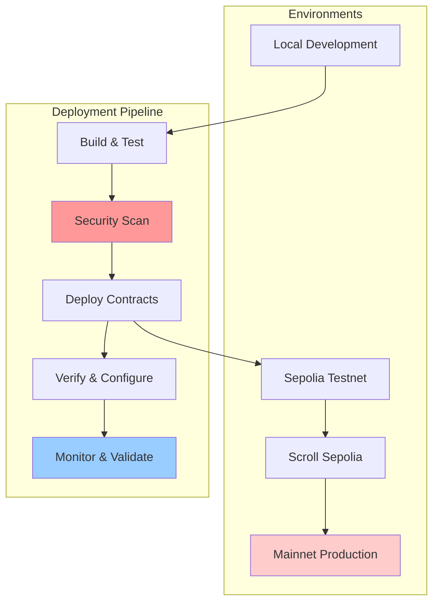

# 08 — Deployment Operations & Infrastructure

## Deployment Philosophy

The GIVE Protocol follows a systematic deployment approach emphasizing security, reliability, and progressive rollout across multiple environments.



## Infrastructure Architecture

### Network Configuration

#### Supported Networks
| Network | Chain ID | Purpose | RPC Endpoint |
|---------|----------|---------|---------------|
| Localhost | 31337 | Development | http://127.0.0.1:8545 |
| Sepolia | 11155111 | Testing | https://sepolia.infura.io/v3/{key} |
| Scroll Sepolia | 534351 | Staging | https://sepolia-rpc.scroll.io |
| Scroll Mainnet | 534352 | Production | https://rpc.scroll.io |

#### Environment Variables
```bash
# .env.production
DEPLOYMENT_ENV=production
SCROLL_MAINNET_RPC_URL=https://rpc.scroll.io
PRIVATE_KEY=0x...
ETHERSCAN_API_KEY=...

# Contract Configuration
PROD_ADMIN_ADDRESS=0x...
PROD_TREASURY_ADDRESS=0x...
PROD_MINIMUM_STAKE=1000000000000000 # 0.001 ETH

# Monitoring
DATADOG_API_KEY=...
SENTRY_DSN=...
GRAFANA_URL=...

# IPFS Configuration  
PINATA_API_KEY=...
PINATA_SECRET_KEY=...
IPFS_GATEWAY=https://gateway.pinata.cloud
```

### Smart Contract Deployment

#### Deployment Script Architecture
```solidity
// script/DeployProduction.s.sol
pragma solidity ^0.8.20;

import "forge-std/Script.sol";
import "forge-std/console.sol";

import {RoleManager} from "../src/access/RoleManager.sol";
import {CampaignRegistry} from "../src/campaign/CampaignRegistry.sol";
import {StrategyRegistry} from "../src/manager/StrategyRegistry.sol";
import {CampaignVaultFactory} from "../src/vault/CampaignVaultFactory.sol";
import {PayoutRouter} from "../src/payout/PayoutRouter.sol";
import {GiveVault4626} from "../src/vault/GiveVault4626.sol";
import {AaveAdapter} from "../src/adapters/AaveAdapter.sol";

/// @title Production Deployment Script
/// @notice Deploys complete GIVE Protocol infrastructure to mainnet
contract DeployProductionScript is Script {
    
    struct DeploymentAddresses {
        address roleManager;
        address campaignRegistry;
        address strategyRegistry;
        address vaultFactory;
        address payoutRouter;
        address vaultImplementation;
        address aaveAdapter;
    }
    
    struct NetworkConfig {
        address admin;
        address treasury;
        address guardian;
        uint256 minimumStake;
        address aavePoolProvider;
        address weth;
        address usdc;
    }
    
    // Network configurations
    mapping(uint256 => NetworkConfig) public networkConfigs;
    
    function run() external returns (DeploymentAddresses memory) {
        uint256 chainId = block.chainid;
        NetworkConfig memory config = getNetworkConfig(chainId);
        
        console.log("Deploying GIVE Protocol to chain ID:", chainId);
        console.log("Admin address:", config.admin);
        console.log("Treasury address:", config.treasury);
        
        vm.startBroadcast();
        
        DeploymentAddresses memory addresses = deployProtocol(config);
        
        vm.stopBroadcast();
        
        // Post-deployment configuration
        configureProtocol(addresses, config);
        
        // Save deployment addresses
        saveDeploymentAddresses(addresses, chainId);
        
        // Verify contracts
        verifyContracts(addresses);
        
        console.log("Deployment completed successfully");
        return addresses;
    }
    
    function deployProtocol(NetworkConfig memory config) 
        internal 
        returns (DeploymentAddresses memory addresses) 
    {
        // 1. Deploy RoleManager
        addresses.roleManager = address(new RoleManager(config.admin));
        console.log("RoleManager deployed:", addresses.roleManager);
        
        // 2. Deploy registries
        addresses.campaignRegistry = address(new CampaignRegistry(
            addresses.roleManager,
            payable(config.treasury),
            config.minimumStake
        ));
        console.log("CampaignRegistry deployed:", addresses.campaignRegistry);
        
        addresses.strategyRegistry = address(new StrategyRegistry(
            addresses.roleManager
        ));
        console.log("StrategyRegistry deployed:", addresses.strategyRegistry);
        
        // 3. Deploy vault system
        addresses.vaultImplementation = address(new GiveVault4626());
        console.log("Vault implementation deployed:", addresses.vaultImplementation);
        
        addresses.vaultFactory = address(new CampaignVaultFactory(
            addresses.roleManager,
            addresses.vaultImplementation
        ));
        console.log("VaultFactory deployed:", addresses.vaultFactory);
        
        // 4. Deploy payout router
        addresses.payoutRouter = address(new PayoutRouter(
            addresses.roleManager,
            addresses.campaignRegistry,
            addresses.vaultFactory
        ));
        console.log("PayoutRouter deployed:", addresses.payoutRouter);
        
        // 5. Deploy yield adapters
        if (config.aavePoolProvider != address(0)) {
            addresses.aaveAdapter = address(new AaveAdapter(
                addresses.roleManager,
                config.aavePoolProvider,
                config.weth,
                address(0) // Will be set per vault
            ));
            console.log("AaveAdapter deployed:", addresses.aaveAdapter);
        }
    }
    
    function configureProtocol(
        DeploymentAddresses memory addresses,
        NetworkConfig memory config
    ) internal {
        RoleManager roleManager = RoleManager(addresses.roleManager);
        
        // Grant initial roles
        roleManager.grantRole(roleManager.CAMPAIGN_ADMIN_ROLE(), config.admin);
        roleManager.grantRole(roleManager.STRATEGY_ADMIN_ROLE(), config.admin);
        roleManager.grantRole(roleManager.VAULT_OPS_ROLE(), config.admin);
        roleManager.grantRole(roleManager.TREASURY_ROLE(), config.treasury);
        roleManager.grantRole(roleManager.GUARDIAN_ROLE(), config.guardian);
        
        console.log("Protocol roles configured");
        
        // Register initial strategies
        if (addresses.aaveAdapter != address(0)) {
            StrategyRegistry strategyRegistry = StrategyRegistry(addresses.strategyRegistry);
            strategyRegistry.registerStrategy(
                addresses.aaveAdapter,
                "Aave V3 WETH Strategy",
                "Low risk yield generation through Aave V3 lending",
                300, // 3% estimated APY
                StrategyRegistry.RiskLevel.Low
            );
            console.log("Aave strategy registered");
        }
    }
    
    function getNetworkConfig(uint256 chainId) internal pure returns (NetworkConfig memory) {
        if (chainId == 534352) { // Scroll Mainnet
            return NetworkConfig({
                admin: 0x742d35Cc6854D2532CC49D0b92C7aC14EeCd1d47,
                treasury: 0x1234567890123456789012345678901234567890,
                guardian: 0x0987654321098765432109876543210987654321,
                minimumStake: 0.001 ether,
                aavePoolProvider: 0x69850D0B276776781C063771b161bd8894BCdD04,
                weth: 0x5300000000000000000000000000000000000004,
                usdc: 0x06eFdBFf2a14a7c8E15944D1F4A48F9F95F663A4
            });
        } else if (chainId == 534351) { // Scroll Sepolia
            return NetworkConfig({
                admin: 0x742d35Cc6854D2532CC49D0b92C7aC14EeCd1d47,
                treasury: 0x742d35Cc6854D2532CC49D0b92C7aC14EeCd1d47,
                guardian: 0x742d35Cc6854D2532CC49D0b92C7aC14EeCd1d47,
                minimumStake: 0.0001 ether,
                aavePoolProvider: 0x0496275d34753A48320CA58103d5220d394FF77F,
                weth: 0x5300000000000000000000000000000000000004,
                usdc: 0x94a9D9AC8a22534E3FaCa9F4e7F2E2cf85d5E4C8
            });
        }
        revert("Unsupported network");
    }
    
    function saveDeploymentAddresses(
        DeploymentAddresses memory addresses,
        uint256 chainId
    ) internal {
        string memory json = "deployment";
        
        vm.serializeAddress(json, "RoleManager", addresses.roleManager);
        vm.serializeAddress(json, "CampaignRegistry", addresses.campaignRegistry);
        vm.serializeAddress(json, "StrategyRegistry", addresses.strategyRegistry);
        vm.serializeAddress(json, "VaultFactory", addresses.vaultFactory);
        vm.serializeAddress(json, "PayoutRouter", addresses.payoutRouter);
        vm.serializeAddress(json, "VaultImplementation", addresses.vaultImplementation);
        
        string memory output = vm.serializeAddress(json, "AaveAdapter", addresses.aaveAdapter);
        
        string memory filename = string.concat(
            "deployments/",
            vm.toString(chainId),
            "-",
            vm.toString(block.timestamp),
            ".json"
        );
        
        vm.writeJson(output, filename);
        
        // Also write to latest.json for easy access
        string memory latestFile = string.concat("deployments/", vm.toString(chainId), "-latest.json");
        vm.writeJson(output, latestFile);
        
        console.log("Deployment addresses saved to:", filename);
    }
    
    function verifyContracts(DeploymentAddresses memory addresses) internal {
        // Contract verification would be implemented here
        // This is typically done via forge verify-contract commands
        console.log("Contract verification initiated");
        console.log("Verify contracts manually using:");
        console.log("forge verify-contract", addresses.roleManager, "RoleManager");
        console.log("forge verify-contract", addresses.campaignRegistry, "CampaignRegistry");
        // ... other contracts
    }
}
```

#### Deployment Automation
```bash
#!/bin/bash
# scripts/deploy-production.sh

set -e

# Configuration
ENVIRONMENT=${1:-production}
NETWORK=${2:-scroll}
DRY_RUN=${3:-false}

echo "🚀 Starting GIVE Protocol deployment to $ENVIRONMENT"
echo "Network: $NETWORK"
echo "Dry run: $DRY_RUN"

# Load environment variables
if [ -f ".env.$ENVIRONMENT" ]; then
    source ".env.$ENVIRONMENT"
else
    echo "❌ Environment file .env.$ENVIRONMENT not found"
    exit 1
fi

# Verify required environment variables
required_vars=(
    "PRIVATE_KEY"
    "RPC_URL" 
    "ETHERSCAN_API_KEY"
    "PROD_ADMIN_ADDRESS"
    "PROD_TREASURY_ADDRESS"
)

for var in "${required_vars[@]}"; do
    if [ -z "${!var}" ]; then
        echo "❌ Missing required environment variable: $var"
        exit 1
    fi
done

echo "✅ Environment variables validated"

# Pre-deployment checks
echo "🔍 Running pre-deployment checks..."

# Check contract compilation
cd backend
forge build

if [ $? -ne 0 ]; then
    echo "❌ Contract compilation failed"
    exit 1
fi

echo "✅ Contracts compiled successfully"

# Run tests
echo "🧪 Running test suite..."
forge test

if [ $? -ne 0 ]; then
    echo "❌ Tests failed"
    exit 1
fi

echo "✅ All tests passed"

# Security analysis
echo "🔒 Running security analysis..."
slither . --config-file slither.config.json

if [ $? -ne 0 ]; then
    echo "⚠️ Security issues detected - review before proceeding"
    read -p "Continue anyway? (y/N) " -n 1 -r
    echo
    if [[ ! $REPLY =~ ^[Yy]$ ]]; then
        exit 1
    fi
fi

# Gas estimation
echo "⛽ Estimating gas costs..."
forge script script/DeployProduction.s.sol:DeployProductionScript \
    --rpc-url $RPC_URL \
    --private-key $PRIVATE_KEY \
    --estimate-gas-only

# Deployment execution
if [ "$DRY_RUN" == "true" ]; then
    echo "🧪 Dry run - simulating deployment..."
    forge script script/DeployProduction.s.sol:DeployProductionScript \
        --rpc-url $RPC_URL \
        --private-key $PRIVATE_KEY
else
    echo "🚀 Executing deployment..."
    
    # Backup any existing deployments
    if [ -f "deployments/$NETWORK-latest.json" ]; then
        cp "deployments/$NETWORK-latest.json" "deployments/$NETWORK-backup-$(date +%s).json"
    fi
    
    # Execute deployment
    forge script script/DeployProduction.s.sol:DeployProductionScript \
        --rpc-url $RPC_URL \
        --private-key $PRIVATE_KEY \
        --broadcast \
        --verify \
        --etherscan-api-key $ETHERSCAN_API_KEY
    
    if [ $? -eq 0 ]; then
        echo "✅ Deployment successful!"
        
        # Update frontend configuration
        cd ../frontend
        node scripts/update-contract-addresses.js $ENVIRONMENT
        
        # Notify monitoring systems
        if [ ! -z "$WEBHOOK_URL" ]; then
            curl -X POST "$WEBHOOK_URL" \
                -H "Content-Type: application/json" \
                -d "{\"text\":\"GIVE Protocol deployed to $ENVIRONMENT on $NETWORK\"}"
        fi
        
        echo "🎉 Deployment pipeline completed successfully"
    else
        echo "❌ Deployment failed"
        exit 1
    fi
fi
```

### Frontend Deployment

#### Next.js Production Build
```dockerfile
# Dockerfile
FROM node:18-alpine AS base

# Install dependencies only when needed
FROM base AS deps
WORKDIR /app

# Install dependencies based on the preferred package manager
COPY package.json pnpm-lock.yaml* ./
RUN corepack enable pnpm && pnpm i --frozen-lockfile

# Rebuild the source code only when needed
FROM base AS builder
WORKDIR /app
COPY --from=deps /app/node_modules ./node_modules
COPY . .

# Build arguments for contract addresses
ARG NEXT_PUBLIC_CAMPAIGN_REGISTRY_ADDRESS
ARG NEXT_PUBLIC_STRATEGY_REGISTRY_ADDRESS
ARG NEXT_PUBLIC_VAULT_FACTORY_ADDRESS
ARG NEXT_PUBLIC_RPC_URL
ARG NEXT_PUBLIC_CHAIN_ID

# Build application
RUN corepack enable pnpm && pnpm build

# Production image, copy all the files and run next
FROM base AS runner
WORKDIR /app

ENV NODE_ENV production

RUN addgroup --system --gid 1001 nodejs
RUN adduser --system --uid 1001 nextjs

COPY --from=builder /app/public ./public

# Set the correct permission for prerender cache
RUN mkdir .next
RUN chown nextjs:nodejs .next

# Automatically leverage output traces to reduce image size
COPY --from=builder --chown=nextjs:nodejs /app/.next/standalone ./
COPY --from=builder --chown=nextjs:nodejs /app/.next/static ./.next/static

USER nextjs

EXPOSE 3000

ENV PORT 3000

# server.js is created by next build from the standalone output
CMD ["node", "server.js"]
```

#### Deployment Pipeline
```yaml
# .github/workflows/deploy.yml
name: Deploy to Production

on:
  push:
    branches: [main]
    tags: ['v*']

env:
  REGISTRY: ghcr.io
  IMAGE_NAME: ${{ github.repository }}

jobs:
  deploy-contracts:
    runs-on: ubuntu-latest
    if: startsWith(github.ref, 'refs/tags/')
    
    outputs:
      campaign-registry: ${{ steps.deploy.outputs.campaign-registry }}
      strategy-registry: ${{ steps.deploy.outputs.strategy-registry }}
      vault-factory: ${{ steps.deploy.outputs.vault-factory }}
    
    steps:
      - name: Checkout
        uses: actions/checkout@v3
        with:
          submodules: recursive
      
      - name: Install Foundry
        uses: foundry-rs/foundry-toolchain@v1
      
      - name: Deploy contracts
        id: deploy
        run: |
          cd backend
          source ../.env.production
          ./scripts/deploy-production.sh production scroll false
          
          # Extract addresses from deployment file
          CAMPAIGN_REGISTRY=$(jq -r '.CampaignRegistry' deployments/534352-latest.json)
          STRATEGY_REGISTRY=$(jq -r '.StrategyRegistry' deployments/534352-latest.json)
          VAULT_FACTORY=$(jq -r '.VaultFactory' deployments/534352-latest.json)
          
          echo "campaign-registry=$CAMPAIGN_REGISTRY" >> $GITHUB_OUTPUT
          echo "strategy-registry=$STRATEGY_REGISTRY" >> $GITHUB_OUTPUT
          echo "vault-factory=$VAULT_FACTORY" >> $GITHUB_OUTPUT
        env:
          PRIVATE_KEY: ${{ secrets.DEPLOYER_PRIVATE_KEY }}
          RPC_URL: ${{ secrets.SCROLL_RPC_URL }}
          ETHERSCAN_API_KEY: ${{ secrets.SCROLLSCAN_API_KEY }}

  deploy-frontend:
    runs-on: ubuntu-latest
    needs: deploy-contracts
    if: always() && (needs.deploy-contracts.result == 'success' || github.ref == 'refs/heads/main')
    
    steps:
      - name: Checkout
        uses: actions/checkout@v3
      
      - name: Set up Docker Buildx
        uses: docker/setup-buildx-action@v2
      
      - name: Log in to Container Registry
        uses: docker/login-action@v2
        with:
          registry: ${{ env.REGISTRY }}
          username: ${{ github.actor }}
          password: ${{ secrets.GITHUB_TOKEN }}
      
      - name: Extract metadata
        id: meta
        uses: docker/metadata-action@v4
        with:
          images: ${{ env.REGISTRY }}/${{ env.IMAGE_NAME }}
      
      - name: Build and push Docker image
        uses: docker/build-push-action@v4
        with:
          context: ./frontend
          push: true
          tags: ${{ steps.meta.outputs.tags }}
          labels: ${{ steps.meta.outputs.labels }}
          build-args: |
            NEXT_PUBLIC_CAMPAIGN_REGISTRY_ADDRESS=${{ needs.deploy-contracts.outputs.campaign-registry || vars.CAMPAIGN_REGISTRY_ADDRESS }}
            NEXT_PUBLIC_STRATEGY_REGISTRY_ADDRESS=${{ needs.deploy-contracts.outputs.strategy-registry || vars.STRATEGY_REGISTRY_ADDRESS }}
            NEXT_PUBLIC_VAULT_FACTORY_ADDRESS=${{ needs.deploy-contracts.outputs.vault-factory || vars.VAULT_FACTORY_ADDRESS }}
            NEXT_PUBLIC_RPC_URL=${{ vars.PUBLIC_RPC_URL }}
            NEXT_PUBLIC_CHAIN_ID=534352
      
      - name: Deploy to production
        run: |
          echo "Deploying to production with image: ${{ steps.meta.outputs.tags }}"
          # Integration with deployment platform (Railway, Vercel, etc.)
```

## Monitoring & Observability

### Application Performance Monitoring

#### Monitoring Stack
```yaml
# docker-compose.monitoring.yml
version: '3.8'

services:
  # Prometheus for metrics collection
  prometheus:
    image: prom/prometheus:latest
    container_name: prometheus
    ports:
      - "9090:9090"
    volumes:
      - ./monitoring/prometheus.yml:/etc/prometheus/prometheus.yml
      - prometheus_data:/prometheus
    command:
      - '--config.file=/etc/prometheus/prometheus.yml'
      - '--storage.tsdb.path=/prometheus'
      - '--web.console.libraries=/etc/prometheus/console_libraries'
      - '--web.console.templates=/etc/prometheus/consoles'

  # Grafana for visualization
  grafana:
    image: grafana/grafana:latest
    container_name: grafana
    ports:
      - "3001:3000"
    environment:
      - GF_SECURITY_ADMIN_PASSWORD=admin
    volumes:
      - grafana_data:/var/lib/grafana
      - ./monitoring/grafana/dashboards:/var/lib/grafana/dashboards
      - ./monitoring/grafana/provisioning:/etc/grafana/provisioning

  # Node exporter for system metrics
  node-exporter:
    image: prom/node-exporter:latest
    container_name: node-exporter
    ports:
      - "9100:9100"
    volumes:
      - /proc:/host/proc:ro
      - /sys:/host/sys:ro
      - /:/rootfs:ro
    command:
      - '--path.procfs=/host/proc'
      - '--path.rootfs=/rootfs'
      - '--path.sysfs=/host/sys'

volumes:
  prometheus_data:
  grafana_data:
```

#### Smart Contract Monitoring
```typescript
// monitoring/contract-monitor.ts
import { ethers } from 'ethers';
import { CampaignRegistryABI } from '../src/abis';
import { CONTRACT_ADDRESSES } from '../src/config/contracts';

export class ContractMonitor {
  private provider: ethers.Provider;
  private contracts: Record<string, ethers.Contract>;
  
  constructor(rpcUrl: string) {
    this.provider = new ethers.JsonRpcProvider(rpcUrl);
    this.initializeContracts();
  }
  
  private initializeContracts() {
    this.contracts = {
      campaignRegistry: new ethers.Contract(
        CONTRACT_ADDRESSES.CampaignRegistry,
        CampaignRegistryABI,
        this.provider
      ),
      // ... other contracts
    };
  }
  
  async startMonitoring() {
    console.log('Starting contract monitoring...');
    
    // Monitor campaign submissions
    this.contracts.campaignRegistry.on(
      'CampaignSubmitted',
      (campaignId, creator, curator, metadataURI, stakeAmount, event) => {
        this.logMetric('campaign_submitted', {
          campaignId: campaignId.toString(),
          creator,
          stakeAmount: ethers.formatEther(stakeAmount),
          blockNumber: event.blockNumber,
          transactionHash: event.transactionHash,
        });
      }
    );
    
    // Monitor campaign approvals
    this.contracts.campaignRegistry.on(
      'CampaignApproved',
      (campaignId, approver, curator, event) => {
        this.logMetric('campaign_approved', {
          campaignId: campaignId.toString(),
          approver,
          curator,
          blockNumber: event.blockNumber,
          transactionHash: event.transactionHash,
        });
      }
    );
    
    // Monitor system health
    setInterval(() => {
      this.checkSystemHealth();
    }, 60000); // Every minute
  }
  
  private async checkSystemHealth() {
    try {
      const blockNumber = await this.provider.getBlockNumber();
      const campaignCounter = await this.contracts.campaignRegistry.campaignCounter();
      
      this.logMetric('system_health', {
        blockNumber,
        campaignCount: campaignCounter.toString(),
        timestamp: Date.now(),
      });
      
    } catch (error) {
      console.error('Health check failed:', error);
      this.logMetric('system_error', {
        error: error.message,
        timestamp: Date.now(),
      });
    }
  }
  
  private logMetric(metric: string, data: Record<string, any>) {
    // Send to monitoring system (Datadog, New Relic, etc.)
    console.log(`[${metric}]`, data);
    
    // Example: Send to Datadog
    if (process.env.DATADOG_API_KEY) {
      // Implementation for Datadog metrics
    }
  }
}

// Start monitoring
if (require.main === module) {
  const monitor = new ContractMonitor(process.env.RPC_URL!);
  monitor.startMonitoring();
}
```

### Alerting & Incident Response

#### Alert Configuration
```yaml
# monitoring/alerts.yml
groups:
  - name: give-protocol-alerts
    rules:
      # High gas usage alert
      - alert: HighGasUsage
        expr: ethereum_gas_used > 8000000
        for: 5m
        labels:
          severity: warning
        annotations:
          summary: "High gas usage detected"
          description: "Transaction gas usage {{ $value }} exceeds threshold"
      
      # Contract call failure
      - alert: ContractCallFailure
        expr: rate(contract_call_failures[5m]) > 0.1
        for: 2m
        labels:
          severity: critical
        annotations:
          summary: "Contract call failures detected"
          description: "{{ $value }} contract calls per second are failing"
      
      # Frontend error rate
      - alert: HighErrorRate
        expr: rate(http_requests_total{status=~"5.."}[5m]) > 0.05
        for: 3m
        labels:
          severity: critical
        annotations:
          summary: "High error rate in frontend"
          description: "Error rate is {{ $value }} per second"
      
      # Campaign submission anomaly
      - alert: CampaignSubmissionAnomaly
        expr: rate(campaigns_submitted_total[1h]) > 100
        for: 10m
        labels:
          severity: warning
        annotations:
          summary: "Unusual campaign submission rate"
          description: "{{ $value }} campaigns submitted per second"
```

#### Incident Response Playbook
```markdown
# Incident Response Playbook

## Severity Levels

### P0 - Critical (Response: Immediate)
- Protocol security vulnerability
- Complete service outage
- Fund loss or lock-up

**Response Actions:**
1. Activate incident team immediately
2. Pause affected contracts if possible
3. Investigate and contain issue
4. Prepare public communication
5. Implement fix and recovery

### P1 - High (Response: 1 hour)
- Partial service degradation
- Smart contract function failures
- High error rates

### P2 - Medium (Response: 4 hours)
- Performance issues
- Non-critical feature problems
- Monitoring alerts

### P3 - Low (Response: Next business day)
- Minor UI issues
- Documentation problems
- Enhancement requests

## Emergency Procedures

### Contract Pause Protocol
```bash
# Emergency contract pause
forge script script/EmergencyPause.s.sol \
    --rpc-url $RPC_URL \
    --private-key $GUARDIAN_PRIVATE_KEY \
    --broadcast

# Verify pause status
cast call $CONTRACT_ADDRESS "paused()" --rpc-url $RPC_URL
```

### Communication Templates
**Internal Alert:**
```
🚨 INCIDENT: [P0/P1/P2/P3] - [Brief Description]
Status: [Investigating/Identified/Resolved]
Impact: [Description of user impact]
ETA: [Estimated resolution time]
Lead: [Incident commander]
```

**Public Communication:**
```
We are currently investigating an issue affecting [service/feature].
Users may experience [specific impact].
We will provide updates every [timeframe].
No user funds are at risk.
```
```

## Backup & Recovery

### Database Backup Strategy
```bash
#!/bin/bash
# scripts/backup.sh

BACKUP_DIR="/backups/give-protocol"
TIMESTAMP=$(date +%Y%m%d_%H%M%S)

# Create backup directory
mkdir -p "$BACKUP_DIR/$TIMESTAMP"

# Backup contract deployment addresses
cp -r deployments/ "$BACKUP_DIR/$TIMESTAMP/"

# Backup configuration files
cp .env.production "$BACKUP_DIR/$TIMESTAMP/"
cp frontend/.env.local "$BACKUP_DIR/$TIMESTAMP/"

# Backup monitoring configuration
cp -r monitoring/ "$BACKUP_DIR/$TIMESTAMP/"

# Create archive
tar -czf "$BACKUP_DIR/give-protocol-$TIMESTAMP.tar.gz" "$BACKUP_DIR/$TIMESTAMP"

# Upload to cloud storage
aws s3 cp "$BACKUP_DIR/give-protocol-$TIMESTAMP.tar.gz" s3://give-protocol-backups/

# Cleanup old backups (keep 30 days)
find "$BACKUP_DIR" -name "*.tar.gz" -mtime +30 -delete

echo "Backup completed: give-protocol-$TIMESTAMP.tar.gz"
```

### Disaster Recovery Plan
1. **Assessment**: Evaluate scope and impact
2. **Communication**: Notify stakeholders and users  
3. **Isolation**: Pause affected contracts
4. **Recovery**: Deploy fixed contracts or restore from backup
5. **Validation**: Test recovery thoroughly
6. **Resume**: Unpause and monitor closely
7. **Post-mortem**: Document lessons learned

## Maintenance Procedures

### Routine Maintenance Checklist
- [ ] Monitor contract gas usage trends
- [ ] Review security alerts and logs
- [ ] Update dependency versions
- [ ] Verify backup integrity
- [ ] Test emergency procedures
- [ ] Review and update documentation
- [ ] Analyze performance metrics
- [ ] Check certificate expirations

### Upgrade Procedures
```bash
# Smart contract upgrade process
1. Deploy new implementation
2. Run upgrade tests
3. Update proxy if using upgradeable pattern
4. Verify upgrade success
5. Update frontend configuration
6. Monitor for issues
```

This deployment operations guide provides comprehensive procedures for securely deploying, monitoring, and maintaining the GIVE Protocol in production environments while ensuring high availability and rapid incident response capabilities.