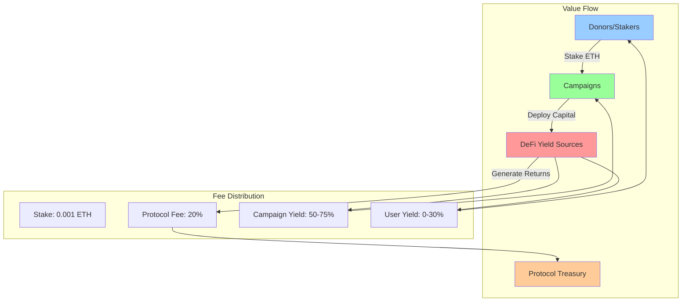
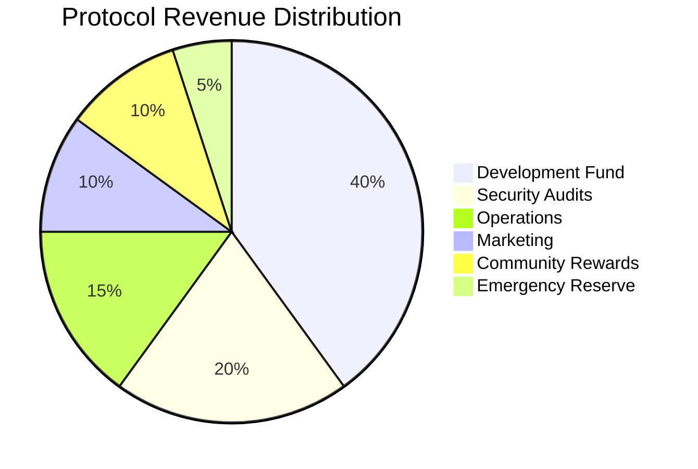

# 09 — Economic Model & Tokenomics

## Economic Philosophy

The GIVE Protocol implements a sustainable economic model that aligns incentives between donors, campaigners, and the protocol while generating meaningful yield for charitable causes.



## Core Economic Mechanisms

### Staking Economics

#### Campaign Submission Costs
| Component | Amount | Purpose | Destination |
|-----------|---------|---------|-------------|
| Minimum Stake | 0.001 ETH | Spam Prevention | Treasury (if approved) |
| Gas Costs | Variable | Transaction Fees | Network |
| IPFS Storage | ~$0.01 | Metadata Storage | Pinata/IPFS Provider |

#### Stake Lifecycle
```typescript
interface StakeEconomics {
  minimumStake: bigint;        // 0.001 ETH mainnet, 0.0001 ETH testnet
  approvalFee: bigint;         // Stake amount → Treasury
  rejectionRefund: bigint;     // Full stake refund
  stakingCapital: bigint;      // User deposits for yield generation
}

// Economic calculations
const calculateStakeValue = (
  userDeposit: bigint,
  yieldGenerated: bigint,
  userAllocation: number // basis points
): StakeValue => {
  const userYield = (yieldGenerated * BigInt(userAllocation)) / 10000n;
  const totalValue = userDeposit + userYield;
  
  return {
    principal: userDeposit,
    yield: userYield,
    totalValue,
    roi: Number((userYield * 10000n) / userDeposit) / 100 // percentage
  };
};
```

### Yield Distribution Model

#### Default Allocation Strategy
```solidity
// Default yield allocation percentages (basis points)
uint16 public constant DEFAULT_CAMPAIGN_PERCENT = 5000;  // 50%
uint16 public constant DEFAULT_USER_PERCENT = 3000;      // 30%  
uint16 public constant DEFAULT_PROTOCOL_PERCENT = 2000;  // 20%

// User customizable allocation options
struct AllocationTier {
    string name;
    uint16 campaignPercent;
    uint16 userPercent;
    uint16 protocolPercent;
    string description;
}

AllocationTier[] public allocationTiers = [
    AllocationTier({
        name: "Balanced",
        campaignPercent: 5000,
        userPercent: 3000,
        protocolPercent: 2000,
        description: "Balanced approach supporting campaigns while earning yield"
    }),
    AllocationTier({
        name: "Campaign Focused", 
        campaignPercent: 7500,
        userPercent: 500,
        protocolPercent: 2000,
        description: "Maximum impact for campaigns with minimal user yield"
    }),
    AllocationTier({
        name: "Yield Optimized",
        campaignPercent: 5000,
        userPercent: 4000, 
        protocolPercent: 1000,
        description: "Higher user returns with reduced protocol fees"
    })
];
```

#### Yield Distribution Mathematics
```typescript
interface YieldDistribution {
  totalYield: bigint;
  campaignShare: bigint;
  userShare: bigint;
  protocolShare: bigint;
  gasEstimated: bigint;
}

const calculateYieldDistribution = (
  totalYield: bigint,
  userAllocation: UserAllocation,
  gasPrice: bigint = 20_000_000_000n // 20 gwei default
): YieldDistribution => {
  // Calculate shares based on user allocation
  const campaignShare = (totalYield * BigInt(userAllocation.campaignPercent)) / 10000n;
  const userShare = (totalYield * BigInt(userAllocation.userPercent)) / 10000n;
  const protocolShare = (totalYield * BigInt(userAllocation.protocolPercent)) / 10000n;
  
  // Estimate gas costs for distribution
  const gasEstimated = gasPrice * 150_000n; // ~150k gas for distribution
  
  return {
    totalYield,
    campaignShare,
    userShare: userShare - gasEstimated, // Subtract gas from user share
    protocolShare,
    gasEstimated
  };
};
```

### Fee Structure

#### Protocol Revenue Streams
1. **Campaign Approval Fees**: 0.001 ETH per approved campaign
2. **Yield Protocol Fees**: 20% of generated yield (default)
3. **Strategy Performance Fees**: 10% of excess returns above benchmark
4. **Withdrawal Fees**: 0.1% for early withdrawals (<30 days)

#### Fee Distribution Breakdown


### Yield Generation Strategies

#### Strategy Risk-Return Profile
| Strategy | Risk Level | Target APY | Protocols | Allocation |
|----------|------------|------------|-----------|------------|
| Aave Lending | Low | 2-4% | Aave V3 | 50% |
| Compound | Low | 2-3% | Compound V3 | 25% |
| Liquid Staking | Medium | 4-6% | Lido, Rocket Pool | 20% |
| Yield Farming | High | 8-15% | Various DeFi | 5% |

#### Strategy Implementation
```solidity
struct YieldStrategy {
    address adapter;           // Strategy adapter contract
    string name;              // Human readable name
    string description;       // Strategy description
    uint256 targetAPY;        // Expected APY in basis points
    RiskLevel riskLevel;      // Risk classification
    uint256 totalAllocated;   // Total funds allocated
    uint256 maxAllocation;    // Maximum allocation limit
    bool isActive;            // Strategy status
    uint256 performanceFee;   // Performance fee in basis points
}

enum RiskLevel { Low, Medium, High }

// Strategy performance tracking
struct StrategyPerformance {
    uint256 totalDeposited;
    uint256 totalWithdrawn;
    uint256 yieldGenerated;
    uint256 actualAPY;        // Rolling 30-day APY
    uint256 sharpeRatio;      // Risk-adjusted returns
    uint256 lastUpdated;
}
```

### Token Economics (Future Implementation)

#### GIVE Token Utility (Planned)
```typescript
interface GIVETokenomics {
  // Governance utilities
  votingPower: boolean;           // Governance participation
  proposalCreation: boolean;      // Create governance proposals
  
  // Economic utilities
  stakingRewards: boolean;        // Additional yield for GIVE stakers
  feeDiscounts: boolean;         // Reduced protocol fees
  earlyAccess: boolean;          // Priority access to new strategies
  
  // Distribution schedule
  totalSupply: bigint;           // 100M GIVE tokens
  initialDistribution: {
    team: number;                // 20% - 4 year vesting
    community: number;           // 40% - Community rewards
    treasury: number;            // 15% - Protocol treasury  
    investors: number;           // 15% - Strategic investors
    liquidity: number;           // 10% - DEX liquidity
  };
}

// Token distribution timeline
const tokenDistribution = {
  genesis: {
    team: 0,              // 0% at launch
    community: 10_000_000, // 10% immediate community allocation
    treasury: 15_000_000, // 15% to treasury
    investors: 0,         // Cliff period
    liquidity: 10_000_000 // 10% for DEX liquidity
  },
  
  // Monthly vesting schedule
  monthlyRelease: {
    team: 416_667,        // ~417k tokens/month over 48 months
    community: 625_000,   // Community incentives
    investors: 312_500    // Investor vesting over 48 months
  }
};
```

### Revenue Projections

#### Growth Model Assumptions
```typescript
interface GrowthProjections {
  // User adoption metrics
  monthlyNewCampaigns: number;     // 50 → 500 over 12 months
  averageStakePerCampaign: bigint; // 10 ETH average
  stakingParticipationRate: number; // 15% → 35% adoption
  
  // Yield metrics
  averageYieldAPY: number;         // 4.5% blended yield
  protocolFeeCapture: number;      // 20% protocol fee
  
  // Revenue calculations
  monthlyRevenue: bigint;
  annualizedRevenue: bigint;
  breakEvenTimeline: number;       // Months to break even
}

const calculateRevenue = (
  campaigns: number,
  avgStake: bigint,
  yieldAPY: number,
  protocolFee: number
): MonthlyRevenue => {
  const totalStaked = BigInt(campaigns) * avgStake;
  const monthlyYield = totalStaked * BigInt(Math.floor(yieldAPY * 100)) / 1200n; // Monthly yield
  const protocolShare = monthlyYield * BigInt(protocolFee) / 100n;
  
  const campaignFees = BigInt(campaigns) * parseEther("0.001"); // Approval fees
  
  return {
    totalStaked,
    yieldGenerated: monthlyYield,
    protocolFees: protocolShare,
    campaignFees,
    totalRevenue: protocolShare + campaignFees
  };
};
```

#### 12-Month Revenue Projection
| Month | Campaigns | Total Staked | Monthly Yield | Protocol Revenue | Cumulative |
|-------|-----------|--------------|---------------|------------------|------------|
| 1 | 25 | 250 ETH | 0.94 ETH | 0.21 ETH | 0.21 ETH |
| 6 | 150 | 1,500 ETH | 5.63 ETH | 1.28 ETH | 7.50 ETH |
| 12 | 300 | 3,000 ETH | 11.25 ETH | 2.55 ETH | 18.75 ETH |

### Economic Security Model

#### Risk Mitigation Strategies
```typescript
interface RiskParameters {
  // Concentration limits
  maxCampaignAllocation: bigint;    // 10% max per campaign
  maxStrategyAllocation: bigint;    // 50% max per strategy
  
  // Liquidity requirements
  minimumLiquidityRatio: number;    // 15% liquid reserves
  emergencyWithdrawalLimit: bigint; // 24hr withdrawal cap
  
  // Insurance mechanisms
  protocolInsurance: bigint;        // Insurance fund size
  slashingConditions: string[];     // Conditions for slashing
  
  // Oracle dependencies
  priceOracleTimeout: number;       // Max oracle staleness
  fallbackPriceSources: string[];   // Backup price feeds
}

// Economic attack vectors and mitigations
const securityMeasures = {
  flashLoanAttacks: {
    mitigation: "Time-weighted price oracles, withdrawal delays",
    implementation: "TWAP pricing with 24hr delay on large withdrawals"
  },
  
  yieldFarmingExploits: {
    mitigation: "Strategy allocation limits, gradual deployment",
    implementation: "Max 5% allocation to new strategies, 30-day ramp"
  },
  
  governanceAttacks: {
    mitigation: "Timelock controls, guardian multisig",
    implementation: "48hr timelock on parameter changes, 2/3 guardian approval"
  }
};
```

### Incentive Alignment

#### Campaign Creator Incentives
```solidity
// Campaign performance bonuses
struct CampaignIncentives {
    uint256 baseYieldShare;        // Base campaign allocation
    uint256 performanceBonus;      // Bonus for meeting milestones  
    uint256 communityBonus;        // Bonus for high engagement
    uint256 loyaltyMultiplier;     // Multiplier for repeat campaigns
}

function calculateCampaignYield(
    uint256 baseYield,
    uint256 milestoneCompletion,    // 0-100%
    uint256 engagementScore,        // 0-100
    bool isRepeatCampaigner
) external pure returns (uint256 totalYield) {
    uint256 performanceBonus = (baseYield * milestoneCompletion) / 200; // Up to 50% bonus
    uint256 engagementBonus = (baseYield * engagementScore) / 400;      // Up to 25% bonus
    uint256 loyaltyBonus = isRepeatCampaigner ? baseYield / 10 : 0;     // 10% loyalty bonus
    
    return baseYield + performanceBonus + engagementBonus + loyaltyBonus;
}
```

#### Staker Reward Programs
```typescript
interface StakerRewards {
  // Loyalty tiers based on staking duration
  tiers: {
    bronze: { minDays: 30, yieldBonus: 5 };   // 5% bonus after 30 days
    silver: { minDays: 90, yieldBonus: 10 };  // 10% bonus after 90 days  
    gold: { minDays: 180, yieldBonus: 20 };   // 20% bonus after 180 days
    diamond: { minDays: 365, yieldBonus: 35 }; // 35% bonus after 1 year
  };
  
  // Volume-based rewards
  volumeMultipliers: {
    tier1: { minStake: parseEther("1"), multiplier: 1.0 };
    tier2: { minStake: parseEther("10"), multiplier: 1.1 };
    tier3: { minStake: parseEther("50"), multiplier: 1.2 };
    tier4: { minStake: parseEther("100"), multiplier: 1.3 };
  };
}
```

### Sustainability Metrics

#### Key Performance Indicators
```typescript
interface SustainabilityKPIs {
  // Financial sustainability
  burnRate: bigint;                // Monthly operational costs
  runway: number;                  // Months of runway remaining
  revenueGrowthRate: number;       // Month-over-month growth %
  
  // Network effects
  campaignSuccessRate: number;     // % of campaigns reaching goals
  stakerRetentionRate: number;     // % of stakers active after 6 months
  averageStakeDuration: number;    // Average days staked
  
  // Impact metrics  
  totalDonated: bigint;           // Total donations facilitated
  activeCampaigns: number;        // Currently active campaigns
  beneficiaryReach: number;       // People impacted by campaigns
}

// Sustainability dashboard
const trackSustainability = (): SustainabilityReport => {
  return {
    financialHealth: calculateFinancialHealth(),
    growthMetrics: calculateGrowthMetrics(),
    impactMetrics: calculateImpactMetrics(),
    recommendations: generateRecommendations()
  };
};
```

### Economic Governance

#### Parameter Adjustment Framework
```solidity
// Governable parameters with safe ranges
struct EconomicParameters {
    uint256 minimumStake;           // Range: 0.0001 - 0.01 ETH
    uint256 protocolFeeRate;        // Range: 1000 - 3000 BP (10-30%)
    uint256 maxCampaignDuration;    // Range: 30 - 365 days
    uint256 withdrawalDelay;        // Range: 0 - 7 days
    uint256 emergencyWithdrawFee;   // Range: 0 - 500 BP (0-5%)
}

// Governance proposal structure
struct EconomicProposal {
    string title;
    string description;
    EconomicParameters proposedParams;
    uint256 executionDelay;         // Timelock period
    uint256 requiredQuorum;         // Voting threshold
    address proposer;
    uint256 createdAt;
}
```

This economic model ensures sustainable growth while maintaining strong incentive alignment between all stakeholders in the GIVE Protocol ecosystem.