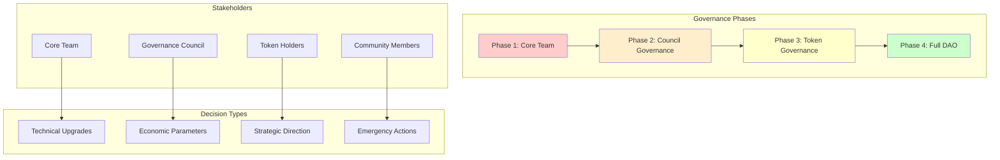

# 10 — Governance & Protocol Evolution

## Governance Philosophy

The GIVE Protocol implements a progressive decentralization model, starting with core team governance and gradually transitioning to community-driven decision making as the protocol matures.



## Governance Architecture

### Multi-Layered Decision Framework

#### Decision Matrix by Authority Level
| Decision Type | Phase 1 | Phase 2 | Phase 3 | Phase 4 |
|---------------|---------|---------|---------|---------|
| **Technical Upgrades** | Core Team | Technical Council | Token Vote | Full DAO |
| **Economic Parameters** | Core Team | Council Vote | Token Vote | Full DAO |
| **Strategic Direction** | Core Team | Council Consensus | Token Vote | Full DAO |
| **Emergency Actions** | Guardian Multisig | Guardian Multisig | Emergency Council | Emergency DAO |
| **Role Assignments** | Admin | Council | Token Vote | Full DAO |

### Phase 1: Core Team Governance (Launch → 6 months)

#### Governance Structure
```solidity
// Initial governance implementation
contract CoreTeamGovernance {
    address public admin;
    address[] public coreTeam;
    mapping(address => bool) public isCoreTeamMember;
    
    modifier onlyAdmin() {
        require(msg.sender == admin, "Only admin");
        _;
    }
    
    modifier onlyCoreTeam() {
        require(isCoreTeamMember[msg.sender], "Only core team");
        _;
    }
    
    // Core team can propose and execute changes
    function proposeParameterChange(
        address target,
        bytes calldata data,
        string calldata description
    ) external onlyCoreTeam returns (uint256 proposalId) {
        // Implementation for core team proposals
    }
    
    // Admin can execute immediately (for urgent fixes)
    function adminExecute(
        address target,
        bytes calldata data
    ) external onlyAdmin {
        // Direct execution for emergency situations
    }
}
```

#### Core Team Responsibilities
- **Protocol Development**: Smart contract upgrades and feature implementation
- **Security Management**: Monitoring and responding to security issues
- **Economic Tuning**: Adjusting fees, yields, and incentive parameters
- **Strategic Planning**: Roadmap development and partnership decisions
- **Community Building**: Growing the user and developer community

### Phase 2: Council Governance (6 months → 18 months)

#### Governance Council Structure
```typescript
interface GovernanceCouncil {
  // Council composition
  members: {
    technicalExperts: Address[];    // 3 members - Protocol developers
    economicExperts: Address[];     // 2 members - DeFi economists  
    communityReps: Address[];       // 3 members - Community elected
    legalAdvisor: Address;          // 1 member - Legal compliance
    securityExpert: Address;        // 1 member - Security specialist
  };
  
  // Voting mechanisms
  votingPower: Record<Address, number>;
  quorumThreshold: number;          // 60% for standard proposals
  superMajorityThreshold: number;   // 75% for critical changes
  
  // Proposal lifecycle
  proposalDelay: number;            // 48 hours minimum
  votingPeriod: number;            // 7 days voting window
  executionDelay: number;          // 24 hours after passage
}
```

#### Council Governance Contract
```solidity
// Enhanced governance with council voting
contract CouncilGovernance {
    
    struct Proposal {
        uint256 id;
        address proposer;
        string title;
        string description;
        address[] targets;
        bytes[] calldatas;
        uint256 startTime;
        uint256 endTime;
        uint256 forVotes;
        uint256 againstVotes;
        uint256 abstainVotes;
        ProposalState state;
        mapping(address => bool) hasVoted;
        mapping(address => VoteType) votes;
    }
    
    enum ProposalState {
        Pending,
        Active, 
        Canceled,
        Defeated,
        Succeeded,
        Queued,
        Expired,
        Executed
    }
    
    enum VoteType { Against, For, Abstain }
    
    mapping(uint256 => Proposal) public proposals;
    mapping(address => uint256) public votingPower;
    uint256 public proposalCount;
    
    // Council member management
    address[] public councilMembers;
    mapping(address => bool) public isCouncilMember;
    mapping(address => CouncilRole) public memberRole;
    
    enum CouncilRole {
        Technical,
        Economic,
        Community,
        Legal,
        Security
    }
    
    function propose(
        address[] memory targets,
        bytes[] memory calldatas,
        string memory title,
        string memory description
    ) external onlyCouncilMember returns (uint256) {
        require(targets.length == calldatas.length, "Length mismatch");
        require(targets.length > 0, "Empty proposal");
        
        uint256 proposalId = ++proposalCount;
        
        Proposal storage proposal = proposals[proposalId];
        proposal.id = proposalId;
        proposal.proposer = msg.sender;
        proposal.title = title;
        proposal.description = description;
        proposal.targets = targets;
        proposal.calldatas = calldatas;
        proposal.startTime = block.timestamp + PROPOSAL_DELAY;
        proposal.endTime = proposal.startTime + VOTING_PERIOD;
        proposal.state = ProposalState.Pending;
        
        emit ProposalCreated(
            proposalId,
            msg.sender,
            targets,
            calldatas,
            title,
            description,
            proposal.startTime,
            proposal.endTime
        );
        
        return proposalId;
    }
    
    function castVote(uint256 proposalId, VoteType vote) external onlyCouncilMember {
        Proposal storage proposal = proposals[proposalId];
        
        require(proposal.state == ProposalState.Active, "Voting not active");
        require(block.timestamp <= proposal.endTime, "Voting ended");
        require(!proposal.hasVoted[msg.sender], "Already voted");
        
        uint256 weight = votingPower[msg.sender];
        
        if (vote == VoteType.For) {
            proposal.forVotes += weight;
        } else if (vote == VoteType.Against) {
            proposal.againstVotes += weight;
        } else {
            proposal.abstainVotes += weight;
        }
        
        proposal.hasVoted[msg.sender] = true;
        proposal.votes[msg.sender] = vote;
        
        emit VoteCast(msg.sender, proposalId, vote, weight);
    }
    
    function executeProposal(uint256 proposalId) external {
        Proposal storage proposal = proposals[proposalId];
        
        require(proposal.state == ProposalState.Queued, "Not queued");
        require(block.timestamp >= proposal.endTime + EXECUTION_DELAY, "Still in delay");
        
        proposal.state = ProposalState.Executed;
        
        // Execute all calls in the proposal
        for (uint256 i = 0; i < proposal.targets.length; i++) {
            (bool success, ) = proposal.targets[i].call(proposal.calldatas[i]);
            require(success, "Execution failed");
        }
        
        emit ProposalExecuted(proposalId);
    }
}
```

### Phase 3: Token Governance (18 months → 3 years)

#### GIVE Token Implementation
```solidity
// Governance token with delegation capabilities
contract GIVEToken is ERC20Votes, ERC20Permit {
    
    constructor() ERC20("GIVE Protocol", "GIVE") ERC20Permit("GIVE Protocol") {
        _mint(msg.sender, 100_000_000 * 10**decimals()); // 100M total supply
    }
    
    // Required overrides for ERC20Votes
    function _afterTokenTransfer(
        address from,
        address to,
        uint256 amount
    ) internal override(ERC20, ERC20Votes) {
        super._afterTokenTransfer(from, to, amount);
    }
    
    function _mint(address to, uint256 amount) internal override(ERC20, ERC20Votes) {
        super._mint(to, amount);
    }
    
    function _burn(address account, uint256 amount) internal override(ERC20, ERC20Votes) {
        super._burn(account, amount);
    }
}
```

#### Token-Based Governance
```solidity
// Full token governance implementation
contract TokenGovernance is Governor, GovernorSettings, GovernorCountingSimple, 
                          GovernorVotes, GovernorVotesQuorumFraction, GovernorTimelockControl {
    
    constructor(
        IVotes _token,
        TimelockController _timelock
    )
        Governor("GIVE Protocol Governor")
        GovernorSettings(1 /* 1 block */, 50400 /* 1 week */, 0)
        GovernorVotes(_token)
        GovernorVotesQuorumFraction(4) // 4% quorum
        GovernorTimelockControl(_timelock)
    {}
    
    // Voting delay: 1 block (immediate)
    function votingDelay() public view override(IGovernor, GovernorSettings) returns (uint256) {
        return super.votingDelay();
    }
    
    // Voting period: 1 week
    function votingPeriod() public view override(IGovernor, GovernorSettings) returns (uint256) {
        return super.votingPeriod();
    }
    
    // Quorum: 4% of total supply
    function quorum(uint256 blockNumber)
        public
        view
        override(IGovernor, GovernorVotesQuorumFraction)
        returns (uint256)
    {
        return super.quorum(blockNumber);
    }
    
    function state(uint256 proposalId)
        public
        view
        override(Governor, GovernorTimelockControl)
        returns (ProposalState)
    {
        return super.state(proposalId);
    }
    
    function propose(
        address[] memory targets,
        uint256[] memory values,
        bytes[] memory calldatas,
        string memory description
    ) public override(Governor, IGovernor) returns (uint256) {
        return super.propose(targets, values, calldatas, description);
    }
    
    function proposalThreshold() public view override(Governor, GovernorSettings) returns (uint256) {
        return 1_000_000 * 10**18; // 1M GIVE tokens required to propose
    }
    
    function _execute(
        uint256 proposalId,
        address[] memory targets,
        uint256[] memory values,
        bytes[] memory calldatas,
        bytes32 descriptionHash
    ) internal override(Governor, GovernorTimelockControl) {
        super._execute(proposalId, targets, values, calldatas, descriptionHash);
    }
    
    function _cancel(
        address[] memory targets,
        uint256[] memory values,
        bytes[] memory calldatas,
        bytes32 descriptionHash
    ) internal override(Governor, GovernorTimelockControl) returns (uint256) {
        return super._cancel(targets, values, calldatas, descriptionHash);
    }
    
    function _executor() internal view override(Governor, GovernorTimelockControl) returns (address) {
        return super._executor();
    }
    
    function supportsInterface(bytes4 interfaceId)
        public
        view
        override(Governor, GovernorTimelockControl)
        returns (bool)
    {
        return super.supportsInterface(interfaceId);
    }
}
```

#### Token Distribution Strategy
```typescript
interface TokenDistribution {
  // Initial allocation (100M GIVE total)
  allocations: {
    team: {
      amount: 20_000_000;        // 20% - 4 year vesting
      vestingSchedule: LinearVesting;
      cliffPeriod: 12;          // 12 months cliff
    };
    
    community: {
      amount: 40_000_000;        // 40% - Community incentives
      distribution: {
        stakingRewards: 20_000_000;    // Staking incentives
        campaignRewards: 10_000_000;   // Campaign bonuses
        governanceRewards: 5_000_000;  // Governance participation
        futurePrograms: 5_000_000;     // Future community programs
      };
    };
    
    treasury: {
      amount: 15_000_000;        // 15% - Protocol treasury
      purpose: "Protocol development and operations";
    };
    
    investors: {
      amount: 15_000_000;        // 15% - Strategic investors
      vestingSchedule: LinearVesting;
      cliffPeriod: 12;          // 12 months cliff
    };
    
    liquidity: {
      amount: 10_000_000;        // 10% - DEX liquidity
      allocation: "Immediate release for AMM pools";
    };
  };
}
```

### Phase 4: Full DAO Governance (3+ years)

#### Comprehensive DAO Structure
```solidity
// Full DAO implementation with specialized councils
contract GiveProtocolDAO {
    
    // Specialized governance councils
    struct Council {
        string name;
        address[] members;
        uint256 votingPower;
        bytes32[] permissions;
        uint256 quorum;
    }
    
    mapping(bytes32 => Council) public councils;
    
    // Council types
    bytes32 public constant TECHNICAL_COUNCIL = keccak256("TECHNICAL_COUNCIL");
    bytes32 public constant ECONOMIC_COUNCIL = keccak256("ECONOMIC_COUNCIL");
    bytes32 public constant SECURITY_COUNCIL = keccak256("SECURITY_COUNCIL");
    bytes32 public constant GRANTS_COUNCIL = keccak256("GRANTS_COUNCIL");
    
    // Delegated democracy - token holders can delegate specific areas
    struct DelegationPreferences {
        address technicalDelegate;    // Delegate for technical proposals
        address economicDelegate;     // Delegate for economic proposals
        address generalDelegate;      // Delegate for general proposals
        uint256 delegatedAmount;      // Amount of tokens delegated
    }
    
    mapping(address => DelegationPreferences) public delegations;
    
    // Proposal categories requiring different governance mechanisms
    enum ProposalCategory {
        Technical,      // Smart contract upgrades, new features
        Economic,       // Fee changes, yield parameters
        Strategic,      // Partnerships, major direction changes
        Emergency,      // Security responses, pausing
        Constitutional  // Governance changes, fundamental protocol changes
    }
    
    struct DAOProposal {
        uint256 id;
        ProposalCategory category;
        address proposer;
        string title;
        string description;
        address[] targets;
        bytes[] calldatas;
        uint256 startTime;
        uint256 endTime;
        uint256 forVotes;
        uint256 againstVotes;
        uint256 abstainVotes;
        ProposalState state;
        uint256 quorumRequired;
        uint256 majorityRequired;
    }
    
    function submitProposal(
        ProposalCategory category,
        address[] memory targets,
        bytes[] memory calldatas,
        string memory title,
        string memory description
    ) external returns (uint256) {
        // Category-specific validation and routing
        if (category == ProposalCategory.Emergency) {
            require(councils[SECURITY_COUNCIL].members.length > 0, "Security council not initialized");
            // Route to security council for immediate action
        }
        
        // Standard proposal flow for other categories
        return _createProposal(category, targets, calldatas, title, description);
    }
}
```

## Upgrade Mechanisms

### Smart Contract Upgrade Process

#### Upgrade Authority Hierarchy
```solidity
// Timelocked upgrade mechanism
contract ProtocolUpgradeController {
    
    struct UpgradeProposal {
        address newImplementation;
        bytes initData;
        uint256 proposalTime;
        uint256 executionTime;
        bool executed;
        UpgradeType upgradeType;
    }
    
    enum UpgradeType {
        Minor,      // Bug fixes, minor improvements (24h delay)
        Major,      // New features, significant changes (7 day delay)
        Critical,   // Security fixes (immediate execution)
        Breaking    // Breaking changes (30 day delay + governance)
    }
    
    mapping(uint256 => UpgradeProposal) public upgradeProposals;
    uint256 public proposalCount;
    
    // Multi-sig guardian for critical upgrades
    address public guardianMultisig;
    
    // Timelock delays by upgrade type
    mapping(UpgradeType => uint256) public timelockDelays;
    
    constructor() {
        timelockDelays[UpgradeType.Minor] = 1 days;
        timelockDelays[UpgradeType.Major] = 7 days;
        timelockDelays[UpgradeType.Critical] = 0;
        timelockDelays[UpgradeType.Breaking] = 30 days;
    }
    
    function proposeUpgrade(
        address newImplementation,
        bytes memory initData,
        UpgradeType upgradeType,
        string memory justification
    ) external onlyAuthorized returns (uint256) {
        uint256 proposalId = ++proposalCount;
        
        upgradeProposals[proposalId] = UpgradeProposal({
            newImplementation: newImplementation,
            initData: initData,
            proposalTime: block.timestamp,
            executionTime: block.timestamp + timelockDelays[upgradeType],
            executed: false,
            upgradeType: upgradeType
        });
        
        emit UpgradeProposed(
            proposalId,
            newImplementation,
            upgradeType,
            justification,
            upgradeProposals[proposalId].executionTime
        );
        
        return proposalId;
    }
    
    function executeUpgrade(uint256 proposalId) external {
        UpgradeProposal storage proposal = upgradeProposals[proposalId];
        
        require(!proposal.executed, "Already executed");
        require(block.timestamp >= proposal.executionTime, "Timelock not expired");
        
        // Special handling for critical upgrades
        if (proposal.upgradeType == UpgradeType.Critical) {
            require(msg.sender == guardianMultisig, "Only guardian can execute critical upgrades");
        }
        
        proposal.executed = true;
        
        // Execute the upgrade
        _performUpgrade(proposal.newImplementation, proposal.initData);
        
        emit UpgradeExecuted(proposalId, proposal.newImplementation);
    }
}
```

### Governance Parameter Evolution

#### Dynamic Parameter Adjustment
```typescript
interface GovernanceParameters {
  // Voting parameters (adjustable via governance)
  proposalThreshold: bigint;        // Tokens required to propose
  quorumThreshold: number;          // % of tokens for quorum
  votingPeriod: number;            // Blocks for voting period
  timelockDelay: number;           // Blocks for execution delay
  
  // Economic parameters (governance controlled)
  protocolFeeRate: number;         // Basis points
  minimumStake: bigint;            // Wei amount
  maxCampaignDuration: number;     // Seconds
  emergencyWithdrawFee: number;    // Basis points
  
  // Security parameters
  pauseAuthority: Address[];       // Who can pause protocol
  guardianMultisig: Address;       // Emergency actions
  upgradeAuthority: Address;       // Contract upgrades
}

// Parameter change validation
const validateParameterChange = (
  parameter: keyof GovernanceParameters,
  newValue: any,
  currentValue: any
): ValidationResult => {
  const limits = {
    protocolFeeRate: { min: 500, max: 5000 },      // 5-50%
    quorumThreshold: { min: 2, max: 20 },          // 2-20%
    votingPeriod: { min: 17280, max: 120960 },     // 3-21 days in blocks
    timelockDelay: { min: 17280, max: 172800 }     // 3-30 days in blocks
  };
  
  // Validate against limits and implement gradual change requirements
  return {
    valid: checkLimits(parameter, newValue, limits[parameter]),
    gradualChangeRequired: Math.abs(newValue - currentValue) > getMaxChangeThreshold(parameter),
    requiredApproval: getRequiredApprovalLevel(parameter, newValue)
  };
};
```

## Risk Management Framework

### Governance Risk Mitigation

#### Attack Vector Analysis
```typescript
interface GovernanceRisks {
  // Governance capture risks
  whaleAttack: {
    description: "Large token holder manipulating votes";
    mitigation: "Delegated voting, quadratic voting, time locks";
    monitoring: "Track voting concentration, delegate diversity";
  };
  
  flashLoanGovernance: {
    description: "Temporary token acquisition for malicious votes";
    mitigation: "Snapshot-based voting, minimum holding periods";
    monitoring: "Track large token movements before votes";
  };
  
  lowTurnout: {
    description: "Proposals passing with minimal participation";
    mitigation: "Quorum requirements, participation incentives";
    monitoring: "Track voter turnout trends";
  };
  
  // Emergency response
  emergencyProcedures: {
    pauseProtocol: "Guardian multisig can pause within 1 hour";
    emergencyUpgrade: "Critical security fixes bypass timelock";
    communicationPlan: "Immediate community notification channels";
  };
}
```

#### Guardian Multisig Operations
```solidity
// Emergency guardian system
contract EmergencyGuardian {
    
    address[] public guardians;
    mapping(address => bool) public isGuardian;
    uint256 public required; // Number of signatures required
    
    struct EmergencyAction {
        address target;
        bytes data;
        string justification;
        uint256 executionTime;
        uint256 confirmations;
        mapping(address => bool) confirmed;
    }
    
    mapping(uint256 => EmergencyAction) public emergencyActions;
    uint256 public actionCount;
    
    // Emergency pause - can be executed immediately
    function emergencyPause(address[] memory targets, string memory reason) 
        external 
        onlyGuardian 
    {
        for (uint256 i = 0; i < targets.length; i++) {
            IPausable(targets[i]).pause();
        }
        
        emit EmergencyPause(targets, reason, msg.sender);
    }
    
    // Other emergency actions require multisig
    function proposeEmergencyAction(
        address target,
        bytes memory data,
        string memory justification
    ) external onlyGuardian returns (uint256) {
        uint256 actionId = ++actionCount;
        
        EmergencyAction storage action = emergencyActions[actionId];
        action.target = target;
        action.data = data;
        action.justification = justification;
        action.executionTime = block.timestamp + 1 hours; // 1 hour delay
        
        // Auto-confirm from proposer
        action.confirmed[msg.sender] = true;
        action.confirmations = 1;
        
        emit EmergencyActionProposed(actionId, target, justification, msg.sender);
        
        return actionId;
    }
    
    function confirmEmergencyAction(uint256 actionId) external onlyGuardian {
        EmergencyAction storage action = emergencyActions[actionId];
        
        require(!action.confirmed[msg.sender], "Already confirmed");
        require(block.timestamp < action.executionTime + 24 hours, "Expired");
        
        action.confirmed[msg.sender] = true;
        action.confirmations++;
        
        // Execute if threshold met
        if (action.confirmations >= required && block.timestamp >= action.executionTime) {
            (bool success, ) = action.target.call(action.data);
            require(success, "Emergency action failed");
            
            emit EmergencyActionExecuted(actionId, msg.sender);
        }
    }
}
```

## Future Governance Evolution

### Research Areas for Governance V2
```typescript
interface FutureGovernanceFeatures {
  // Advanced voting mechanisms
  quadraticVoting: boolean;         // Reduce whale influence
  liquidDemocracy: boolean;         // Flexible delegation
  futarchy: boolean;                // Prediction market governance
  
  // Cross-chain governance
  multiChainSync: boolean;          // Synchronized governance across chains
  bridgedVoting: boolean;           // Vote with tokens on different chains
  
  // AI-assisted governance
  proposalAnalysis: boolean;        // AI impact analysis of proposals
  automatedExecution: boolean;      // Smart contract automated governance
  
  // Privacy features
  privateVoting: boolean;           // Zero-knowledge vote privacy
  anonymousProposals: boolean;      // Anonymous proposal submission
}
```

### Governance Metrics Dashboard
```typescript
interface GovernanceMetrics {
  // Participation metrics
  voterTurnout: number;             // % of tokens participating
  proposalSuccessRate: number;      // % of proposals passing
  averageVotingTime: number;        // Time to reach quorum
  
  // Decentralization metrics
  votingPowerDistribution: number[];  // Gini coefficient of voting power
  delegationDiversity: number;        // Number of active delegates
  councilRotation: number;           // Frequency of council changes
  
  // Effectiveness metrics
  proposalImplementationTime: number; // Time from passage to execution
  parameterStability: number;         // Frequency of parameter changes
  emergencyResponseTime: number;      // Time to respond to crises
  
  // Health indicators
  governanceHealth: number;          // Composite health score
  communityEngagement: number;       // Forum/discussion participation
  developerParticipation: number;    // Technical contributor involvement
}
```

This governance framework ensures the GIVE Protocol evolves safely while maintaining community trust and enabling decentralized decision-making as the protocol matures.