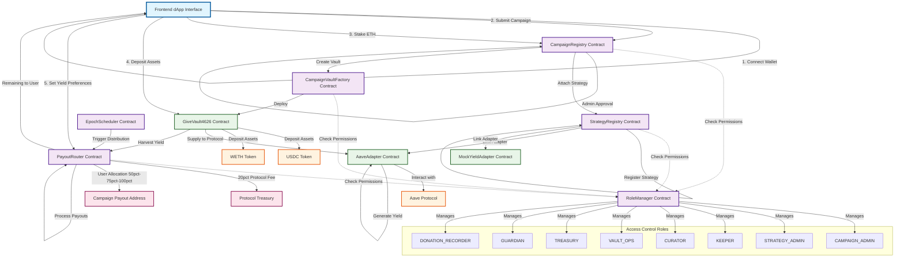

# GIVE Protocol Flow Diagram

```mermaid
graph TB
    %% User Interfaces
    UI[Frontend dApp Interface]
    
    %% Core Access Control
    RM[RoleManager Contract]
    
    %% Campaign Management Layer
    CR[CampaignRegistry Contract]
    SR[StrategyRegistry Contract]
    CVF[CampaignVaultFactory Contract]
    
    %% Vault & Strategy Layer  
    GV[GiveVault4626 Contract]
    AA[AaveAdapter Contract]
    MYA[MockYieldAdapter Contract]
    
    %% Payout & Distribution
    PR[PayoutRouter Contract]
    ES[EpochScheduler Contract]
    
    %% External Protocols
    AAVE[Aave Protocol]
    USDC[USDC Token]
    WETH[WETH Token]
    
    %% Treasury & Governance
    TREAS[Protocol Treasury]
    CAMP_PAYOUT[Campaign Payout Address]
    
    %% User Actions Flow
    UI -->|1. Connect Wallet| UI
    UI -->|2. Submit Campaign| CR
    UI -->|3. Stake ETH| CR
    UI -->|4. Deposit Assets| GV
    UI -->|5. Set Yield Preferences| PR
    
    %% Access Control Integration
    CR -.->|Check Permissions| RM
    SR -.->|Check Permissions| RM  
    PR -.->|Check Permissions| RM
    CVF -.->|Check Permissions| RM
    
    %% Campaign Lifecycle
    CR -->|Campaign Submitted| CR
    CR -->|Admin Approval| CR
    CR -->|Attach Strategy| SR
    CR -->|Create Vault| CVF
    CVF -->|Deploy| GV
    
    %% Strategy Management
    SR -->|Register Strategy| SR
    SR -->|Link Adapter| AA
    SR -->|Link Adapter| MYA
    
    %% Vault Operations
    GV -->|Deposit Assets| USDC
    GV -->|Deposit Assets| WETH
    GV -->|Supply to Protocol| AA
    AA -->|Interact with| AAVE
    
    %% Yield Generation & Distribution
    AA -->|Generate Yield| AA
    GV -->|Harvest Yield| PR
    PR -->|20pct Protocol Fee| TREAS
    PR -->|User Allocation 50pct-75pct-100pct| CAMP_PAYOUT
    PR -->|Remaining to User| UI
    
    %% Epoch Management
    ES -->|Trigger Distribution| PR
    PR -->|Process Payouts| PR
    
    %% Role Definitions
    subgraph "Access Control Roles"
        CADMIN[CAMPAIGN_ADMIN]
        SADMIN[STRATEGY_ADMIN] 
        KEEPER[KEEPER]
        CURATOR[CURATOR]
        VOPS[VAULT_OPS]
        TREASURY[TREASURY]
        GUARDIAN[GUARDIAN]
        RECORDER[DONATION_RECORDER]
    end
    
    RM -->|Manages| CADMIN
    RM -->|Manages| SADMIN
    RM -->|Manages| KEEPER
    RM -->|Manages| CURATOR
    RM -->|Manages| VOPS
    RM -->|Manages| TREASURY
    RM -->|Manages| GUARDIAN
    RM -->|Manages| RECORDER

    %% Styling
    classDef userInterface fill:#e1f5fe,stroke:#01579b,stroke-width:3px
    classDef coreContract fill:#f3e5f5,stroke:#4a148c,stroke-width:2px
    classDef yieldContract fill:#e8f5e8,stroke:#1b5e20,stroke-width:2px
    classDef externalProtocol fill:#fff3e0,stroke:#e65100,stroke-width:2px
    classDef treasury fill:#fce4ec,stroke:#880e4f,stroke-width:2px
    
    class UI userInterface
    class RM,CR,SR,CVF,PR,ES coreContract
    class GV,AA,MYA yieldContract
    class AAVE,USDC,WETH externalProtocol
    class TREAS,CAMP_PAYOUT treasury
```