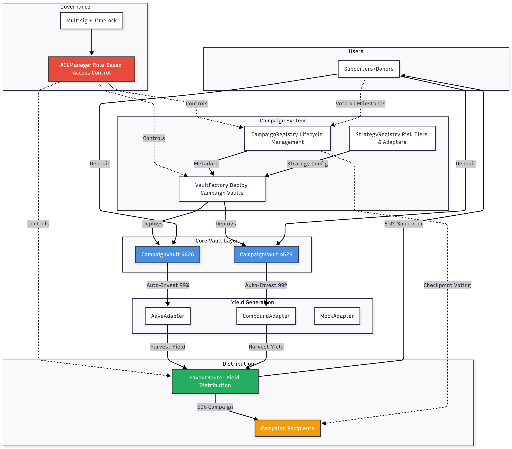

# GIVE Protocol – No-Loss Donations Powered by DeFi

> **The Future of Giving**: Stake your assets, fund social impact with yield, keep your principal forever.

GIVE Protocol is creating a **no-loss donation platform powered by DeFi and blockchain**.

Think of us as a **Web3 version of GoFundMe or Kickstarter**. Instead of donating your capital, we allow users to stake assets into DeFi vaults, and use the generated yield to fund good causes and early-stage projects - **all without losing their capital**.

Every donation is **on-chain, transparent, and ensures recipient accountability**.

**Status:** ✅ **DEPLOYED TO BASE SEPOLIA** (October 2025)  
**Network:** Base Sepolia (Chain ID: 84532) | [View Deployment →](./DEPLOYMENT.md)

---

## 🎯 How It Works

1. **Supporters Stake Assets** - Deposit WETH into campaign-specific vaults
2. **Auto-Investment** - 99% of deposits flow to yield-generating DeFi protocols (Aave, Compound)
3. **Yield Distribution** - Harvested profits split between campaigns and supporters
4. **Principal Safe** - Withdraw your original deposit anytime
5. **Transparent Tracking** - All donations on-chain with campaign milestones

---

## 🏗️ Architecture



### Core Components

**Governance Layer**
- **ACLManager** - Role-based access control for all protocol operations
- Multisig + Timelock governance model

**Campaign Management**
- **CampaignRegistry** - Campaign lifecycle (submission → approval → active → completed)
- **StrategyRegistry** - Risk tiers and adapter configurations
- **VaultFactory** - Deploy ERC-4626 vaults for each campaign

**Vault System**
- **CampaignVault4626** - ERC-4626 compliant vaults with auto-investment
- **YieldAdapters** - Integrations with Aave, Compound (Morpho, Yearn coming soon)
- 99% auto-invested, 1% cash buffer for instant withdrawals

**Distribution**
- **PayoutRouter** - Yield distribution to campaigns and supporters
- **Checkpoint Voting** - Supporters vote on campaign milestones
- Failed checkpoints halt payouts until resolved

---

## 📊 Main Contracts (Base Sepolia)

| Contract | Address | Purpose |
|----------|---------|---------|
| **ACLManager** | `0xC6454Ec62f53823692f426F1fb4Daa57c184A36A` | Role-based access control |
| **CampaignRegistry** | `0x51929ec1C089463fBeF6148B86F34117D9CCF816` | Campaign lifecycle management |
| **PayoutRouter** | `0xe1BD0BA2e0891c95Bd02eA248f8115E7c7DC37c5` | Yield distribution |
| **GIVE WETH Vault** | `0x28ac6D6505E2875FFF9E13d1B788A8d4740a7278` | Main deposit vault |

**Full deployment details:** See [DEPLOYMENT.md](./DEPLOYMENT.md)

---

## 🚀 Quick Start

### For Users
1. Get Base Sepolia ETH: https://www.coinbase.com/faucets/base-ethereum-sepolia-faucet
2. Wrap to WETH: `0x4200000000000000000000000000000000000006`
3. Deposit to vault: `0x28ac6D6505E2875FFF9E13d1B788A8d4740a7278`
4. **Your principal stays safe** - only yield goes to campaigns!

### For Developers
```bash
# Backend (Foundry)
cd backend
forge build && forge test

# Frontend (Vite + React)
cd frontend
pnpm install && pnpm dev
```

---

## 📁 Repository Structure

```
backend/          Foundry contracts + tests
  src/            Core protocol contracts
    governance/   ACLManager, role-based access
    registry/     Campaign & strategy registries
    vault/        ERC-4626 vaults + auto-investment
    adapters/     Yield generation (Aave, Compound)
    payout/       PayoutRouter for distribution
  test/           116 passing tests

frontend/         Vite + React + RainbowKit frontend
apps/web/         Next.js 14 alternative frontend
docs/             Technical documentation
```

---

## 🔐 Security

- **Principal Protection** - User deposits always withdrawable (yield-only for campaigns)
- **UUPS Upgrades** - Only `ROLE_UPGRADER` can upgrade via ACL
- **Role-Based Access** - All permissions via ACLManager
- **Emergency Controls** - Pause, emergency withdraw, grace periods
- **Flash Loan Protection** - Minimum stake duration for voting eligibility

---

## 📚 Documentation

- **[DEPLOYMENT.md](./DEPLOYMENT.md)** - All contract addresses and deployment info
- **[TODO.md](./TODO.md)** - Future roadmap and planned features
- **[docs/ARCHITECTURE.md](./docs/ARCHITECTURE.md)** - System design details
- **[docs/TESTNET_OPERATIONS_GUIDE.md](./docs/TESTNET_OPERATIONS_GUIDE.md)** - User guide

---

## 🌐 Links

- **Testnet:** https://sepolia.basescan.org
- **Base Sepolia Faucet:** https://www.coinbase.com/faucets/base-ethereum-sepolia-faucet
- **Frontend (Production):** [Deployed on Vercel]

---

*Last Updated: October 27, 2025 | Version: 0.5.0 | Network: Base Sepolia*
