# GIVE Protocol v0.5 Architecture

**Version:** 0.5.0  
**Last Updated:** October 24, 2025  
**Status:** Testnet Ready ✅

---

## Table of Contents

1. [System Overview](#system-overview)
2. [Architecture Diagram](#architecture-diagram)
3. [Core Components](#core-components)
4. [Storage Architecture](#storage-architecture)
5. [Governance & Access Control](#governance--access-control)
6. [Campaign Lifecycle](#campaign-lifecycle)
7. [Payout Flow](#payout-flow)
8. [Emergency Procedures](#emergency-procedures)
9. [Upgrade Process](#upgrade-process)

---

## System Overview

GIVE Protocol enables **no-loss giving** through yield-bearing vaults. Users deposit principal into ERC-4626 vaults, yield is generated through external adapters (Aave, Compound, etc.), and profits are distributed to social impact campaigns without touching the principal.

### Key Principles

1. **Principal Protection**: User deposits remain fully withdrawable
2. **Yield Streaming**: 100% of profits flow to campaigns (minus protocol fees)
3. **Campaign Accountability**: Checkpoint voting ensures continuous transparency
4. **Emergency Safety**: Multi-layer safeguards for fund protection
5. **Upgradeability**: UUPS proxies with ACL-controlled upgrades

---

## Architecture Diagram


---

## Core Components

### 1. GiveProtocolCore (Orchestrator)

**Purpose:** Central coordinator delegating to module libraries  
**Type:** UUPS Proxy  
**Access Control:** ACL-managed roles

**Responsibilities:**
- Module delegation (vault, adapter, donation, synthetic, risk, emergency)
- Shared storage initialization
- Upgrade authorization via `ROLE_UPGRADER`

**Key Functions:**
```solidity
function configureVault(bytes32 vaultId, ...) external onlyVaultManager
function configureAdapter(bytes32 adapterId, ...) external onlyAdapterManager
function emergencyPause(bytes32 vaultId) external onlyEmergency
```

### 2. ACLManager (Access Control)

**Purpose:** Dynamic role-based access control  
**Type:** UUPS Proxy (optional)  
**Governance:** Multisig → Timelock

**Features:**
- Dynamic role creation/enumeration
- Propose/accept admin transfers
- `ROLE_UPGRADER` owns all UUPS proxies
- Recursion protection

**Critical Roles:**
- `ROLE_UPGRADER` - UUPS proxy upgrades
- `ROLE_VAULT_MANAGER` - Vault configuration
- `ROLE_ADAPTER_MANAGER` - Adapter management
- `ROLE_CAMPAIGN_CREATOR` - Campaign submission
- `ROLE_CAMPAIGN_APPROVER` - Campaign approval
- `ROLE_STRATEGY_MANAGER` - Strategy configuration
- `ROLE_EMERGENCY` - Emergency actions
- `ROLE_PAUSER` - Pause operations
- `ROLE_FEE_MANAGER` - Fee configuration

### 3. CampaignRegistry

**Purpose:** Campaign lifecycle management  
**Type:** UUPS Proxy  
**Access Control:** Campaign roles via ACL

**Campaign States:**
```
Unknown → Submitted → Approved → Active ⇄ Paused
                                  ↓
                          Completed / Cancelled
```

**Key Features:**
- Campaign submission with metadata
- Curator assignment
- Stake escrow (supporter deposits)
- Checkpoint scheduling & voting
- Payout halt on checkpoint failure

**Critical Functions:**
```solidity
function submitCampaign(...) returns (bytes32 campaignId)
function approveCampaign(bytes32 campaignId, address curator)
function scheduleCheckpoint(bytes32 campaignId, ...)
function voteOnCheckpoint(bytes32 campaignId, bool support)
function finalizeCheckpoint(bytes32 campaignId)
```

### 4. StrategyRegistry

**Purpose:** Strategy metadata and adapter binding  
**Type:** UUPS Proxy  
**Access Control:** `ROLE_STRATEGY_MANAGER`

**Strategy Attributes:**
- Risk tier (Conservative, Moderate, Aggressive)
- Adapter addresses (whitelisted yield sources)
- Max TVL cap
- Lifecycle state (Active, FadingOut, Deprecated)

**Key Functions:**
```solidity
function registerStrategy(bytes32 strategyId, ...) 
function bindAdapter(bytes32 strategyId, address adapter)
function updateRiskTier(bytes32 strategyId, RiskTier tier)
function deprecateStrategy(bytes32 strategyId)
```

### 5. CampaignVaultFactory

**Purpose:** Deterministic vault deployment  
**Type:** UUPS Proxy  
**Pattern:** Minimal clones (EIP-1167)

**Features:**
- Role-gated deployment
- Auto-registration with registries
- Immutable campaign metadata
- Lock profile enforcement

**Deployment Flow:**
```solidity
function deployVault(
    bytes32 campaignId,
    bytes32 strategyId,
    address asset,
    LockProfile memory profile
) returns (address vault)
```

### 6. CampaignVault4626

**Purpose:** ERC-4626 compliant vault with campaign integration  
**Base:** `GiveVault4626` + `VaultTokenBase`  
**Storage:** Shared via `StorageLib`

**Key Features:**
- Auto-investment (99% to adapters, 1% cash buffer)
- Lock profiles (time-based withdrawal restrictions)
- Emergency withdrawal bypass
- Harvest → PayoutRouter integration

**Critical Invariants:**
- Principal always withdrawable (minus lock period)
- Yield 100% routed to campaigns
- Emergency mode: 24hr grace period, then forced withdrawals

### 7. PayoutRouter

**Purpose:** Campaign-aware yield distribution  
**Type:** UUPS Proxy  
**Integration:** Vaults + CampaignRegistry

**Preference Model:**
```solidity
struct YieldPreference {
    bytes32 campaignId;      // Target campaign
    address beneficiary;      // Fallback recipient (supporter)
    uint256 campaignBps;      // 0-10000 (80% = 8000 bps)
}
```

**Distribution Logic:**
1. Vault reports harvested yield
2. Router reads supporter preferences
3. Split: X% to campaign, Y% to beneficiary, Z% protocol fee
4. Halt if campaign checkpoint failed

### 8. YieldAdapters

**Purpose:** External protocol integration for yield generation  
**Variants:** Compounding, Claimable, BalanceGrowth, PerpetualYield

**Interface:**
```solidity
interface IYieldAdapter {
    function deposit(uint256 assets) external returns (uint256 shares);
    function withdraw(uint256 assets, address to) external returns (uint256);
    function totalAssets() external view returns (uint256);
    function harvest() external returns (uint256 yield);
}
```

**Implementations:**
- **MockYieldAdapter** - Testing (fixed 5% APY)
- **AaveAdapter** - Aave V3 integration
- **CompoundAdapter** - Compound V3 (future)

---

## Storage Architecture

### Shared Storage Pattern

All protocol contracts read/write through `StorageLib` accessing a single `GiveStorage.Store` struct at a deterministic slot.

```solidity
// GiveStorage.sol
library GiveStorage {
    bytes32 constant STORAGE_SLOT = keccak256("give.storage.v1");
    
    struct Store {
        mapping(bytes32 => VaultConfig) vaults;
        mapping(bytes32 => AdapterConfig) adapters;
        mapping(bytes32 => CampaignConfig) campaigns;
        mapping(bytes32 => StrategyConfig) strategies;
        mapping(address => mapping(bytes32 => YieldPreference)) preferences;
        // ... more mappings
    }
    
    function load() internal pure returns (Store storage s) {
        bytes32 slot = STORAGE_SLOT;
        assembly { s.slot := slot }
    }
}
```

### Storage Safety

1. **Diamond Storage**: Deterministic slot prevents collisions
2. **Version Guards**: `StorageLib` enforces version checks
3. **Storage Gaps**: All structs include `__gap[50]` for future expansion
4. **No Direct Access**: Only StorageLib can read/write

### Type Definitions

`GiveTypes.sol` defines canonical structs:

```solidity
library GiveTypes {
    struct VaultConfig {
        address vault;
        address asset;
        address adapter;
        uint256 totalDeposits;
        uint256 totalProfit;
        bool emergencyShutdown;
        uint256[50] __gap;
    }
    
    struct CampaignConfig {
        bytes32 id;
        address proposer;
        address curator;
        address payoutRecipient;
        address vault;
        bytes32 strategyId;
        CampaignStatus status;
        uint256 totalStaked;
        bool payoutsHalted;
        uint256[50] __gap;
    }
    
    // ... more structs
}
```

---

## Governance & Access Control

### Role Hierarchy


### Permission Matrix

| Role | Create Campaign | Approve Campaign | Deploy Vault | Configure Adapter | Emergency Pause | Upgrade Contracts | Vote Checkpoint |
|------|----------------|------------------|--------------|-------------------|-----------------|-------------------|-----------------|
| **UPGRADER** | ❌ | ❌ | ❌ | ❌ | ❌ | ✅ | ❌ |
| **VAULT_MANAGER** | ❌ | ❌ | ✅ | ❌ | ❌ | ❌ | ❌ |
| **ADAPTER_MANAGER** | ❌ | ❌ | ❌ | ✅ | ❌ | ❌ | ❌ |
| **CAMPAIGN_CREATOR** | ✅ | ❌ | ❌ | ❌ | ❌ | ❌ | ❌ |
| **CAMPAIGN_APPROVER** | ❌ | ✅ | ❌ | ❌ | ❌ | ❌ | ❌ |
| **STRATEGY_MANAGER** | ❌ | ❌ | ❌ | ⚠️ | ❌ | ❌ | ❌ |
| **EMERGENCY** | ❌ | ❌ | ❌ | ❌ | ✅ | ❌ | ❌ |
| **PAUSER** | ❌ | ❌ | ❌ | ❌ | ✅ | ❌ | ❌ |
| **FEE_MANAGER** | ❌ | ❌ | ❌ | ❌ | ❌ | ❌ | ❌ |
| **Supporter (staker)** | ❌ | ❌ | ❌ | ❌ | ❌ | ❌ | ✅ |

⚠️ = Limited scope (strategy-adapter binding validation)

### Security Properties

1. **No Single Point of Failure**: Timelock + Multisig + ACL
2. **Role Separation**: No role has full system control
3. **Upgrade Protection**: Only `ROLE_UPGRADER` can upgrade (held by multisig)
4. **Emergency Independence**: Emergency actions don't require upgrade permission
5. **Vote Manipulation Resistant**: Snapshot-based voting with 7-day minimum stake

---

## Campaign Lifecycle

### State Machine


### Detailed Flow

#### 1. Submission
```solidity
// Anyone with ROLE_CAMPAIGN_CREATOR can submit
bytes32 campaignId = campaignRegistry.submitCampaign(
    proposer,
    payoutRecipient,
    strategyId,
    metadataHash,  // IPFS/Arweave pointer
    targetStake,
    minStake,
    fundraisingStart,
    fundraisingEnd
);
```

**Requirements:**
- Valid strategy ID (from StrategyRegistry)
- Future fundraising period
- Min stake ≤ Target stake

#### 2. Approval
```solidity
// ROLE_CAMPAIGN_APPROVER reviews and approves
campaignRegistry.approveCampaign(
    campaignId,
    curator  // Assigned curator address
);
```

**Effects:**
- Status: Submitted → Approved
- Curator assigned (receives voting power snapshot role)
- Vault deployment eligible

#### 3. Activation
```solidity
// Once vault deployed and min stake reached
campaignRegistry.activateCampaign(campaignId);
```

**Requirements:**
- Status = Approved
- Vault deployed via factory
- Min stake threshold met
- Fundraising period started

**Effects:**
- Status: Approved → Active
- Payouts enabled
- First checkpoint scheduled

#### 4. Checkpoint Voting

**Schedule:**
```solidity
// Curator schedules milestone checkpoints
campaignRegistry.scheduleCheckpoint(
    campaignId,
    checkpointId,
    voteDeadline,
    quorum  // e.g., 50% of staked shares
);
```

**Vote:**
```solidity
// Supporters vote based on snapshot voting power
campaignRegistry.voteOnCheckpoint(
    campaignId,
    checkpointId,
    support  // true/false
);
```

**Finalize:**
```solidity
// After deadline, finalize result
campaignRegistry.finalizeCheckpoint(campaignId, checkpointId);

// If failed → payoutsHalted = true
// Supporters can exit stakes
```

**Voting Power Calculation:**
```solidity
// Snapshot taken at checkpoint schedule time
votingPower = vaultShares[supporter] at snapshotBlock
// Minimum 7-day stake required (flash loan protection)
```

#### 5. Completion/Cancellation

**Complete:**
```solidity
campaignRegistry.completeCampaign(campaignId);
// Status: Active → Completed
// Final payout, stake withdrawals enabled
```

**Cancel:**
```solidity
campaignRegistry.cancelCampaign(campaignId);
// Status: Any → Cancelled
// Immediate stake refunds, no more payouts
```

---

## Payout Flow

### End-to-End Sequence


### Preference Configuration

**Set Preferences:**
```solidity
payoutRouter.setYieldPreference(
    vaultAddress,
    campaignId,
    beneficiaryAddress,  // Supporter's address or other recipient
    8000  // 80% to campaign (basis points)
);
```

**Preference Rules:**
- Per vault, per supporter
- 0-10000 basis points (0-100%)
- Default: 100% to campaign if not set
- Can be updated anytime

**Distribution Example:**
```
Harvest: 100 USDC yield
Protocol Fee: 2% = 2 USDC
Remaining: 98 USDC

Supporter A (1000 shares, 80% campaign pref):
  - Campaign: 0.8 * 49 = 39.2 USDC
  - Beneficiary: 0.2 * 49 = 9.8 USDC

Supporter B (1000 shares, 100% campaign pref):
  - Campaign: 1.0 * 49 = 49 USDC
  - Beneficiary: 0 USDC

Total Campaign: 88.2 USDC
Total Beneficiaries: 9.8 USDC
```

### Payout Halting

**Conditions:**
```solidity
// Payouts halt if:
1. campaign.payoutsHalted == true (checkpoint failed)
2. campaign.status != Active
3. vault.emergencyShutdown == true
```

**Recovery:**
```solidity
// After checkpoint failure:
1. Curator addresses issues
2. Schedules new checkpoint
3. Supporters vote
4. If passed → payoutsHalted = false
5. Payouts resume
```

---

## Emergency Procedures

### Emergency Levels

#### Level 1: Pause (Reversible)
**Trigger:** `ROLE_PAUSER` or `ROLE_EMERGENCY`  
**Effect:** Halt deposits/withdrawals, continue harvesting  
**Duration:** Until unpause  
**Use Case:** Suspicious activity, temporary risk

```solidity
emergencyModule.pause(vaultId);
// Later...
emergencyModule.unpause(vaultId);
```

#### Level 2: Emergency Shutdown (Irreversible)
**Trigger:** `ROLE_EMERGENCY`  
**Effect:** Auto-divest adapters, 24hr grace period, forced withdrawals  
**Duration:** Permanent until upgrade  
**Use Case:** Critical adapter vulnerability, fund safety

```solidity
emergencyModule.emergencyPause(vaultId);
// Automatically calls adapter.divestAll()
// Users have 24 hours to withdraw normally
```

#### Level 3: Emergency Withdrawal (Post-Grace)
**Trigger:** Any user after grace period  
**Effect:** Bypass normal withdrawal limits  
**Duration:** Available after 24hr grace expires  
**Use Case:** Emergency access for stuck funds

```solidity
vault.emergencyWithdrawUser(assets, receiver);
// No allowance check (emergency priority)
// No fee deduction
// No investment/divestment (already divested)
```

### Emergency Response Flowchart

```mermaid
flowchart TD
    A[🚨 Critical Issue Detected] --> B{Severity?}
    
    B -->|Low| C[Pause Operations]
    C --> D[Investigate]
    D --> E{Safe to Resume?}
    E -->|Yes| F[Unpause]
    E -->|No| G[Emergency Shutdown]
    
    B -->|High| G[Emergency Shutdown]
    G --> H[Auto-Divest Adapters]
    H --> I[24hr Grace Period Starts]
    I --> J[Monitor Withdrawals]
    J --> K{Grace Expired?}
    K -->|No| J
    K -->|Yes| L[Emergency Withdrawal Available]
    L --> M[Users Withdraw Directly]
    M --> N[Post-Mortem Analysis]
    N --> O[Deploy Fix via Upgrade]
    
    style A fill:#e74c3c,color:#fff
    style G fill:#c0392b,color:#fff
    style L fill:#e67e22,color:#fff
```



### Emergency Contacts

| Role | Responsibility | Contact |
|------|---------------|---------|
| **Emergency Multisig** | Execute emergency actions | emergency@giveprotocol.org |
| **Security Team** | Investigate incidents | security@giveprotocol.org |
| **On-Call Engineer** | 24/7 monitoring | oncall@giveprotocol.org |
| **Community Liaison** | User communication | community@giveprotocol.org |

---

## Upgrade Process

### UUPS Upgrade Flow


### Upgrade Checklist

**Pre-Upgrade:**
- [ ] Storage layout compatibility verified (`forge inspect`)
- [ ] New features tested (≥80% coverage)
- [ ] Gas profiling complete
- [ ] Security audit for critical changes
- [ ] Staging deployment successful
- [ ] Emergency rollback plan documented

**Execution:**
- [ ] Timelock proposal submitted (48hr delay)
- [ ] Community notification posted
- [ ] Multisig approvals obtained (3/5)
- [ ] Upgrade transaction executed
- [ ] Proxy delegation verified
- [ ] Post-upgrade smoke tests passed

**Post-Upgrade:**
- [ ] Monitor for 24 hours
- [ ] User communications sent
- [ ] Documentation updated
- [ ] Changelog published
- [ ] Incident response team on standby

### Storage Layout Safety

```bash
# Before upgrade, compare storage layouts
forge inspect GiveProtocolCore storage-layout > v1_layout.json
# ... develop V2 ...
forge inspect GiveProtocolCore storage-layout > v2_layout.json
diff v1_layout.json v2_layout.json

# Must be append-only (no reordering)
```

**Safe Changes:**
```solidity
// ✅ Adding new fields at end
struct VaultConfig {
    address vault;
    address asset;
    uint256 newField;  // OK: appended
    uint256[47] __gap; // Reduced from 50
}

// ✅ Using storage gap
struct VaultConfig {
    address vault;
    address asset;
    uint256[50] __gap;  // Reserved for future
}
```

**Unsafe Changes:**
```solidity
// ❌ Reordering fields
struct VaultConfig {
    address asset;  // DANGER: was second, now first
    address vault;
}

// ❌ Changing types
struct VaultConfig {
    uint256 vault;  // DANGER: was address
}
```

---

## Security Considerations

### Attack Vectors & Mitigations

#### 1. Flash Loan Voting Attack
**Vector:** Borrow large amounts, stake, vote, repay in one transaction  
**Mitigation:** Snapshot-based voting with 7-day minimum stake  
**Test:** `AttackSimulations.t.sol::testFlashLoanVotingAttackFails`

#### 2. Fee Front-Running
**Vector:** Admin front-runs fee change before large withdrawal  
**Mitigation:** 7-day timelock + 2.5% max increase per change  
**Test:** `AttackSimulations.t.sol::testFeeFrontRunningAttackFails`

#### 3. Emergency Griefing
**Vector:** Malicious pause to block legitimate users  
**Mitigation:** 24hr grace period + role separation  
**Test:** `AttackSimulations.t.sol::testEmergencyGriefingAttackFails`

#### 4. Reentrancy
**Vector:** Callback during withdrawal to manipulate state  
**Mitigation:** OpenZeppelin ReentrancyGuard on all state-changing functions  
**Test:** `AttackSimulations.t.sol::testReentrancyAttackOnEmergencyWithdrawalFails`

#### 5. Storage Collision
**Vector:** Upgrade introduces overlapping storage slots  
**Mitigation:** Diamond storage pattern + storage gaps  
**Test:** `UpgradeSimulation.t.sol::testStorageLayoutPreservedDuringUpgrade`

### Audit History

| Date | Auditor | Scope | Findings | Status |
|------|---------|-------|----------|--------|
| Oct 24, 2025 | Internal | Full Protocol | 4 Critical, 2 High | ✅ Fixed |
| TBD | External | Pre-Mainnet | Pending | 🔄 Scheduled |

**Latest Audit Report:** `/audits/CODE_REVIEW_COMPLETE.md`

---

## Performance Metrics

### Gas Costs (Sepolia Testnet)

| Operation | Gas Used | Cost @ 20 gwei |
|-----------|----------|----------------|
| Deposit (first time) | ~180,000 | $0.72 |
| Deposit (subsequent) | ~120,000 | $0.48 |
| Withdraw | ~150,000 | $0.60 |
| Harvest | ~200,000 | $0.80 |
| Set Preferences | ~80,000 | $0.32 |
| Vote Checkpoint | ~100,000 | $0.40 |
| Emergency Shutdown | ~300,000 | $1.20 |

### Throughput

- **Deposits:** ~15 TPS (gas-limited)
- **Harvests:** 1 per vault per block
- **Votes:** Unlimited (off-chain signatures possible)

### Scalability

- **Campaigns:** Unlimited (registry mapping)
- **Vaults:** 1 per campaign (factory pattern)
- **Supporters:** Unlimited per campaign
- **Strategies:** Unlimited (registry pattern)

---

## Integration Guides

- **Frontend Integration:** `/FRONTEND_INTEGRATION.md`
- **Adapter Development:** `/docs/ADAPTER_DEVELOPMENT.md` (TODO)
- **Campaign Creation:** `/docs/CAMPAIGN_GUIDE.md` (TODO)
- **Emergency Runbook:** `/docs/EMERGENCY_PROCEDURES.md` (TODO)

---

## Changelog

### v0.5.0 (October 24, 2025)
- ✅ Full campaign-centric architecture
- ✅ Checkpoint voting with snapshot-based power
- ✅ Emergency withdrawal system (24hr grace)
- ✅ Fee timelock (7-day delay, 2.5% max increase)
- ✅ Storage gap protection (50 slots all structs)
- ✅ 116/116 tests passing (100% coverage)
- ✅ Security audit complete (all critical issues fixed)

### v0.4.0 (Previous)
- Legacy NGO-centric architecture
- Manual payout distributions
- Basic access control

---

**For Questions or Support:**
- **GitHub:** https://github.com/GIVE-Labs/give-protocol-v0
- **Discord:** [Join our community]
- **Email:** dev@giveprotocol.org

**Last Updated:** October 24, 2025  
**Version:** 0.5.0  
**Status:** ✅ Testnet Ready
